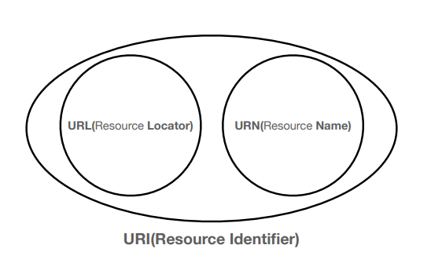
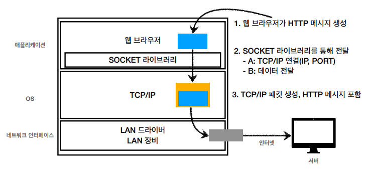

# URI와 웹브라우저 요청 흐름
## URI / URL / URN
> URI (Uniform Resource Indentifier)
- URI는 로케이터( locator ), 이름( name ) 또는 둘 다 추가로 분류될 수 있다.

    
    
- URI 단어의 뜻
  - Uniform : 리소스를 식별하는 통일된 방식
  - Resource : 자원, URI로 식별할 수 있는 모든것 ( 제한 없음 )
  - Identifier : 다른 항목과 구분하는데 필요한 정보
- URL
  - Locator : 리소스가 있는 위치를 지정
- URN
  - Name : 리소스에 이름을 부여
- 통상적으로 URI와 URL을 같은 의미로 사용한다.
- 하지만 정확히 말해서 URL은 쿼리스트링을 포함하지 않는다.
***
## **URI 전체 문법**
- **scheme://[userinfo@]host[:port][/path][?query][#fragment]**
- https://www.google.com:443/search?q=hello&hl=ko
  - 프로토콜 ( https )
  - 호스트명 ( www.google.com )
  - 포트번호 ( 443 )
  - 패스 ( /search )
  - 쿼리 파라미터 ( q=hello&hl=ko )
> scheme
- 주로 프로토콜 사용
  - 프로토콜 : 어떤 방식으로 자원에 접근할 것인가 하는 약속 규칙
  - http, https, ftp 등등
- http는 80 포트, https는 443 포트를 주로 사용한다.
- http, https의 포트는 생략 가능하다.
- https는 http에 보안을 추가한 것이다. (HTTP Secure)
> userinfo
- URL에 사용자 정보를 포함해서 인증할 때 사용한다.
- 거의 사용하지 않는다.
> host
- 호스트명
- 도메인명 또는 IP 주소를 직접 사용가능하다.
> port
- 접속 포트
- 일반적으로 생략한다. 생략 시 http는 80, https는 443
> path
- 리소스의 경로( path )
- 계층적 구조 ( depth )
> query
- key=value 형태
- ?로 시작, &로 추가 가능
- query parameter, query string 등으로 불린다.
  - 웹서버에 제공하는 파라미터.
  - 모든 정보가 문자로 넘어간다( 숫자를 입력해도 문자로 넘어감 )
> fragment
- html 내부 북마크 등에 사용된다.
***
## 웹 브라우저 요청 흐름

1. DNS 서버를 조회한다. ( IP 주소를 확인할 수 있음 )
2. 포트 정보를 확인한다.
3. 웹 브라우저가 HTTP 요청 메세지 생성
4. SOCKET 라이브러리를 통해 전달
   - TCP/IP 연결 (IP, PORT)
   - 데이터 전달
5. TCP/IP 패킷 생성, HTTP 메시지 포함
6. 서버에서 클라이언트의 요청을 받으면 이를 해석한다.
7. 서버에서 HTTP 응답 메시지를 생성한다. ( 예를 들어 HTML 데이터 )
8. 서버도 응답 패킷을 만들고 TCP/IP를 씌워서 웹 브라우저로 전송한다.
9. 웹 브라우저가 전달받은 데이터를 랜더링해서 화면에 뿌려준다.
