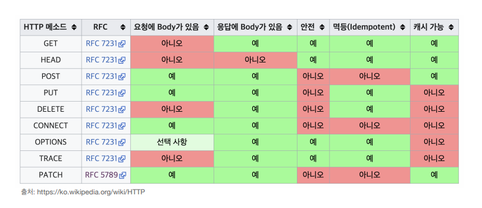

# HTTP Method
## HTTP API 설계 ( 회원 관리 )
- 회원 정보를 관리하는 API 설계
  - 회원 목록 조회
  - 회원 조회
  - 회원 등록
  - 회원 수정
  - 회원 삭제
- **URI 설계 시 가장 중요한 것은 리소스를 식별하는 것이다.**
> ### **리소스의 의미는 무엇일까?**
- 예를 들어 *"미네랄을 캔다."* 에서 리소스는 *"미네랄"* 이다.
- 따라서 *"회원 정보를 조회해라."* 에서 리소스는 *"회원"* 을 의미한다.
- *최근 HTTP 스펙에선 'Resource'가 'Representation' 변경되었으나, 여기서는 표현하기 쉽게 '리소스'로 부르기로 하자.*
> **리소스를 어떻게 식별하는게 좋을까?**
- 회원을 *등록*하고 *수정*하고 *조회*하는 *기능*들은 모두 배제한다.
- **회원이라는 리소스만 식별하면 된다.** -> 회원 리소스를 URI에 매핑
> ***가장 중요한 것은 리소스와 행위를 분리하는 것이다!***
- **URI는 리소스만 식별하게 설계하는 것이 좋다.**
  - 리소스: 회원
  - 행위: 조회, 등록, 수정, 삭제, 변경
- 그렇다면 행위는 어떻게 구분할 것인가?
***
## HTTP 메소드 - GET, POST
> **HTTP 주요 메소드**
- ```GET```: 리소스 조회
- ```POST```: 요청 데이터 처리, 주로 등록에 사용
- ```PUT```: 리소스를 대체, 해당 리소스가 없으면 새로 생성
- ```PATCH```: 리소스를 부분적으로 변경
- ```DELETE```: 리소스 삭제
> **HTTP 기타 메소드**
- ```HEAD```: ```GET과``` 동일하지만 메시지 부분을 제외하고 상태줄과 헤더만 반환한다.
- ```OPTIONS```: 해당 리소스에 대한 통신 가능 옵션( 메소드 )을 설명( 주로 CORS에서 사용 )
- 이외에 ```CONNECT```와 ```TRACE```도 있으나 거의 사용되지 않는다.
> **GET**
- 리소스 조회
  - '조회' 기능을 수행할 때는 ```GET```을 사용하는 것이 유리하다.
- 서버에 전달하고 싶은 데이터는 query( 쿼리 파라미터, 쿼리 스트링 )를 통해서 전달한다.
- ( HTTP 최근 스펙에서 )메시지 바디를 사용해서 데이터를 전달할 수 있지만, 지원하지 않는 서버가 많아서 권장하지 않는다. ( 실무에선 GET 메소드에 메시지 바디를 사용하지 않는다. )
> **POST**
- 요청 데이터 처리
- ***메시지 바디를 통해 서버로 요청 데이터를 전달한다.***
- 서버는 요청 데이터를 처리한다.
  - 메시지 바디를 통해 들어온 데이터를 처리하는 모든 기능을 수행한다.
- 주로 전달된 데이터로 신규 리소스 등록, 프로세스 처리에 사용된다.
> **POST는 요청 데이터를 어떻게 처리한다는 것일까?**
- 스펙
  - POST 메소드는 대상 리소스가 리소스의 고유한 의미 체계에 따라 요청에 포함된 표현을 처리하도록 요청한다.
- 예를 들어 POST는 다음과 같은 기능에 사용된다.
  - HTML 양식에 입력된 필드와 같은 데이터 블록을 데이터 처리 프로세스에 제공한다.\
    - 회원가입, 주문 등
  - 게시판, 뉴스 그룹, 메일링 리스트, 블로그 또는 유사한 기사 그룹에 메시지 게시
    - 게시판 글쓰기, 댓글 달기
  - 서버가 아직 식별하지 않은 새 리소스 생성
    - 신규 주문 생성
  - 기존 자원에 데이터 추가
    - 한 문서 끝에 내용 추가하기
- 해당 리소스 URI에 POST 요청이 오면 요청 데이터를 어떻게 처리할지 리소스마다 따로 정해줘야 한다. 즉, 정해진 것이 없다.
> **POST 정리**
- 새 리소스 생성( 등록 )
  - 서버가 아직 식별하지 않은 리소스를 생성한다.
- 요청 데이터 처리
  - 단순히 데이터를 생성하거나, 변경하는 것을 넘어서 프로세스를 처리해야 하는 경우
    - 주문에서 결제 완료->배달 시작->배달 완료 처럼 단순히 값 변경을 넘어 프로세스의 상태가 변경되는 경우
  - POST의 결과로 새로운 리소스가 생성되지 않을 수도 있다.
    - POST /orders/{orderId}/start-delivery ( 컨트롤 URI )
      - **리소스만으로 URI를 설계하는 것이 가장 좋지만 어쩔 수 없는 경우도 존재한다.**
      - 그런 경우 다음과 같이 '행위'를 URI에 포함시키기도 한다. ( 컨트롤 URI )
- 다른 메소드로 처리하기 애매한 경우
  - 예를 들어 JSON으로 조회 데이터를 넘기고 싶은데, GET 메소드를 사용하기 어려운 경우
  - 이렇게 애매한 경우엔 리소스를 조회하고 싶어도 GET이 아닌 POST를 사용한다.
> **PUT**
- 리소스를 대체
  - 리소스가 있으면 대체
  - 리소스가 없으면 생성
- 클라이언트가 리소스를 식별
  - 클라이언트가 리소스 위치를 알고 URI 지정
    - PUT /members/100 HTTP/1.1
      - 100번에 리소스를 생성하겠다!
  - POST는 클라이언트가 리소스의 정확한 위치를 알지 못한다.
    - POST /members HTTP/1.1 
      - 어디에든 상관없으니 리소스를 생성하겠다!
- 주의! PUT은 리소스를 완전히 대체한다.
  - 기존 리소스에 나이, 이름, 성별 데이터 필드가 존재했다고 가정하자.
  - 나이 데이터만 변경하고 싶어서 PUT을 통해 나이 데이터 값을 전송해준다.
  - 그러면 기존에 존재했던 이름, 성별 데이터 필드가 모두 날아간다.
> **PATCH**
- 리소스를 부분 변경
- PUT을 통해 리소스를 부분적으로 수정할 수 없었던 문제를 보완해준다.
- 하지만 가끔 PATCH를 지원하지 않는 서버가 존재한다. 이런 경우엔 POST를 사용하면 된다.
> **DELETE**
- 리소스를 제거
***
## HTTP 메소드의 속성

> **안전**
- 호출해도 리소스를 변경하지 않는다. ( GET, HEAD )
- 그래도 계속 호출해서 서버에 로그가 쌓이면 장애가 발생하지 않는가?
  - HTTP의 안전이라는 속성은 해당 리소스의 변화만 고려한다.
> **멱등( Idempotent )**
- 같은 요청을 여러번 호출해도 결과가 똑같다. ( GET, PUT, DELETE )
  - GET
    - 한 번 조회하든, 두 번 조회하든 같은 결과가 조회된다.
  - PUT
    - PUT은 같은 요청을 받으면 기존 데이터를 덮어쓴다. 즉 결국 최종 결과물은 동일하다.
  - DELETE
    - 결과를 삭제한다. 같은 요청을 여러번 해도 삭제된 결과는 똑같다.
  - **POST**
    - 멱등이 아니다.
    - 두 번 호출하면 같은 결제가 중복해서 발생할 수 있다.
- **멱등의 활용**
  - 자동 복구 메커니즘
  - 만약 요청에 대한 서버의 응답이 없을 경우 자동적으로 다시 한번 요청을 보내도록 설계한다.
  - 멱등인 경우 서버가 TIMEOUT 등으로 정상 응답을 못주었을 때, 클라이언트가 같은 요청을 다시 해도된다.
- 만약 재요청 중간에 다른 곳에서 리소스를 변경해버리면?
  - 멱등은 외부 요인으로 중간에 리소스가 변경되는 것 까지는 고려하지 않는다.
  - 멱등은 같은 클라이언트가 자신만 같은 요청을 반복했을 때의 결과를 고려한다.
> **캐시가능**
- 응답 결과 리스소를 캐시해서 사용해도 되는가?( GET, HEAD, POST, PATCH )
- 실제로는 GET, HEAD 정도만 캐시로 사용한다.
  - POST, PATCH는 본문 내용까지 캐시 키로 고려해야 하는데, 구현이 쉽지 않다.