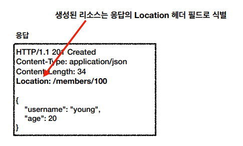
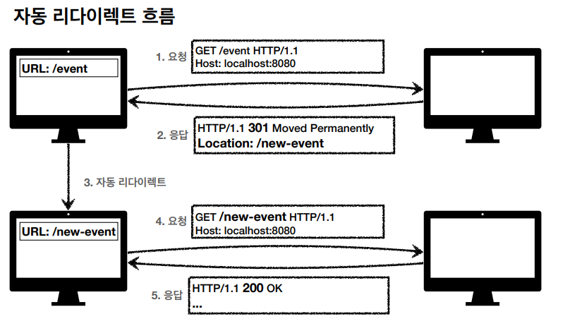
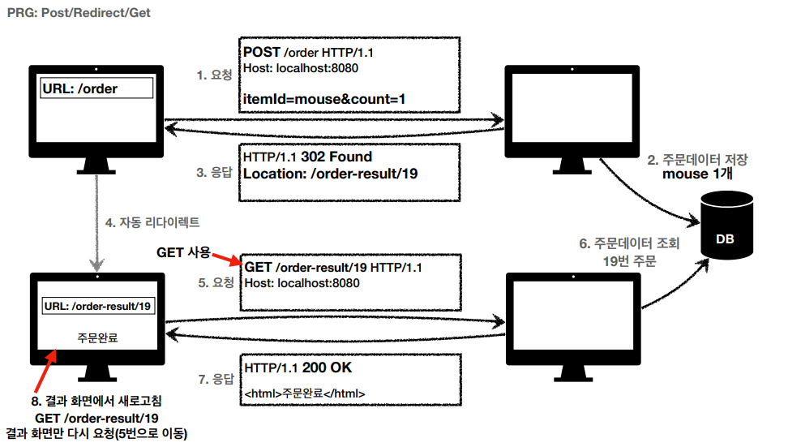

# HTTP 상태코드
클라이언트가 보낸 요청의 처리 상태를 응답에서 알려주는 기능
- 100번대( Informational ) : 요청이 수신되어 처리중
  - 거의 사용되지 않음
- 200번대( Successful ) : 요청 정상 처리
- 300번대 ( Redirection ) : 요청을 완료하려면 추가 행동이 필요
- 400번대 ( Client Error ) : 클라이언트 오류, 잘못된 문법등으로 서버가 요청을 수행할 수 없음
- 500번대 ( Server Error ) : 서버 오류, 서버가 정상 요청을 처리하지 못함
> ### 만약 모르는 상태코드가 나타나면?
- 클라이언트가 인식할 수 없는 상태코드를 서버측에서 반환하면?
- 클라이언트는 상위 상태코드로 해석해서 처리한다.
  - 몇번대 상태코드인지 큰 범위에서 해석한다.
- 미래에 새로운 상태 코드가 추가되어도 클라이언트를 변경하지 않아도 된다.
***
## 200번대( 성공 )
- 200 OK
- 201 Created
- 202 Accepted
- 204 No Content
> ### 200 OK
- 서버측에서 요청을 정상적으로 처리했을 때
> ### 201 Created
- 요청이 성공해서 새로운 리소스가 생성됐을 때
- 생성된 리소스는 응답의 ```Location``` 헤더 필드로 식별한다.

> ### 202 Accepted
- 요청이 접수되었으나 아직 처리가 완료되지 않았을 때
- 배치 처리 같은 곳에서 사용 
  - 요청 접수 후 1시간 뒤에 배치 프로세스가 요청을 처리하는 상황
> ### 204 No Content
- 서버가 요청을 성공적으로 수행했지만, ***응답 페이로드***(전송되는 데이터를 의미한다.) 본문에 보낼 데이터가 없을 때
- 웹 문서 편집기의 save 버튼
  - save 버튼의 결과로 아무 내용이 없어도 된다.
  - save 버튼을 눌러도 같은 화면을 유지해야 한다. 
- 결과 내용이 없어도 상태코드가 200번대 이므로 요청은 성공했음을 확인할 수 있다.

***
## 300번대( 리다이렉션 )
요청을 완료하기 위해 유저 에이전트의 추가 조치가 필요
- 300 Multiple Choices
  - 거의 사용하지 않는다.
- 301 Moved Permanently
- 302 Found
- 303 See Other
- 304 Not Modified
- 307 Temporary Redirect
- 308 Permanent Redirect
> ### '리다이렉션'이란?
- 웹 브라우저는 300번대 응답 결과에 ```Location``` 헤더가 있으면, ```Location``` 위치로 자동 이동한다. ( 리다이렉트 )
- 웹 브라우저가 자체적으로 서버에 새로운 요청을 보낸다.

    
> ### 리다이렉션의 종류
- 영구 리다이렉션: 특정 리소스의 URI가 영구적으로 이동한다.
  - 예) /memebers -> /users
  - 예) /event -> /new-event
- 일시 리다이렉션: 일시적인 변경
  - 주문 완료 후 주문 내역 화면으로 이동
  - PRG: POST/Redirect/GET
- 특수 리다이렉션
  - 결과 대신 캐시를 사용

> ### 영구 리다이렉션( 301, 308 )
- 리소스의 URI가 영구적으로 이동
- 원래의 URL을 사용하지 않는다. 검색 엔진 등에서도 변경을 인지할 수 있다.
- **301 Moved Permanently**
  - 리다이렉트시 요청 메소드가 GET으로 변한다. 본문이 제거**될 수도** 있다.
- **308 Permanent Redirect**
  - 기본적으로 301과 같은 기능
  - 리다이렉트시 요청 메서드와 본문을 유지한다.

> ### 일시적 리다이렉션( 302, 303, 307 )
- 리소스의 URI가 일시적으로 변경
- 따라서 검색 엔진 등에서 URL을 변경하면 안된다.
- **302 Found**
  - 리다이렉트 시 요청 메서드가 GET으로 변하고, 본문이 제거**될 수도** 있다.
- **307 Temporary Redirect**
  - 302와 기능이 같다.
  - 리다이렉트 시 요청 메서드와 본문을 유지한다. ( ***요청 메서드를 절대 변경하면 안된다!*** )
- **303 See Other**
  - 302와 기능이 같다.
  - 리다이렉트 시 요청 메서드가 **반드시** GET으로 변경된다.
> ### PRG: POST/Redirect/GET
- POST로 주문 후에 웹 브라우저를 새로고침하면?
  - 새로고침은 다시 요청을 보낸다.
  - 중복 주문이 발생할 수 있다.
- 이를 방지하기 위해 PRG를 사용한다.
  - POST로 주문 후에 새로고침으로 인한 중복 주문 방지
  - POST로 주문 후에 주문 결과 화면을 GET 메서드로 리다이렉트
  - 새로고침해도 결과 화면을 GET으로 조회
  - 중복 주문 대신 결과 화면만 GET으로 다시 요청
  
> ### 기타 리다이렉션
- 300 Muliple Choices: 사용하지 않는다.
- **304 Not Modified**
  - 캐시를 목적으로 사용된다.
  - 클라이언트에게 리소스가 수정되지 않았음을 알려준다. 따라서 클라이언트는 로컬 PC에 저장된 캐시를 재사용한다.( 캐시로 리다이렉트 한다. )
  - 304 응답은 응답에 메시지 바디를 포함하면 안된다.( 로컬 캐시를 사용해야 하므로 )
  - 조건부 GET, HEAD 요청 시 사용한다.
> ### 리다이렉션 결론
- 역사
  - 처음 302 스펙의 의도는 HTTP 메서드를 유지하는 것이다.
  - 그런데 웹 브라우저들이 대부분 GET으로 변경해버림( 일부는 다르게 동작 )
  - 그래서 모호한 302를 대신하는 명확한 307, 303이 등장함( 301 대응으로 308도 등장 )
- 현실
  - 307, 303을 권장하지만 현실적으로 이미 많은 애플리케이션 라이브러리들이 302를 기본값으로 사용
  - 자동 리다이렉션 시에 GET으로 변해도 되면 그냥 302를 사용해도 큰 문제가 없다.
***
## 400번대
클라이언트 오류
- 클라이언트의 요청에 잘못된 문법등으로 서버가 요청을 수행할 수 없음
- **오류의 원인이 클라이언트에 있다.**
- ***중요!!*** 클라이언트가 이미 잘못된 요청을 보내고 있기 때문에 똑같은 재시도가 발생해도 실패한다.
> ### 400 Bad Request
- 클라이언트가 잘못된 요청을 해서 서버가 요청을 처리할 수 없는 상태일 때
- 요청 구문, 메시지 등등 오류
- 클라이언트는 요청 내용을 다시 검토하고 보내야한다.
  - 예) 요청 파라미터가 잘못되거나, API 스펙이 맞지 않을 때
> ### 401 Unauthorized
- 클라이언트가 해당 리소스에 대한 인증이 필요할 때
- 인증( Authentication )되지 않음
- 401 오류 발생 시 응답에 ```WWW-Authenticate``` 헤더와 함께 인증 방법을 설명
- 참고
  - 인증( Authentication ): 본인이 누구인지 확인( 로그인 )
  - 인가( Authorization ): 권한부여( ADMIN 권한 처럼 특정 리소스에 접근할 수 있는 권한, 인증이 있어야 인가가 있다.)
  - 오류 메시지가 Unauthorized이지만 인증되지 않았다는 뜻이다.( 이름이 아쉽다. )
> ### 403 Forbidden
- 서버가 요청을 이해했지만 승인을 거부한다.
- 주로 인증 자격 증명은 있지만, 접근 권한이 불충분한 경우
  - 예) ADMIN 등급이 아닌 사용자가 로그인 했지만, ADMIN 등급의 리소스에 접근하는 경우
> ### 404 Not Found
- 요청 리소스를 찾을 수 없음
- 요청 리소스가 서버에 없음
- 또는 클라이언트가 권한이 부족한 리소스에 접근할 때, 해당 리소스를 숨기고 싶은 상황에 사용한다.
***
## 500번대
서버 오류
- 서버 문제로 오류가 발생
- 서버에 문제가 있기 때문에 재시도하면 성공할 수도 있음( 서버가 복구됐을 때 )
> ### 500 Internal Server Error
- 서버 문제로 오류가 발생했을 때
- 애매하면 500 오류
> ### 503 Service Unavailable
- 서비스 이용 불가
- 서버가 일시적인 과부하 또는 예정된 작업으로 잠시 요청을 처리할 수 없음
- Retry-After 헤더 필드로 얼마뒤에 복구되는지 보낼 수도 있다.
> ### 주의사항
- 왠만하면 서버에서는 500대 에러를 발생시키면 안된다.
- 어쩔 수 없이 서버가 터졌을 때( 심각한 서버 오류 ) 500 에러를 내보내야 한다.
