# HTTP 헤더 - 일반 헤더
## HTTP 헤더 개요
```header-field``` = ```field-name``` ":" OWS ```field-value``` OWS ( OWS: 띄워쓰기 허용 )
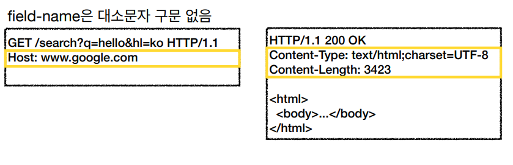
> ### HTTP 헤더 용도
- HTTP 전송에 필요한 모든 부가 정보를 담고있다.
  - 예) 메시지 바디의 내용, 메시지 바디의 크기, 압축, 인증, 요청 클라이언트, 서버 정보, 캐시 관리 정보 등등
- 표준 헤더가 너무 많다.
- 필요시 임의의 헤더를 추가할 수 있다.
> ### HTTP 헤더 분류
- General 헤더: 메시지 전체에 적용되는 정보
- Request 헤더: 요청 정보
- Response 헤더: 응답 정보
- Entity 헤더: 엔티티 바디 정보
  - 예) ```Content-Type: text/html```, ```Content-Length: 3423```
> ### HTTP BODY - message body: RFC 2616( 과거 )
- 메시지 본문( message body )은 엔티티 본문( entity body )을 전달하는데 사용한다.
- 엔티티 본문은 요청이나 응답에서 전달할 실제 데이터를 의미한다.
- 엔티티 헤더는 엔티티 본문의 데이터를 해석할 수 있는 정보를 제공한다.
  - 데이터 유형( html, json ), 데이터 길이, 압축 정보 등등
> ### HTTP BODY - message body: RFC 7230( 최신 )
- 엔티티( Entity ) -> 표현( Representation )
  - Representation = representation Metadata + Representation Data
  - 표현 = 표현 메타데이터 + 표현 데이터
- 메시지 본문( message body )을 통해 표현 데이터를 전달한다.
- 메시지 본문 = 페이로드( payload )
- 표현은 요청이나 응답에서 전달할 실제 데이터이다.
- 표현 헤더는 표현 데이터를 해석할 수 있는 정보를 제공한다.
  - 데이터 유형( html, json ), 데이터 길이, 압축 정보 등등
- 참고: 엄밀히 말하면 표현 헤더는 표현 메타데이터와, 페이로드 메시지를 구분해야한다.
- '표현'이라고 명칭한 이유
  - 리소스가 전달될 때 데이터가 ```html```로 **표현**되거나 ```json```으로 **표현**되기 때문이다.
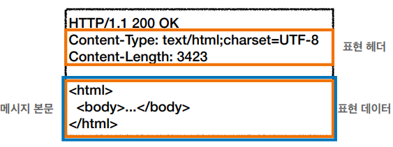

***
## 표현
- ```Content-Type```: 표현 데이터의 형식
- ```Content-Encoding```: 표현 데이터의 압축 방식
- ```Content-Language```: 표현 데이터의 자연 언어
- ```Content-Length```: 표현 데이터의 길이
- 표현 헤더는 전송, 응답 둘 다 사용한다.
> ### Content-Type
- 표현 데이터의 형식을 설명한다.
- 미디어 타입, 문자 인코딩
  - ```text/html;charset=utf-8```
  - ```application/json```
    - 기본 인코딩 타입은 ```UTF-8```이다.
  - ```image/png```
> ### Content-Encoding
- 표현 데이터 인코딩
  - 대표적으로 ```gzip```, ```deflate```, ```identity```가 있다.
- 표현 데이터를 압축하기 위해 사용한다.
- 데이터를 전달하는 곳에서 압축 후 인코딩 헤더를 추가한다.
- 데이터를 읽는 쪽에서 인코딩 헤더의 정보로 압축을 해제한다.
> ### Content-Language
- 표현 데이터의 자연 언어를 표현한다.
- 표현 데이터가 어떤 언어로 구성되었는지 알려준다.
  - ```ko```, ```en```, ```en-US``` 등등
> ### Content-Length
- 표현 데이터의 길이
- 바이트 단위로 표현된다.
- 주의! ```Transfer-Encoding```( 전송 인코딩 )을 사용하면 ```Content-Length```를 사용하면 안된다.

***
## 협상( 콘텐츠 네고시에이션 )
클라이언트가 선호하는 표현 요청을 의미한다. 예를 들어 클라이언트가 특정 회원의 데이터를 원하면 서버 측에서 최대한 클라이언트의 선호에 맞춰 해당 데이터를 전달할 수 있게끔 만들어주는 것이다.
- ```Accept```: 클라이언트가 선호하는 미디어 타입 전달
- ```Accept-Charset```: 클라이언트가 선호하는 문자 인코딩 전달
- ```Accept-Encoding```: 클라이언트가 선호하는 압축 인코딩 전달
- ```Accept-Language```: 클라이언트가 선호하는 자연 언어 전달
- 협상 헤더는 요청시에만 사용한다.
> ### Accept-Language 예시
- ```Accept-Language``` 사용 전
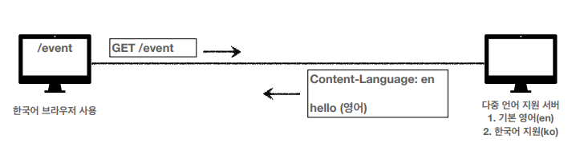
- ```Accept-Language``` 사용 후
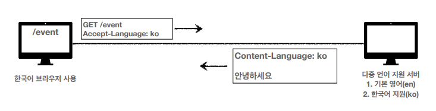
- 복잡한 예시
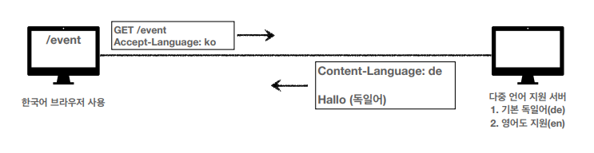
  - 다중 언어 지원 서버가 기본적으로 독일어를 지원한다.
  - 이때 해당 서버가 ```Accept-Language```로 지정한 한국어를 지원하지 않는다면 기본 언어인 독일어를 내보낸다.
  - 클라이언트가 차라리 독일어보단 영어로 된 데이터를 받고싶다면 어떻게 해야하는가?
> ### 협상과 우선순위1( Quality Values(q) )
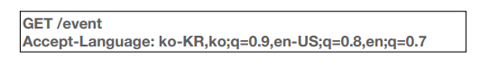
- ```Quality Values(q)``` 값을 사용한다.
- 0~1, 클수록 높은 우선 순위를 갖는다.
- 생략하면 1로 지정된다.

> ### 협상과 우선순위2( Quality Values(q) )
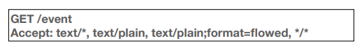
- 구체적인 것이 우선한다.
- 
> ### 협상과 우선순위3( Quality Values(q) )
- 구체적인 것을 기준으로 미디어 타입을 맞춘다.
- 이렇게 구체적으로 들어갈 일이 매우 드물다.

***
## 전송 방식
- 단순 전송
- 압축 전송
- 분할 전송
- 범위 전송

> ### 단순 전송
- ```Content-Length```를 명확히 알 수 있을 때
- 한번에 보내고 한번에 받는다.
> ### 압축 전송
- 데이터를 압축해서 보낸다.
- ```Content-Encoding```을 표기해줘야 한다.
> ### 분할 전송
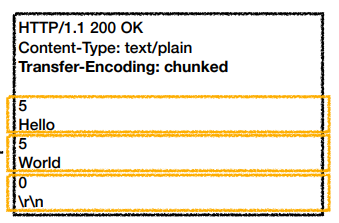
- 5바이트 Hello를 보낸다.
- 5바이트 World를 보낸다.
- 전송 완료.
- **주의!** 분할 전송 시에는 ```Content-Length``` 사용해선 안된다!
  - ```Content-Length```가 가늠이 안되기 때문이다.
> ### 범위 전송
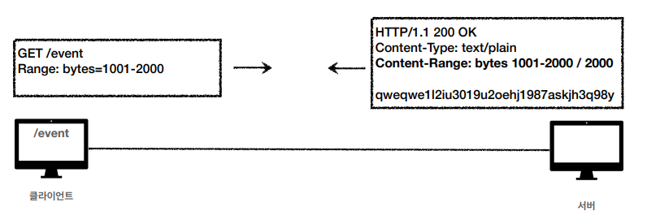

***
## 일반 정보
> ### From
- 유저 에이전트의 이메일 정보
- 일반적으로 잘 사용되지 않는다.
- 검색 엔진 같은 곳에서 주로 사용한다.
- **요청**에서 사용한다.
> ### Referer
- 이전 웹 페이지의 주소 정보( 많이 쓰인다. )
- 현재 요청된 페이지의 이전 웹 페이지 주소 정보
- ```Referer```를 사용해서 유입 경로를 분석할 수 있다.
- **요청**에서 사용한다.
- 참고: referer는 단어 referrer의 오타이다.
> ### User-agent
- 클라이언트의 애플리케이션 정보( 웹 브라우저 정보 등등 )
- 통계 정보
- 어떤 종류의 브라우저에서 장애가 발생하는지 파악할 수 있다.
- **요청**에서 사용한다.
> ### Server
- 요청을 처리하는 ORIGIN 서버의 소프트웨어 정보
  - 클라이언트가 요청을 보냈을때 많은 서버를 거쳐간다.
  - 여기서 실제로 Response 해주는 서버를 ORIGIN 서버라고 부른다.
- ```Server: Apache/2.2.22 (Debian)```
- **응답**에서 사용한다.
> ### Date
- 메시지가 발생한 날짜와 시간
- **응답**에서 사용한다.

***
## 특별한 정보
> ### Host
- 요청에서 사용한다.( ***필수 값*** )
- 하나의 서버가 여러 도메인을 처리해야 할 때
- 하나의 IP 주소에 여러 도메인이 적용되어 있을 때
  - TCP/IP는 IP 로 통신한다.
  - 해당 IP 주소에 접근 후 가상 호스팅으로 만들어진 도메인에 다시 접근
  - 가상 호스트란 싱글 서버에서 여러개의 도메인 이름으로 호스팅하기 위한 방법이다.
> ### Location
- 페이지 리다이렉션
- 웹 브라우저는 300번대 응답의 결과에 ```Location``` 헤더가 있으면, ```Location``` 위치로 자동 이동한다.( 리다이렉트 )
- ```201 Created```: ```Location``` 값은 요청에 의해 생성된 리소스 URI
- ```3xx (Redirection)```: ```Location``` 값은 요청을 자동으로 리다이렉션하기 위한 대상 리소스를 가리킨다.
> ### Allow
- 허용 가능한 HTTP 메서드
- 405 (Method Not Allowd)에서 응답에 포함해야한다.
- 예) ```Allow: GET, HEAD, PUT```
  - ```HEAD``` 메소드는 ```GET```와 동일하지만 메시지 부분을 제외하고 상태줄과 헤더만 반환한다.
> ### Retry-After
- 유저 에이전트가 다음 요청을 하기까지 기다려야하는 시간
- 503( Service Unavailable ): 서비스가 언제까지 불능인지 알려줄 수 있음.
- 날짜를 표기하거나 시간을 표기할 수 있다.( 초단위 )

***
## 인증
> ### Authorization
- 클라이언트 인증 정보를 서버에 전달한다.
- 인증과 관련된 메커니즘은 다양하기 때문에 추후에 구체적으로 공부해야한다.
> ### WWW-Authenticate
- 리소스 접근 시 필요한 인증 방법을 정의한다.
- ```401 Unauthorized``` 응답과 함께 사용한다.

***
## 쿠키
클라이언트가 서버에 로그인 했다. 하지만 클라이언트가 로그인 했음에도 서버는 해당 클라이언트의 정보를 알 수가 없다. HTTP는 **Stateless**하기 때문이다.
- HTTP는 **무상태( Stateless )** 프로토콜이다.
- 클라이언트와 서버가 요청과 응답을 주고 받으면 연결이 끊어진다.
- 클라이언트가 다시 요청하면 서버는 이전 요청을 기억하지 못한다.
- 클라이언트와 서버는 서로 **상태**를 유지하지 않는다.

적절히 서버가 클라이언트의 정보를 알수 있게 해주는 방법은 모든 요청에 사용자 정보를 포함시키는 것이다. 하지만 모든 요청에 사용자 정보를 포함시키면 번거로울 뿐만아니라 보안에도 문제가 생긴다. 이를 해결하기위해 **쿠키**를 사용한다.

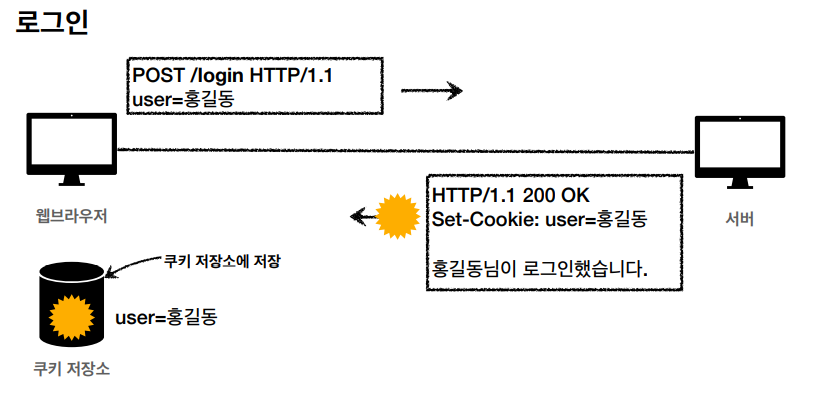
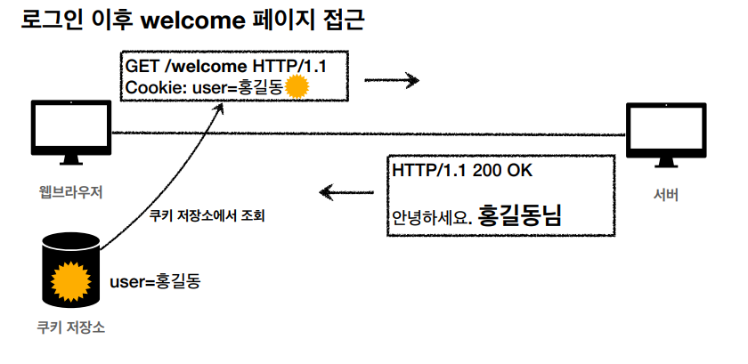

쿠키는 모든 요청에 쿠키 정보를 자동으로 포함시킨다.

> ### 쿠키 사용
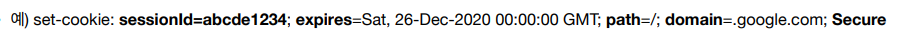
- 사용처
  - 사용자 로그인 세션 관리
  - 광고 정보 트래킹
- 쿠키 정보는 항상 서버에 전송된다.
  - 네트워크 트래픽이 추가로 유발된다.( 항상 추가로 데이터가 전송되기 때문 )
  - 따라서 최소한의 정보만 사용해야한다.( 세션 id, 인증 토큰 )
  - 서버에 전송하지 않고, 웹 브라우저 내부에 데이터를 저장하고 싶으면 웹 스토리지( localStorage, sessionStorage ) 참고
    - 서버에 전송하지 않고 스크립트 내부 로직에서만 사용할 용도라면 웹 스토리지를 사용하는 것이 효율적이다.
- 주의!
  - 보안에 민감한 데이터는 저장하면 안된다.( 주민번호, 신용카드 번호 등등 )
> ### 쿠키의 생명주기
- ```expires```
  - 날짜를 지정한다.
  - 만료일이 되면 쿠키를 삭제한다.
- ```max-age```
  - 초단위로 시간을 지정한다.
  - 0이나 음수를 지정하면 쿠키가 삭제된다.
- 세션 쿠키
  - 만료 날짜를 생략하면 브라우저 종료 시 까지만 유지된다.
- 영속 쿠키
  - 만료 날짜를 입력하면 해당 날짜까지 유지된다.

> ### 쿠키 - 도메인
- 모든 사이트에서 쿠키를 전송하면 문제가 될 수 있다. 도메인을 설정해서 특정 사이트에서만 쿠키가 전송될 수 있도록 설정한다.
  - 예) ```domain=example.org```
- **명시**: 명시한 문서 기준 도메인 + 서브 도메인 포함
  - ```domain=example.org```을 지정해서 쿠키 생성
    - example.org는 물론이고
    - dev.example.org도 쿠키에 접근한다.
- **생략**: 현재 문서 기준 도메인만 적용
  - example.org에서 쿠키를 생성하고 domain을 지정하지 않는다.
    - example.org에서만 쿠키 접근
    - dev.example.org는 쿠키 미접근
  
> ### 쿠키 - 경로
- 예) ```path=/home```
- 이 경로를 포함한 하위 경로 페이지만 쿠키 접근
- 일반적으로 path=/ 루트로 지정한다.( 보통 한 도메인 안에서 쿠키를 다 보내는게 좋기 때문이다. )
  - ```path=/home``` 지정
  - ```/home/level1``` 쿠키 접근 가능
  - ```/home/level1/level2``` 쿠키 접근 가능
  - ```/hello``` 쿠키 접근 불가능

> ### 쿠키 - 보안
- ```Secure```
  - 원래 쿠키는 http, https를 구분하지 않고 전송한다.
  - ```Secure```를 적용하면 https인 경우에만 쿠키를 전송한다.
- ```HttpOnly```
  - XSS 공격 방지
  - 자바스크립트에서 접근 불가( document.cookie )
  - HTTP 전송에만 사용
- ```SameSite```
  - XSRF 공격 방지
  - 요청 도메인과 쿠키에 설정된 도메인이 같은 경우만 쿠키 전송


