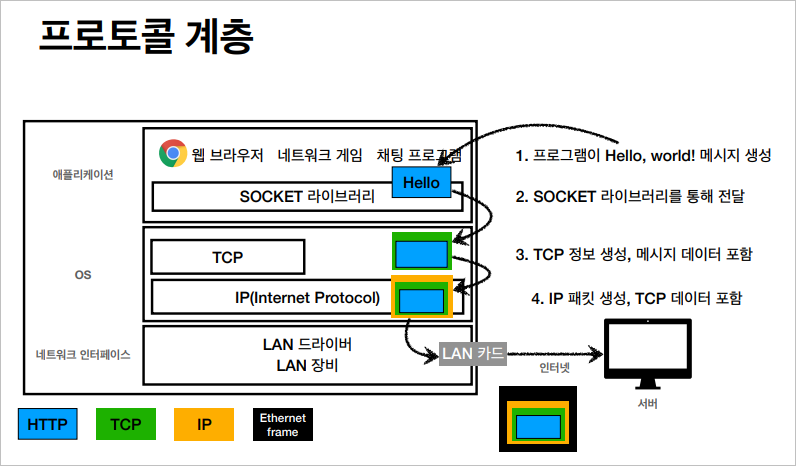

# 인터넷 네트워크

- 인터넷 연결망은 굉장히 복잡하다.
- 멀리 떨어진 다른 컴퓨터와 통신하기 위해서는 인터넷 연결망 안에 있는 수많은 노드를 통과해서 원하는 위치까지 정확히 도달해야 한다.
- 원하는 컴퓨터에 정확히 도달하기 위해서는 **규칙**이 필요하다. 그 규칙이 바로 **인터넷 프로토콜**이다.

## IP (Internet Protocol)

### IP 프로토콜의 역할

- 지정한 IP **주소**(IP Address)에 **데이터** 전달
- **패킷**(Packet)이라는 **통신 단위**로 데이터 전달
- 패킷에는 다음과 같은 정보가 담긴다.
  - 출발지 IP
  - 목적지 IP
  - 데이터
- 인터넷 연결망은 굉장히 복잡하기 때문에 **요청**시 거쳐간 노드와 **응답**을 받아올 때 지나오는 노드가 **서로 다를 수 있다.**

### IP 프로토콜의 한계

- **비연결성**
  - 패킷을 받을 대상이 없거나 서비스 불능 상태여도 패킷이 전송된다.
  - 예를 들어 데이터를 전송했는데 수신 대상의 컴퓨터가 꺼져있어도 데이터가 전송된다.
- **비신뢰성**
  - 중간에 패킷이 사라질 가능성도 있다. (**소실 가능성**이 있다.)
  - 여러개의 패킷을 보냈을 경우 패킷이 순서대로 도착하지 않을 수 있다.
    - 보내는 정보의 크기가 1500byte를 넘을 경우 IP 프로토콜은 데이터를 나눠서 보낸다.
- **프로그램 구분**
  - 같은 IP를 사용하는 서버에서 통신하는 애플리케이션이 둘 이상일 때 구분이 힘들 수 있다.
  - 유튜브를 보면서 게임도 하고 카카오톡으로 연락도 하고있다면 IP 만으로는 프로그램들을 구분하기 힘들다.
- 이러한 한계를 보완해주는 것이 **TCP/UDP**이다.

## TCP / UDP

### 인터넷 프로토콜 스택의 4계층

- **애플리케이션 계층**
  - HTTP
  - FTP
- **전송 계층** 
  - TCP
  - UDP
- **인터넷 계층**
  - IP
- **네트워크 인터페이스 계층**

### 프로토콜 계층

채팅프로그램 구현 시

1. 프로그램이 사용자가 입력한 메세지 생성(전송 데이터)
2. 해당 메세지가 SOCKET 라이브러리를 통해 전달
3. TCP 정보 생성, 메시지 데이터 포함
4. IP 패킷 생성, TCP 데이터 포함
5. 이더넷 프레임이 포함되어 최종적으로 정보가 전달된다.

### TCP/IP 패킷 정보

IP 패킷은 TCP 세그먼트가 씌워진 후에 그 위에 덮힌다.

### TCP 세그먼트가 담고 있는 정보

- 출발지 PORT
- 목적지 PORT
- 전송 제어와 관련된 정보
- 순서와 관련된 정보
- 검증과 관련된 정보

### TCP의 특징

- TCP(Transmission Control Protocol)는 **전송 제어 프로토콜**이다.
- **연결 지향**
  - 상대방의 인터넷과 연결되어 있지 않으면 데이터가 전송되지 않는다.
  - 우선적으로 연결을 진행한 후에 정보를 보낸다.
- **데이터 전달 보증**
  - 중간에 패킷이 소실되거나 누락됐을 때 정보를 보낸 요청자가 그 사실을 확인할 수 있다.
- **순서 보장**
- **신뢰**할 수 있는 프로토콜
- 현재는 대부분 TCP 사용

### 어떻게 연결이 되어있는지 확인할 수 있을까? - TCP 3 way handshake

1. 클라이언트가 **SYN(Synchronize - 접속 요청)**을 보냄
2. 서버가 클라이언트의 SYN을 받고 다시 클라이언트 쪽으로 SYN과 **ACK(요청 수락)**을 보낸다.
3. 클라이언트가 서버의 SYN과 ACK을 받으면 서버로 클라이언트의 ACK을 보낸다.
4. 이후 데이터가 전송된다. (참고로 클라이언트가 서버로 ACK을 보내는 동시에 데이터를 함께 보낼 수 있다.)

> ***주의!***  
> 여기서 말하는 연결은 물리적 연결이 아니라 **가상 연결(논리적 연결)**이다.

### 데이터 전달 보증

클라이언트가 데이터를 전달하면 서버쪽에서 데이터가 제대로 도착했다는 신호를 보낸다.

### 순서 보장

- 패킷 1, 2, 3을 보냈다고 가정
- 서버에 패킷1, 3, 2 순서로 도착
- 서버는 클라이언트 쪽으로 **패킷 2번부터 다시 보내라는 신호를 보냄**
- 클라이언트는 서버로 패킷 2번부터 다시 보낸다.

## UDP 특징

- UDP(User Datagram Protocol)은 사용자 데이터그램 프로토콜을 의미한다.
- UDP는 TCP와 같은 계층에 위치한다. (IP 계층 바로 위)
- UDP는 하얀 도화지에 비유한다 (기능이 거의 없다.)
  - UDP에는 IP와 거의 같다. 단지 **PORT**, **체크섬** 정도만 추가된다.
- TCP는 3 way handshake 때문에 기본적으로 속도가 느리다.
- TCP는 기본적인 기능이 많기 때문에 최적화에 한계가 있다.
  - 따라서 대부분의 최적화는 애플리케이션 단계에서 UDP를 통해 이루어진다.
  - 최근 HTTP3에서 TCP의 최적화를 위해서 UDP를 적극 활용하고 있다.

## PORT

- 한번에 둘 이상 연결해야 한다면?
  - 게임하면서 화상 통화를 하고 동시에 웹브라우저 서버에도 요청을 보낼 때
- 앞으로 TCP 세그먼트와 IP 패킷을 묶어서 **TCP/IP 패킷**이라고 부르기로 한다.
- TCP/IP 패킷에 담기는 정보
  - 출발지 IP/PORT
  - 목적지 IP/PORT 
  - 전송 데이터 
  - TCP에 담기는 기본 정보들
- **PORT는 같은 IP내에서 프로세스를 구분한다.**
- 하나의 서버나 컴퓨터를 아파트에 비유한다면 PORT는 해당 아파트의 동과 호수를 의미한다.

### PORT의 특징

- 0 ~ 65535 까지 할당할 수 있다.
- 0 ~ 1023 까지는 잘 알려진 포트, 사용하지 않는 것이 좋다.
  - FTP - 20, 21
  - TELNET - 23
  - HTTP - 80
  - HTTPS - 443

## DNS

- IP는 기억하기 어렵다.
- IP는 변경될 수 있다.
- 이를 보완해주는 것이 DNS이다.
- DNS(Domain Name System)은 **도메인 네임 시스템**을 의미한다.
  - 전화번호부의 역할을 한다.
  - **도메인 명을 IP 주소로 변환**한다.
- 도메인을 구매해서 **DNS 서버**에 도메인명과 해당 도메인의 IP를 등록할 수 있다.
