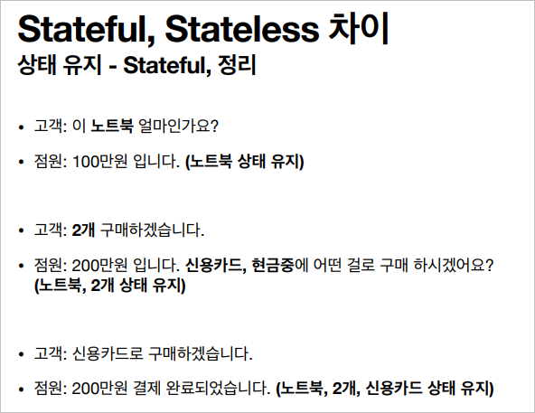
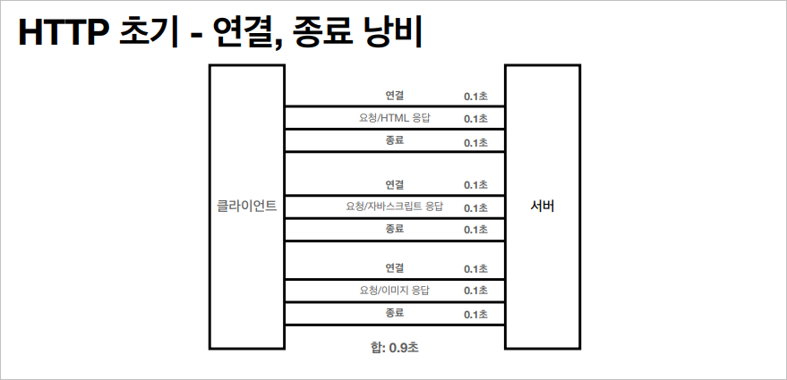

# HTTP

## HTTP (HyperText Transfer Protocol)

- 하이퍼텍스트는 모든 문서가 링크로 연결되는 것을 의미한다.
- 모든 형태의 데이터를 HTTP 메시지에 담아서 전송할 수 있다.
- 서버 간에 데이터를 주고받을 때도 대부분 HTTP를 사용한다.
- 가장 중요한 HTTP 버전은 1997년도에 개발된 **HTTP/1.1**이다.
  - HTTP/2 - 2015년 : 성능개선
  - HTTP/3 - 진행중 : TCP 대신 UDP 사용, 성능 개선

### HTTP의 기반 프로토콜

- TCP
  - HTTP/1.1
  - HTTP/2
  - 해당 버전은 TCP 프로토콜 위에서 동작한다.
- UDP
  - HTTP/3
  - 
### HTTP의 특징

- 클라이언트-서버 구조
- 무상태 프로토콜, 비연결성
- HTTP 메시지
- 단순함, 확장 가능

## 클라이언트 서버 구조

- Request - Response 구조
- 클라이언트는 서버에 **요청**을 보내고 **응답**을 기다린다.
- 서버가 요청에 대한 결과를 만들어서 응답한다.

### 클라이언트-서버를 분리하면 좋은 이유

- 클라이언트 부분 (UI, 프론트엔드)과 서버 부분 (DB, 백엔드)이 독립적으로 발전할 수 있다.
- 클라이언트는 서버에서 어떤 일이 발생하는지 몰라도 되고, 서버가 어떻게 변경되었는지 알 필요가 없다.

## 무상태 프로토콜 ( Stateless )

**무상태 프로토콜은 서버가 클라이언트의 상태를 보존하지 않는 것을 의미한다.**

### Stateful, Stateless 차이

#### 상태유지 (Stateful)

- 중간에 응답 서버가 다른 서버로 바뀌면 안된다.
  - 중간에 노트북을 판매하는 점원이 바뀌면 안된다.
  - <u>중간에 서버가 장애가 나면 클라이언트의 작업에도 차질이 생긴다.</u>
- 다른 서버로 바뀔 때 상태 정보를 다른 서버에게 미리 알려줘야 한다.
  - 중간에 바뀌더라도 전임자가 인수 인계를 잘 해주고 나가야한다.

#### 무상태 (Stateless)

- 중간에 다른 서버로 바뀌어도 된다.
  - 중간에 서버에 장애가 발생하면 다른 서버에서 일을 마저 처리하면 된다.
- 갑자기 클라이언트의 수가 증가해도 서버를 대거 투입할 수 있다.
- 무상태는 응답 서버를 쉽게 바꿀 수 있다. **무한한 서버 증설 가능 (Scale out)**
- 이게 가능한 이유는 무상태에서 클라이언트가 필요한 정보를 전부 서버로 보내기 때문이다.

### Stateless가 절실히 필요한 상황들

- 특정 시간에 맞춰 발생하는 대용량 트래픽
- 예를 들면 선착순 이벤트, 명절 KTX 예약, 학과 수업 등록, 콘서트 티켓팅 등
- 이런 경우 순간 수만명이 동시에 요청을 보내기 때문에 최대한 서버를  **Stateless**하게 설계하는 것이 중요하다.

### Stateless의 한계

- 모든 것을 무상태로 설계할 수 있는 경우가 있고 없는 경우도 있다.
- **Stateless**
  - 로그인이 필요없는 단순한 서비스 소개 화면
- **Stateful**
  - 로그인 기능
- 로그인한 사용자의 경우 로그인 했다는 **상태**를 서버에 **유지**
- 일반적으로 브라우저 쿠키와 서버 세션등을 사용해서 상태유지
- **상태 유지는 최소한으로만 사용해야 한다.**
- **무상태는** 필요한 모든 정보를 서버로 보내기 때문에 **데이터량이 많다는 단점**이 있다.

## 비 연결성( Connectionless )

만약 개별 클라이언트와 서버가 연결을 계속 유지한다고 가정하자. 이 상황에서는 특정 클라이언트가 서비스를 이용하지 않아도 연결이 계속 유지된다. 이로 인해 서버가 클라이언트와 연결하기 위해 사용되는 자원이 낭비되는 문제가 발생하게된다. HTTP는 이와달리 **비 연결성**을 갖고있다. **클라이언트가 요청을 보내고 서버가 해당 요청에 대한 응답을 보내면 TCP/IP 연결이 종료되게 된다.**

- **HTTP**는 기본적으로 **연결을 유지하지 않는 모델**이다.
- 일반적으로 초 단위 이하의 빠른 속도로 요청에 응답한다.
- 1시간동안 수천명이 서비스를 사용해도 실제 서버에서 동시에 처리하는 요청은 수십개 이하로 매우 작다.
- 비 연결성으로 인해 **서버 자원을 매우 효율적으로 사용**할 수 있다.

### 비 연결성의 한계

- TCP/IP 연결을 새로 맺어야한다. - 3 way handshake 시간이 추가된다.
- 웹 브라우저로 사이트를 요청하면 HTML 뿐만 아니라 자바스크립트, CSS, 추가 이미지 등 수 많은 자원이 함께 다운로드된다.

### 비 연결성의 한계 극복

- 지금은 HTTP **지속 연결**(Persistent Connections)로 문제를 해결하고있다.
  - 지속 연결이란 자원 하나를 요청했을 때 이와 묶여있는 모든 자원에 응답하기 위해 연결을 유지하는 상태를 의미한다.
  - 연결 시도 횟수가 줄어들어 효율적이다.
- HTTP/2, HTTP/3에서 더 많은 최적화가 이루어지고 있다.

## HTTP 메시지

- Message-body는 내용이 없으면 생략할 수 있다.

### 시작 라인(요청 메시지)

- **start-line** = request-line / status-line
  - **request-line** = **method** SP(공백) **request-target** SP **HTTP-version** CRLF( 엔터 )

### HTTP 메소드

- 종류 
  - GET, POST, PUT, DELETE
- 서버가 수행해야 할 동작 지정
  - GET : 리소스 조회
  - POST : 요청 내역 처리

### 요청 대상

- absolute-path\[?query]
- 절대경로로 시작하는 경로

### 시작 라인(응답 메시지)

- **status-line** = **HTTP-version** SP **status-code** SP **reason-phrase** CRLF
- **status-code** (HTTP 상태 코드)
  - 클라이언트의 요청의 성공 여부를 나타낸다.
    - `200` : 성공
    - `400` : 클라이언트 요청 오류
    - `500` : 서버 내부 오류
- **reason-phrase**(이유 문구)
  - 사람이 이해할 수 있는 짧은 상태 코드의 설명 글

### HTTP 헤더

- **header-field** 
  - **field-name** ":" OWS **field-value** OWS ( OWS: 띄어쓰기 허용 )
  

- HTTP 전송에 필요한 **모든 부가 정보**가 담겨있다. (메시지 바디를 제외한 모든 메타 데이터가 담겨있다.)
  - 메시지 바디의 내용/종륲
  - 메시지 바디의 크기
  - 압축, 인증
  - 요청 클라이언트(브라우저) 정보
  - 서버 어플리케이션 정보
  - 캐시 관리 정보
  - ...
- 표준 헤더가 너무 많다.
- 필요시 임의의 헤더를 추가할 수있다.

### HTTP 메시지 바디

- 실제 전송할 데이터
  - HTML 문서
  - 이미지
  - 영상
  - JSON 등등
- **byte**로 표현할 수 있는 모든 데이터를 전송할 수 있다.
