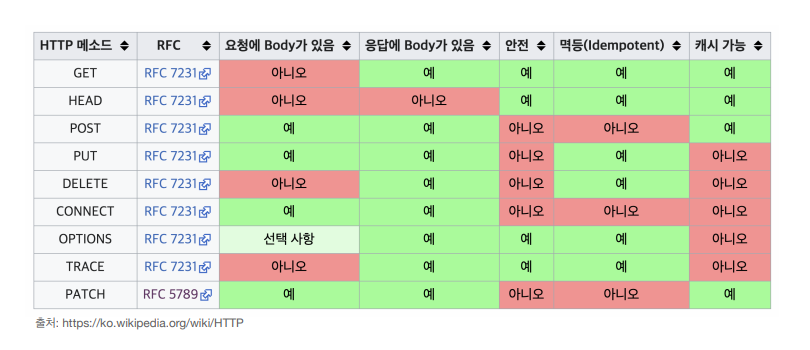

# HTTP Method

## HTTP API 설계 (회원 관리)

회원 정보를 관리하는 API 설계

- 회원 목록 조회: `/read-member-list`
- 회원 조회: `/read-member-by-id`
- 회원 등록: `/create-member`
- 회원 수정: `/update-member`
- 회원 삭제: `/delete-member`

URI 설계 시 가장 중요한 것은 **리소스를 식별하는 것**이다.

### 리소스의 의미는 무엇일까?*

- 예를 들어 "미네랄을 캔다." 에서 리소스는 "미네랄" 이다.
- 따라서 "회원 정보를 조회해라." 에서 리소스는 "회원" 을 의미한다.

> *최근 HTTP 스펙에선 'Resource'가 'Representation' 변경되었으나, 여기서는 표현하기 쉽게 '리소스'로 부르기로 하자.*

### 리소스를 어떻게 식별하는게 좋을까?

- 회원을 등록하고 수정하고 조회하는 **기능들은 모두 배제**한다.
- **회원이라는 리소스만 식별하면 된다.** -> 회원 리소스를 URI에 매핑
- ***가장 중요한 것은 리소스와 행위를 분리하는 것이다!***
- **URI는 리소스만 식별하게 설계하는 것이 좋다.**
  - 리소스: 회원
  - 행위: 조회, 등록, 수정, 삭제, 변경

### API URI 설계

- 회원 목록 조회: `/members`
- 회원 조회: `/members/{id}`
- 회원 등록: `/members/{id}`
- 회원 수정: `/members/{id}`
- 회원 삭제: `/members/{id}`

> 계층 구조상 상위를 컬렉션으로 보고 복수 단어를 사용 권장

그렇다면 행위는 어떻게 구분할 것인가?

## HTTP 메소드 - GET, POST

### HTTP 주요 메소드

- `GET`: 리소스 조회
- `POST`: 요청 데이터 처리, 주로 등록에 사용
- `PUT`: 리소스를 대체, 해당 **리소스가 없으면 새로 생성**
- `PATCH`: 리소스를 **부분적으로 변경**
- `DELETE`: 리소스 삭제
  
### HTTP 기타 메소드

- `HEAD`: `GET`과 동일하지만 메시지 부분을 제외하고 상태줄과 헤더만 반환한다.
- `OPTIONS`: 해당 리소스에 대한 통신 가능 옵션(메소드)을 설명(주로 **CORS**에서 사용)
- 이외에 `CONNECT`와 `TRACE`도 있으나 거의 사용되지 않는다.

### GET

- 리소스 조회
  - **'조회'** 기능을 수행할 때는 `GET`을 사용하는 것이 유리하다.
- 서버에 전달하고 싶은 데이터는 query(쿼리 파라미터, 쿼리 스트링)를 통해서 전달한다.
  
> (HTTP 최근 스펙에서) 메시지 바디를 사용해서 데이터를 전달할 수 있지만, 지원하지 않는 서버가 많아서 권장하지 않는다. (실무에선 **GET 메소드에 메시지 바디를 사용하지 않는다.**)

### POST

- 요청 데이터 처리
- ***메시지 바디를 통해 서버로 요청 데이터를 전달한다.***
- 서버는 요청 데이터를 처리한다.
  - 메시지 바디를 통해 들어온 데이터를 처리하는 모든 기능을 수행한다.
- 주로 전달된 데이터로 신규 리소스 등록, 프로세스 처리에 사용된다.
  - 신규 리소스가 등록되면 새로운 식별자를 생성해서 전달한다.

> **POST는 요청 데이터를 어떻게 처리한다는 것일까?**

- 스펙
  - `POST` 메소드는 대상 리소스가 리소스의 고유한 의미 체계에 따라 요청에 포함된 표현을 처리하도록 요청한다.
- 예를 들어 `POST`는 다음과 같은 기능에 사용된다.
  - HTML 양식에 입력된 필드와 같은 데이터 블록을 데이터 처리 프로세스에 제공한다.
    - 회원가입, 주문 등
  - 게시판, 뉴스 그룹, 메일링 리스트, 블로그 또는 유사한 기사 그룹에 메시지 게시
    - 게시판 글쓰기, 댓글 달기
  - 서버가 아직 식별하지 않은 새 리소스 생성
    - 신규 주문 생성
  - 기존 자원에 데이터 추가
    - 한 문서 끝에 내용 추가하기
  
해당 리소스 URI에 `POST` 요청이 오면 요청 데이터를 어떻게 처리할지 리소스마다 따로 정해줘야 한다. 즉, 정해진 것이 없다.

### POST 정리

- 새 리소스 생성(등록)
  - 서버가 아직 **식별하지 않은 리소스**를 생성한다.
- 요청 데이터 처리
  - 단순히 데이터를 생성하거나, 변경하는 것을 넘어서 **프로세스를 처리**해야 하는 경우
    - 주문에서 결제 완료->배달 시작->배달 완료 처럼 단순히 값 변경을 넘어 **프로세스의 상태가 변경되는 경우**
  - POST의 결과로 **새로운 리소스가 생성되지 않을 수도 있다.**
    - `POST /orders/{orderId}/start-delivery` (컨트롤 URI)
      - **리소스만으로 URI를 설계하는 것이 가장 좋지만 어쩔 수 없는 경우도 존재한다.**
      - 그런 경우 다음과 같이 '행위'를 URI에 포함시키기도 한다. (컨트롤 URI)
- 다른 메소드로 처리하기 애매한 경우
  - 예를 들어 `JSON`으로 조회 데이터를 넘기고 싶은데, `GET` 메소드를 사용하기 어려운 경우
  - 이렇게 애매한 경우엔 리소스를 조회하고 싶어도 `GET`이 아닌 `POST`를 사용한다.

### PUT

- 리소스를 **완전히 대체**
  - 리소스가 있으면 대체
  - 리소스가 없으면 생성
- 클라이언트가 리소스를 식별
  - 클라이언트가 **리소스 위치를 알고 URI 지정**
    - `PUT /members/100 HTTP/1.1`: 100번에 리소스를 생성하겠다!
  - **POST는 클라이언트가 리소스의 정확한 위치를 알지 못한다.**
    - `POST /members HTTP/1.1`: 어디에든 상관없으니 리소스를 생성하겠다!
- **주의! PUT은 리소스를 완전히 대체한다.**
  - 기존 리소스에 나이, 이름, 성별 데이터 필드가 존재했다고 가정하자.
  - 나이 데이터만 변경하고 싶어서 `PUT`을 통해 나이 데이터 값만 전송해준다.
  - 그러면 기존에 존재했던 이름, 성별 데이터 필드가 모두 제거된다.

### PATCH

- 리소스를 **부분 변경**
- `PUT`을 통해 리소스를 부분적으로 수정할 수 없었던 문제를 보완해준다.
- 하지만 가끔 `PATCH`를 지원하지 않는 서버가 존재한다. 이런 경우엔 POST를 사용하면 된다.

### DELETE

- 리소스를 제거

## HTTP 메소드의 속성

### 안전

- 호출해도 리소스를 변경하지 않는다. (`GET`, `HEAD`)
- 그래도 계속 호출해서 서버에 로그가 쌓이면 장애가 발생하지 않는가?
  - HTTP의 안전이라는 속성은 해당 **리소스의 변화만 고려한다.**

### 멱등(Idempotent)

- **같은 요청을 여러번 호출해도 결과가 똑같다.** (`GET`, `PUT`, `DELETE`)
  - `GET`
    - 한 번 조회하든, 두 번 조회하든 같은 결과가 조회된다.
  - `PUT`
    - PUT은 같은 요청을 받으면 **기존 데이터를 덮어쓴다.** 즉 결국 최종 결과물은 동일하다.
  - `DELETE`
    - 결과를 삭제한다. 같은 요청을 여러번 해도 삭제된 결과는 똑같다.

#### 주의

- `POST`
  - **멱등이 아니다.**
  - 두 번 호출하면 같은 결제가 중복해서 발생할 수 있다.

#### 멱등의 활용

- 자동 복구 메커니즘
- 만약 요청에 대한 서버의 응답이 없을 경우 자동적으로 다시 한번 요청을 보내도록 설계한다.
- 멱등인 경우 서버가 TIMEOUT 등으로 정상 응답을 못주었을 때, 클라이언트가 같은 요청을 다시 해도된다.
- 만약 재요청 중간에 다른 곳에서 리소스를 변경해버리면?
  - **멱등은 외부 요인으로 중간에 리소스가 변경되는 것 까지는 고려하지 않는다.**
  - 멱등은 같은 클라이언트가 자신만 같은 요청을 반복했을 때의 결과를 고려한다.

### 캐시가능

- 응답 결과 리스소를 캐시해서 사용해도 되는가?(`GET`, `HEAD`, `POST`, `PATCH`)
- 실제로는 `GET`, `HEAD` 정도만 캐시로 사용한다.
  - `POST`, `PATCH`는 본문 내용까지 캐시 키로 고려해야 하는데, 구현이 쉽지 않다.