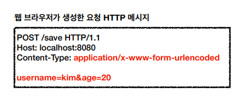
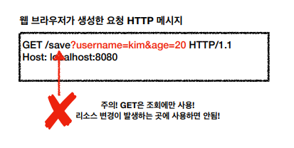

# HTTP Method 활용

- 클라이언트에서 서버로 어떻게 데이터를 보내는지
- HTTP API 설계 예시

## 클라이언트에서 서버로 데이터 전송

### 데이터 전달 방식은 크게 2가지로 나뉜다.

1. 쿼리 파라미터를 통한 데이터 전송
   - `GET`
   - 정렬 필터(검색어)
2. 메시지 바디를 통한 데이터 전송
   - `POST`, `PUT`, `PATCH`
   - 회원 가입, 상품 주문, 리소스 등록, 리소스 변경 등

## 클라이언트에서 서버로 데이터를 전송하는 4가지 상황

### 정적 데이터 조회

- 이미지, 정적 텍스트 문서
- 조회는 `GET`을 사용한다.
- 정적 데이터는 쿼리 파라미터 없이 리소스 경로로 단순하게 조회 가능.

### 동적 데이터 조회

- 주로 검색, 게시판 목록에서 정렬 필터(검색어)
- 조회 조건을 줄여주는 필터, 조회 결과를 정렬하는 정렬 조건에 주로 사용된다.
- 조회는 `GET`을 사용한다.
- `GET`은 쿼리파라미터로 데이터를 전송한다.

### HTML Form을 통한 데이터 전송

#### POST



- HTML Form `submit`시 `POST`로 전송한다.
  - 회원 가입, 상품 주문, 데이터 변경
- `Content-Type: application/x-www-form-urlencoded` 사용 ( 디폴트 값 )
  - form의 내용을 메시지 바디를 통해서 전송한다.(key=value, 쿼리 파라미터 형식)
  - 전송 데이터를 **url encoding** 처리한다.
    - 예) abc김 -> abc%EA%B9%80
- HTML Form은 `GET` 전송도 가능하다.

#### GET



- 데이터가 쿼리 파라미터로 전송된다.

#### Multipart/form-data


- **Content-Type: multipart/form data**
  - 파일 업로드 같은 바이너리 데이터 전송 시 사용한다.
  - 다른 종류의 여러 파일과 폼의 내용과 함께 전송 가능하다.
- 참고로 HTML Form 전송은 `GET`, `POST` 메서드만 지원한다 (`PUT`, `PATCH`, `DELTE` 지원X)

### HTTP API를 통한 데이터 전송

- HTTP Form을 사용하지 않는 대부분의 상황을 의미한다.
- 회원 가입, 상품 주문, 데이터 변경
- Server to Server
  - 백엔드 서버끼리 통신할 때 주로 사용한다.
- 앱 클라이언트
  - 아이폰, 안드로이드
- 웹 클라이언트
  - HTML에서 Form 전송 대신 자바 스크립트를 통한 통신에 사용(AJAX)
  - 예) React, Vue.js 같은 웹 클라이언트와 API 통신
- HTTP API를 사용할 때는 모든 HTTP 메소드를 사용할 수 있다.
  - `POST`, `PUT`, `PATCH`: 메시지 바디를 통해 데이터 전송
  - `GET`: 조회, 쿼리 파라미터로 데이터 전달
- **Content-Type: application/json**을 주로 사용한다.(사실상 표준)
  - TEXT, XML, JSON 등등


## HTTP API 설계 예시

- HTTP API - 컬렉션
  - POST 기반 등록
  - 예) 회원 관리 API 제공
- HTTP API - 스토어
  - PUT 기반 등록
  - 예) 정적 컨텐츠 관리, 원격 파일 관리
- HTML FORM 사용
  - 웹 페이지 회원 관리
  - GET, POST만 지원한다.
  
## 회원 관리 시스템 - POST 기반 등록

### API 설계

- 회원 목록 `/members`: `GET`
- 회원 등록 `/members`: `POST`
- 회원 조회 `/members/{id}`: `GET`
- 회원 수정 `/members/{id}`: `PATCH`, `PUT`, `POST`
  - 주로 `PATCH`를 사용한다.
  - 게시글을 수정할 때는 `PUT`을 사용해도된다.
  - 애매하다 싶으면 천하무적 `POST`를 사용한다.
- 회원 삭제 `/members/{id}`: `DELETE`

### POST - 신규 자원 등록 특징

- 클라이언트는 등록될 **리소스의 URI를 모른다.**
  - 예) `POST /members`
- 서버가 새로 등록된 리소스 URI를 생성해준다.
  
```
HTTP/1.1 201 Created
Location: /members/100
```

- 컬렉션(Collection)
  - 서버가 관리하는 리소스 디렉토리
  - 서버가 리소스의 URI를 생성하고 관리한다.
  - 여기서 컬렉션은 `/members`

## 파일 관리 시스템 - PUT 기반 등록

PUT을 사용하는 경우는 드물다.

### API 설계

- 파일 목록 `/files` -> `GET`
- 파일 조회 `/files/{filename}` -> `GET`
- 파일 등록 `/files/{filename}` -> `PUT`
  - 파일 등록의 경우 **기존에 이미 파일이 존재하면 해당 파일을 신규 파일이 대체해야 한다.**
- 파일 삭제 `/files/{filename}` -> `DELETE`
- 파일 대량 등록 `/files` -> `POST`

### PUT - 신규 자원 등록 특징

- ***클라이언트가 리소스 URI를 알고 있어야 한다.***
  - 예) `PUT /files/star.jpg`
- 클라이언트가** 직접 리소스의 URI를 지정한다.**
- 스토어(Store)
  - 클라이언트가 관리하는 리소스 저장소
  - 클라이언트가 리소스의 URI를 알고 관리한다.
  - 여기서 스토어는 `/files`

## HTML Form 사용

- HTML Form은 `GET`, `POST`만 지원한다.
  - 다른 HTTP 메소드의 기능을 수행하기 위해서는 **컨트롤 URI**를 활용해야한다.
- AJAX와 같은 기술을 사용해서 이러한 제약을 해결할 수 있다.

### 설계

- 회원 목록 `/members` -> `GET`
- 회원 등록 폼 `/members/new` -> `GET`
- 회원 등록 `/members/new`, `/members` -> `POST`
  - 두 가지 방법이 있다.
  - 회원 등록 폼과 회원 등록의 경로를 맞춰주는게 좋다(강사님 의견)
- 회원 조회 `/members/{id}` -> `GET`
- 회원 수정 폼 `/members/{id}/edit` -> `GET`
- 회원 수정 `/members/{id}/edit`, `/members/{id}` -> `POST`
- 회원 삭제 `/members/{id}/delete` -> `POST` 

### 컨트롤 URI

- HTML Form은 `GET`, `POST`만 지원하므로 제약이 있다.
- 이런 제약을 해결하기 위해 **동사로 된 리소스 경로**를 사용한다.
- `POST`의 **`/new`**, **`/edit`**, **`/delete`**가 컨트롤 URI
- HTTP 메소드를 해결하기 애매한 경우 사용한다.(HTTP API 포함)


## 참고하면 좋은 URI 설계 개념

### 문서(document)

- 단일 개념(파일 하나, 객체 인스턴스, 데이터베이스 row)
- 예) `/members/100`, `/files/star.jpg`

### 컬렉션(Collection)

- **서버과 관리하는 리소스 디렉토리**
- 서버가 리소스의 URI를 생성하고 관리한다.
- 예) `/members`

### 스토어(Store)

- **클라이언트가 관리하는 자원 저장소**
- 클라이언트가 리소스의 URI를 알고 관리한다.
- 예) `/files`

### 컨트롤러(controller), 컨트롤 URI

- 문서, 컬렉션, 스토어로 해결하기 어려운 추가 프로세스 실행
- **동사를 직접 사용한다.**
- 예) `/members/{id}/delete`

참조 : https://restfulapi.net/resource-naming
