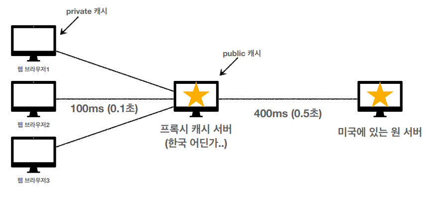
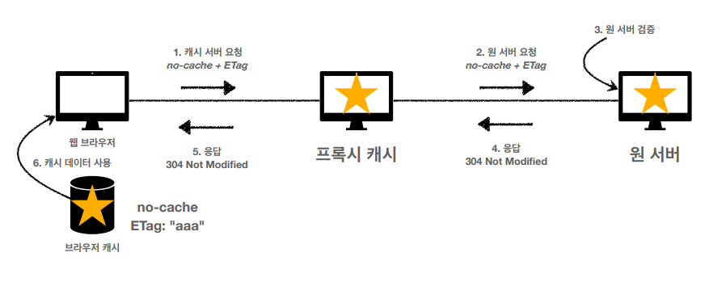
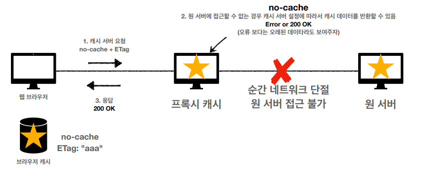

# HTTP 헤더 - 캐시와 조건부 요청

## 캐시 기본 동작

### 캐시가 없을 때

- 클라이언트가 이미지 데이터를 요청할 때마다 서버에서 새롭게 해당 데이터를 전송해준다.
- 데이터가 변경되지 않아도 계속 네트워크를 통해서 데이터를 다운 받아야 한다.
- 이로 인해 브라우저 로딩속도가 느려진다.

### 캐시가 있을 때

- 캐시 덕분에 **캐시 가능 시간동안** 네트워크를 사용하지 않아도 된다.
- 비싼 네트워크 사용량을 줄일 수 있다.
- 브라우저 로딩속도가 빨라진다.
- 예) (응답 헤더)`cache-control: max-age=60`(**초 단위**)

### 캐시 시간 초과했을 때

- 캐시 유효 시간이 초과하면 서버를 통해 데이터를 다시 조회하고 캐시를 갱신한다.
- 이때 다시 네트워크 다운로드가 발생한다.
- 하지만 캐시 시간이 만료됐다고 해서 사용자가 전달받는 데이터가 변하는 것은 아니다.
- 사용자가 갖고있는 이미지 캐시 데이터와 서버가 전송해주는 이미지 데이터가 같다면 캐시 시간이 만료됐다고 해서 다시 다운받을 필요가 있을까?

## 검증 헤더와 조건부 요청

- 캐시 만료 후에도 서버가 데이터를 변경하지 않았을 때
- 생각해보면 데이터를 다시 전송받는 대신 **저장해 두었던 캐시를 재사용**할 수 있다.
- 단! 클라이언트의 **캐시 데이터와 서버의 데이터가 같다는 사실을 확인할 수 있는 방법이 필요**하다.

### 검증 헤더

- **검증 헤더**는 캐시 데이터와 서버 데이터가 같은지 검증하는 데이터이다.
  - `Last-Modified`
  - `Etag`

### 조건부 요청 헤더

- 검증 헤더로 조건에 따른 분기
  - `Last-Modified`(응답), `If-Modified-Since`(요청)
  - `Etag`, `If-None-Match`
  - 조건이 만족하면 `200 OK`
  - 조건이 만족하지 않으면 `304 Not Modified`

### `Last-Modified`, `If-Modified-Since`

- ***```Last-Modified```, ```If-Modified-Since```프로세스***


- 캐시 유효 시간이 초과해도, 서버의 데이터가 갱신되지 않으면 `304 Not Modified` + 헤더 메타 정보만 응답 메시지로 전송한다.(바디는 전송하지 않는다.)
  - 클라이언트는 서버가 보낸 응답 헤더 정보로 캐시의 메타 정보를 갱신한다.
  - 클라이언트는 캐시에 저장되어있는 데이터를 재활용한다.(캐시 저장소로 `Redirect`)
  - 결과적으로 네트워크 다운로드가 발생하지만 용량이 적은 **헤더 정보만 다운로드한다.**
  - 매우 실용적인 해결책
- 서버의 데이터가 갱신되어 클라이언트의 캐시 데이터와 다르다면 `200 OK`, 모든 데이터를 전송한다.
  
### `Last-Modifed`, `If-Modified-Since` 단점

- 1초 미만 단위로 캐시 조정이 불가능하다.
  - 날짜 기반의 로직을 사용하기 때문이다.
  - 날짜 기반 로직에서 시간의 최소단위가 '초'로 설계되어있다.
  - 날짜 기반의 정해진 로직을 사용한다는 것도 단점이 될 수 있다.
- 데이터를 수정해서 날짜가 다르지만, 같은 데이터를 수정해서 데이터의 컨텐츠가 똑같은 경우는 구분하지 못한다.


### `Etag`, `If-None-Match`

서버에서 별도의 캐시 로직을 관리하고 싶은 경우 활용한다.

> 예를 들어 스페이스나 주석처럼 크게 영향이 없는 변화는 무시하고 캐시를 유지하고 싶은 경우

- `Etag`(Entity Tag)
  - 캐시용 데이터에 임의의 고유한 버전 이름을 달아둔다.
  - 예) `Etag:"v1.0"`
- 데이터의 컨텐츠가 변경되면 이름을 바꿔서 변경한다.(`Hash`를 다시 생성한다.)
  - `Hash` 라이브러리는 데이터의 컨텐츠가 같다면 동일한 `Hash` 값을 반환한다.
- 단순하게 `Etag`만 서버에 보내서 같으면 캐시를 유지하고 다르면 데이터를 다시 받는 방식
- **캐시 제어 로직을 서버에서 완전히 관리할 수 있다.** 
  - 클라이언트는 단순히 `Etag` 값을 서버에 제공한다.
  - 클라이언트는 캐시의 메커니즘을 알 수 없게 된다.

## 캐시와 조건부 요청 헤더

### `Cache-Control`

- 캐시 지시어(directives)
- `Cache-Control: max-age`
  - 캐시 유효 시간을 설정
  - 초단위
- `Cache-Control: no-cache`
  - 데이터는 캐시해도 되지만, 항상 원(origin) 서버에 검증하고 사용하라는 의미이다.
  - 원 서버란 중간 서버의 역할을 하는 캐시 서버가 아닌 본 서버를 의미한다. 
- `Cache-Control: no-store`
  - 데이터에 민감한 정보가 있으므로 저장하면 안된다는 의미이다.
  - 메모리에서 사용하고 최대한 빨리 삭제해야한다.

### `Pragma`

- 캐시 제어( 하위 호환 )
- HTTP 1.0 하위 호환이다.
- 거의 사용하지 않는다.
  
### `Expires`

- 캐시 만료일 지정(하위 호환)
- 캐시 만료일을 정확한 날짜로 지정한다.
- **지금은 더 유연한 `Cache-Control: max-age`를 권장한다.**(초 단위로 구분되기 때문)
- `Cache-Control: max-age`와 함께 사용하면 `Expires`는 무시한다.

### 검증헤더(Validator)

- `Etag: "v1.0"`, `Etag: "asid93jkrh2l"`(hash)
- `Last-Modifed: Thu, 04, Jun 2020 07:19:24 GMT`

### 조건부 요청 헤더

> `If-None-Match`, `If-Match`: Etag 값 사용
> `If-Modified-Since`, `If-Unmodified-Since`: Last-Modified 값 사용


## 프록시 캐시



**프록시 캐시란 공용 캐시 저장소**라고 생각하면 된다. 우리가 유튜브 영상을 빠른 속도로 다운받을 수 있는건 프록시 캐시 서버 덕분이다. 최초 요청시에는 프록시 캐시 서버가 존재하지 않는다. 첫번째 요청 이후 프록시 캐시 서버가 만들어지면 두번째 요청부터 속도가 빨라진다. 

### `Cache-Control`

- `Cache-Control: public`
  - 응답이 public 캐시에 저장되어도 된다.
- `Cache-Control: private`
  - 응답이 해당 클라이언트만을 위한 것이다.
  - priavte 캐시에 저장해야한다.(기본값)
- `Cache-Control: s-maxage`
  - 프록시 캐시에만 적용되는 `max-age`
- `Age:60`(HTTP 헤더)
  - 오리진 서버에서 응답 후 프록시 캐시 내에 머문 시간(초)

## 캐시 무효화

- 캐시를 적용하지 않아도 `GET` 요청 시 브라우저가 임의로 캐시하는 경우가 있다.
- 캐시 무효화는 특정 웹에서 캐시를 해선 안될 때 사용한다.
- 확실한 캐시 무효화 응답
  - `Cache-Control: no-cache, no-store, must-revalidate`
  - `Pragma: no-cache`
    - HTTP 1.0 하위 호환
    - 예전 브라우저에서 오는 혹시 모를 요청에 대비 

> ### `Cache-Control`

- `Cache-Control: no-cache`
  - 데이터는 캐시해도 되지만, 항상 원 서버에 검증하고 사용(이름에 주의)
  - 캐시하지 않겠다는 뜻이 아니다.
- `Cache-Control: no-store`
  - 데이터에 민감한 정보가 있으므로 저장하면 안된다는 뜻
  - 메모리에서 사용하고 최대한 빨리 삭제
- `Cache-Control: must-revalidate`
  - 캐시 만료 후 최초 조회 시 원 서버에 검증해야한다.
  - 원 서버 접근 실패 시 반드시 오류가 발생해야한다.
    - `504(Gatway Timeout)`
  - `must-revalidate`는 캐시 유효 시간이 지나지 않았다면 캐시를 사용한다.

### `no-cache` vs``must-revalidate`

#### `no-cache`



  - 오류가 발생하는 것 보다는 예전 데이터라도 고객에게 제공하는 것이 더 낫다고 판단할 수 있다.
  - 이런 경우 `no-cache`라도 프록시 캐시 서버에서 오래된 데이터를 전송해주도록 설정할 수 있다.

<br/>

#### `must-revalidate`


  -`no-cache`와는 다르게 원서버에 접근할 수 없는 경우 **반드시 오류가 발생**하도록 한다.

## 캐시 무효화와 `no-cache`, `must-revalidate`는 무슨 상관이 있는 걸까?(김영한 개발자님 답변)

`no-store`만으로 캐시가 무효화 되어야 하는 것이 맞다.

그런데 HTTP 스펙이라는 것이 모든 상황을 완벽하게 정의했으면 좋겠지만, 디테일하게 들어가면 모호한 부분들이 존재한다.

예를 들어서 웹 브라우저에서 '앞으로 가기', '뒤로 가기'를 했을 때도 이것을 캐시로 볼 것인가? 이때는 `no-store`만 보고 판단할 것인가? `no-cache`를 보고 판단할 것인가?

HTTP 1.1을 지원하지만 조금 오래된 브라우저와의 호환, 그리고 버그. 수 많은 프록시 캐시 업체들과 그 구현 서버 등등...

이런 문제들 때문에 ```no-store```만으로 해결하지는 못하고, 나머지 옵션들도 함께 사용하게 된다. 그래서 구글이나 네이버 등 주요 메이저 사이트의 응답을 보면 ```cache-control: no-cache, no-store, must-revalidate```를 함께 가져간다.

[참고](https://stackoverflow.com/questions/49547/how-do-we-control-web-page-caching-across-all-browsers)