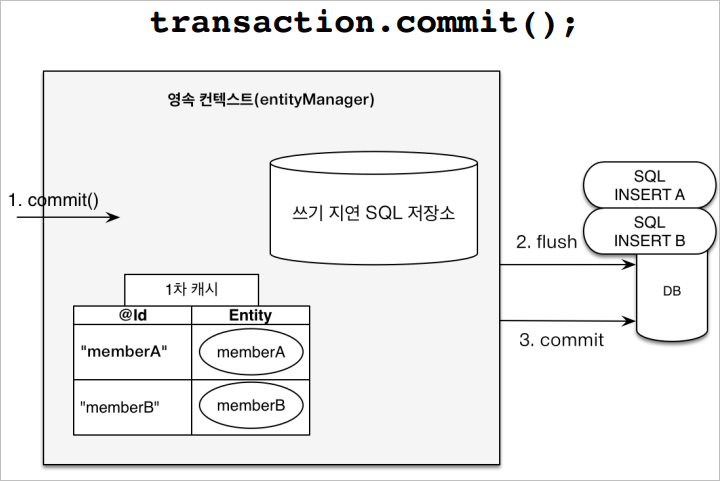

# 영속성 관리 - 내부 동작 방식
## 영속성 컨텍스트
엔티티를  영구 저장하는 환경이라는 뜻이다.
- 영속성 컨텍스트는 논리적인 개념이다.
- 엔티티 매니저를 통해 영속성 컨텍스트에 접근한다.

### 엔티티 매니저 팩토리와 엔티티 매니저

### 비영속 ( new / transient )
- 영속성 컨텍스트와 전혀 관계가 없는 새로운 상태
### 영속 ( managed )
- 영속성 컨텍스트에 관리되는 상태
- 영속 상태가 된다고 해서 바로 DB에 저장되는 것이 아니다.
### 준영속( detached )
- 영속성 컨텍스트에 저장되었다가 분리된 상태
### 삭제( removed )
- 삭제된 상태

### 영속성 컨텍스트의 이점
#### 1차 캐시

#### 동일성( identity ) 보장
1차 캐시로 반복 가능한 읽기( Repeatable Read ) 등급의 트랜잭션 격리 수준을 데이터 베이스가 아닌 애플리케이션 차원에서 제공한다.

#### 엔티티 등록 - 트랜잭션을 지원하는 쓰기 지연
- 엔티티는 `persist` 한다고 DB에 저장되지 않는다.
- 트랜잭션을 커밋하는 순간 DB에 INSERT SQL을 보낸다.
  
  

#### 엔티티 수정 - Dirty Checking( 변경 감지 )

#### 지연 로딩( Lazy Loading )

### 플러시
- 영속성 컨텍스트의 변경내용을 DB에 반영한다.
- 영속성 컨텍스트에 저장된 내용을 DB에 넘겨주는 작업이라고 보면 된다.

#### 플러시 발생
- 변경 감지
- 수정된 엔티티를 쓰기 지연 SQL 저장소에 등록한다.
- 쓰기 지연 SQL 저장소의 쿼리를 DB에 전송한다.
- 플러시를 한다고 DB에 전달된 내용이 `commit`되는 것은 아니다!

#### 영속성 컨텍스트를 플러시하는 방법
- `em.flush()` - 직접 호출
- 트랜잭션 커밋 - 플러시 자동 호출
- JPQL 쿼리 실행 - 플러시 자동 호출
  - JPQL 조회문을 실행했는데 해당 데이터가 DB에 존재하지 않으면 에러가 발생한다.
  - 이런 오류들을 방지하기 위해 JPQL 쿼리 실행시 무조건 플러시를 호출하도록 설계되어있다.

#### 플러시는...
- 영속성 컨텍스트를 비우지 않는다.
- 영속성 컨텍스트의 변경 내용을 DB에 동기화한다.
- 트랜잭션이라는 작업 단위가 중요하다.
  - 커밋 직전에만 동기화하면 된다.

### 준영속 상태
- 영속 상태의 엔티티가 영속성 컨텍스트에서 분리( detached )
  - 영속 상태가 되는 경우
    - `em.persist()` 할 때
    - 1차 캐시에 저장되어있지 않아 DB에서 데이터를 조회했을 때
- 영속성 컨텍스트가 제공하는 기능을 사용하지 못한다.
- 준영속 상태로 만드는 방법
  - `em.detach()`
    - 특정 엔티티만 준영속 상태로 전환
  - `em.clear()`
    - 영속성 컨텍스트를 완전히 초기화
  - `em.close()`
    - 영속성 컨텍스트를 종료