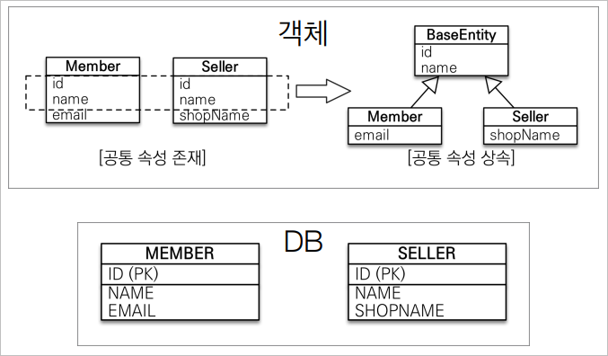

# 고급 매핑
## 상속관계 매핑
- 관계형 데이터베이스에는 상속 관계가 존재하지 않는다.
- 슈퍼타입 서브타입 관계라는 모델링 기법이 객체의 상속과 유사하다.
- 상속관계 매핑은 객체의 상속구조와 DB의 슈퍼타입 서브타입 관계를 매핑하는 것이다.

### 관계형 데이터 베이스에서 상속관계를 매핑하는 법
- 조인 전략( JOINED )
  - **가장 정규화된 방법**
- 단일 테이블 전략( SINGLE_TABLE )
- 구현 클래스마다 테이블 전략( TABLE_PER_CLASS )
- 상속 관계 매핑 전략을 변경할 떄 JPA를 사용하면 단순히 어노테이션만 변경해주면 된다는 장점이 있다.

### 조인 전략
**기본적으로 조인 전략이 가장 정석적인 방법이다.**
- `@Inheritance(strategyType.JOINED)`
  - 조인 전략 사용
- `@DiscriminatorColumn`
  - 테이블에 DTYPE을 생성해주는 어노테이션
  - DTYPE은 왠만하면 넣어주는 것이 좋다.
  - DTYPE에 사용될 엔티티 이름을 변경하고 싶다면?
    - 자식 엔티티에 `@DiscriminatorValue("바꿀 이름")` 어노테이션 추가

#### 장점
- 데이터가 정규화되어 있다.
- 외래키 참조 무결성 제약 조건 활용 가능하다.
  - ITEM_ID를 봐야하는 경우에 ITEM 테이블만 보면 된다.
  - 자식 테이블까지 살펴보지 않아도 되기 떄문에 깔끔하다.
- 저장 공간 효율화

#### 단점
- 조회시 조인을 많이 사용되기 때문에 성능이 저하된다.
- 데이터 저장시 INSERT 쿼리가 두번 실행되기 때문에 성능이 저하된다.
- 조회 쿼리가 복잡하다.

### 단일 테이블 전략
- `@Inheritance(strategyType.SINGLE_TABLE)`
  - 기본값이다.
- 단일 테이블 전략의 경우 DTYPE은 필수다.
- ***단일 테이블 전략은 비즈니스 적으로 정말 단순한 경우에 사용하는게 좋다.***

#### 장점
- 조인이 필요 없으므로 일반적으로 조회 성능이 빠르다.
  - INSERT 쿼리가 한번만 실행된다.
  - 조인할 필요가 없다.
- 조회 쿼리가 단순하다.

#### 단점
- 자식 엔티티가 매핑한 컬럼은 모두 null 허용
- 단일 테이블에 모든 것을 저장하므로 테이블이 커질 수 있다.
- 상황에 따라 오히려 조회 성능이 오히려 느려질 수 있다.

### 구현 클래스마다 테이블 전략
- `@Inheritance(strategyType.TABLE_PER_CLASS)`
- ***사용하면 안되는 전략이다.***
  - 예를 들어 정산을 해야하는 상황에 각 테이블을 통합해서 쿼리하기가 어렵다.
  - 여러 자식 테이블을 함께 조회할 때 성능이 느리다( UNION SQL 사용 )

## @MappedSuperclass
**공통 매핑 정보가 필요할 때 사용한다.**

- BaseEntity에 `@MappedSuperclass` 어노테이션을 추가해줘야한다.
- 상속 관계 매핑이 아니다.
- BaseEntity는 엔티티도 아니고, 테이블과 매핑되지도 않는다.
- BaseEntity를 상속받는 자식클래스에 매핑 정보만 제공해준다.
- 조회, 검색이 불가능하다.
  - `em.find(BaseEntity.class)` 불가능
- 직접 생성해서 사용할 일이 없으므로 추상 클래스 사용을 권장한다.
- 테이블과 관계 없고 단순히 엔티티가 공통으로 사용하는 매핑 정보를 모으는 역할이다.
- 주로 등록일, 수정일, 등록자, 수정자와 같이 전체 엔티티에서 공통으로 사용하는 정보를 한 곳에 모을 때 사용한다.

> **참고**  
`@Entity` 클래스는 엔티티나 `@MappedSuperclass`로 지정한 클래스만 상속 가능하다.

## 그렇다면 실무에서 상속 관계 매핑이 많이 사용되는가?
- 상황에 따라 다르다.
- 애플리케이션이 크지 않을 경우엔 최대한 객체 지향적으로 설계하는게 좋다.
- 애클리케이션이 커지고 데이터 수가 많아지면 최대한 테이블을 단순화하는게 성능적으로 유리하다.
- 예를 들어 데이터 수가 많아져서 성능이 저하됐을 때, Item을 상속받는 Book이나 Movie 같은 엔티티를 단순 JSON 데이터로 테이블에 말아넣는 경우도 있다.

