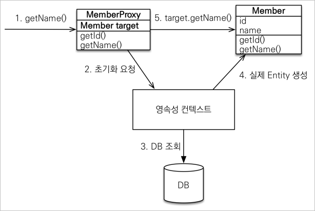

# 프록시와 연관관계
## 프록시
- `em.find()`
  - DB를 통해서 실제 엔티티 객체를 조회한다.
- `em.getReference()`
  - DB 조회를 미루는 가짜 엔티티 객체( 프록시 )를 조회한다.
  - `getReference()`가 호출되는 시점에서는 select 쿼리문이 나가지 않는다.
  - `getReference()`를 통해 불러온 프록시를 활용해서 특정 데이터를 조회할 때 DB에 select 쿼리문을 전송한다.
  
### 프록시 특징
- 실제 클래스를 상속 받아서 만들어진다.
- 실제 클래스와 겉 모양이 같다.
- 사용하는 입장에서는 진짜 객체인지 프록시 객체인지 구분하지 않고 사용하면 된다.
- 프록시 객체는 처음 사용할 때 한번만 초기화된다.
- 프록시 객체를 초기화 할 때, ***프록시 객체가 실제 엔티티로 바뀌는 것이 아니다.초기화되면 프록시 객체를 통해서 실제 엔티티에 접근 가능해지는 것이다.***
- 프록시 객체는 원본 엔티티를 상속받는다. 따라서 타입 체크시 주의해야한다. ( 타입을 체크할 때 `==` 비교시 `false`가 반환된다. 대신 `instance of` 사용하자 )
  - 언제 프록시 객체가 넘어올 지 실제 객체가 반환될 지 정확히 파악하기 힘들기 때문!
- 영속성 컨텍스트에 찾는 엔티티가 이미 있으면 `em.getReference()`를 호출해도 실제 엔티티가 반환된다.
  - ***JPA는 한 트랜잭션 안에서 같은 엔티티를 `==` 비교시 항상 `true`가 반환되는 것을 보장한다.***
    - 만약 한 트랜잭션 안에서 `find()`로 `Member` 클래스 호출하고 이후 `getReference()`로 동일한 `Member` 클래스를 호출하면 **후자는 프록시 객체가 아니라 실제 엔티티를 불러온다.**
    - 만약 한 트랜잭션 안에서 `getReference()`로 `Member` 클래스 호출하고 이후 `find()`로 동일한 `Member` 클래스를 호출하면 **후자는 실제 엔티티가 아니라 프록시 객체가 호출된다.**
- 영속성 컨텍스트의 도움을 받을 수 없는 준영속 상태일 때, 프록시를 초기화하면 문제가 발생한다.
  - hibernate는 `LazyInitializationException` 예외를 터뜨린다.
  - 프록시를 초기화하는 요청이 영속성 컨텍스트를 통해 이루어지기 때문이다.

### 프록시 객체의 초기화

- 초기에 프록시 객체의 target은 null인 상태
- `getName()` 요청이 들어왔을 때 target이 null이라면 영속성 컨텍스트에 초기화 요청을 보내고 DB에서 target이 될 실제 Entity를 불러온다.

### 프록시 유틸리티 메소드
- 프록시 인스턴스의 초기화 여부 확인
  - `emf.getPersistenceUnitUtil.isLoaded(Object entity)`
- 프록시 클래스 확인 방법
  - `entity.getClass().getName()` 출력
- 프록시 강제 초기화
  - `org.hibernate.Hibernate.initialize(entity)`

> 참고  
JPA 표준에는 강제 초기화가 없다.  
강제 호출: `member.getName()`

## 즉시 로딩과 지연 로딩
### 지연 로딩 
- `fetch = FetchType.LAZY`를 통해서 프록시로 조회

### 즉시 로딩
- `fetch = FetchType.EAGER`를 통해서 함께 조회

### 프록시와 즉시로딩 주의 사항
- ***실무에선 반드시 지연 로딩만 사용해야한다.***
- 즉시 로딩을 적용하면 예상하지 못한 SQL이 발생한다.
  - 혹여나 JOIN이 수 십개가 걸려있으면 급격한 성능 저하 문제가 생긴다.
- **즉시 로딩은 JPQL에서 N+1 문제를 일으킨다.**
  - createQuery 문으로 조회를 하면 우선적으로 작성된 SQL문이 DB에 전달된다.
  - Member를 조회하는 쿼리문을 작성했다고 가정해보자.
  - 순수하게 Member만 조회하는 쿼리문이 전달된다.
  - 하지만 JPA 설정을 EAGER로 해두었기 때문에, JPA는 연관된 엔티티( Team )를 불러오는 쿼리문을 다시 한번 전송하게 된다.
  - 혹여나 Member들이 속해있는 Team이 서로 다른 경우 해당 Member의 수 만큼 Team을 조회하는 쿼리문이 새로 전달된다.
  - 따라서 최초 Member를 조회하는 쿼리문(1)이 서로다른 N개의 추가 쿼리문을 불러오는 문제가 발생한다.
- `@ManyToOne`, `@OneToOne`은 기본이 즉시 로딩
- `@OneToMany`, `@ManyToMany`는 기본이 지연 로딩

## 영속성 전이: CASCADE
- `@OneToMany(mappedBy = "parent", cascade = CascadeType.ALL)`
- 특정 엔티티를 영속 상태로 만들 때, 연관된 엔티티도 함께 영속 상태로 만들고 싶을때
- 영속성 전이는 연관관계를 매핑하는 것과 아무런 관련이 없다.
- 엔티티를 영속화 할 때 연관된 엔티티도 함께 영속화하는 편리함을 제공할 뿐이다.

### CASCADE 종류
- **ALL**: 모든 라이프 사이클에 적용
- **PERSIST**: 저장할 때만 적용
- **REMOVE**: 삭제할 때만 적용
- MERGE
- REFRESH
- DETACH

### CASCADE를 사용하면 안되는 상황
- ***해당 엔티티를 소유한 엔티티가 하나가 아니라 여러 엔티티일 경우 절대 CASCADE를 사용해선 안된다.***
- CASCADE는 연관된 엔티티가 거의 동일한 라이프 사이클을 공유할 떄 사용한다.
- CASCADE는 단일 소유자일 경우에만 사용한다.

## 고아 객체
- `orphanRemoval = true`
- 부모 엔티티와 연관 관계가 끊어진 자식 엔티티를 자동으로 삭제하는 기능이다.
- 참조하는 곳이 하나일 때만 사용해야한다.
- 특정 엔티티가 개인 소유할 때만 사용해야한다.
- `@OneToOne`, `@OneToMany`만 가능하다.
- `CascadeType.ALL` 또는 `REMOVE`로 설정해두면 `orphanRemoval = true` 설정이 없어도 부모 객체를 제거 했을 때 연관된 자식 객체들이 모두 제거된다.

### 영속성 전이 + 고아 객체
- `CascadeType.ALL` + `orphanRemoval = true`
- 스스로 생명주기를 관리하는 엔티티는 `em.persist()`로 영속화, `em.remove()`로 제거
- 두 옵션을 모두 활성화 하면 부모 엔티티를 통해서 자식의 생명 주기를 관리할 수 있다.
- 도메인 주도 설계(DDD)의 Aggregate Root 개념을 구현할 때 유용하다.