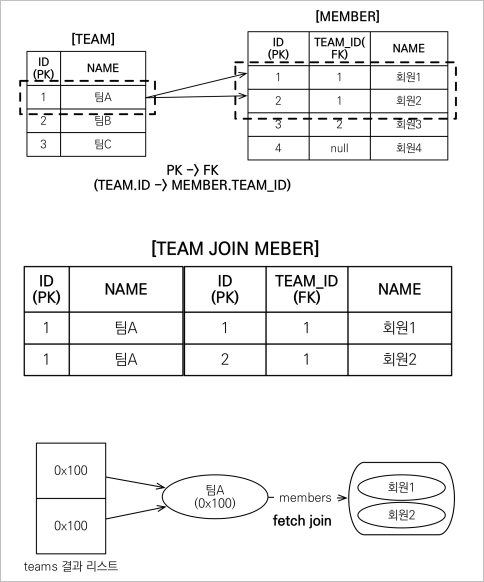
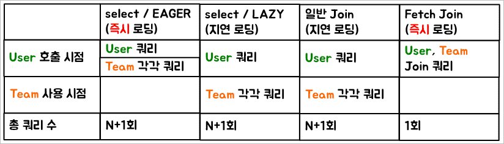

# 객체 지향 쿼리 언어
## 다양한 객체 지향 쿼리 언어들
- JPQL
- JPA Criteria
- QueryDSL
- 네이티브 SQL
- JDBC API 직접 사용, MyBatis, SpringJdbcTemplate 함께 사용

### JPQL
- 가장 단순한 조회 방법
  - `EntityManager.find()`
  - 객체 그래프 탐색( `a.getB().getC()` )
- JPA를 사용하면 엔티티 객체를 중심으로 개발
- 검색을 할 때도 테이블이 아닌 엔티티 객체를 대상으로 검색해야 한다.
- 모든 DB 데이터를 객체로 변환해서 검색하는 것은 불가능하다.
- 애플리케이션이 필요한 데이터만 DB에서 불러오려면 결국 검색 조건이 포함된 SQL이 필요하다.
- JPA는 SQL을 추상화한 JPQL이라는 객체 지향 쿼리 언어를 제공한다.
  - **SQL을 추상화하기 때문에 특정 데이터베이스 SQL에 의존하지 않는다.**
- SQL의 문법과 유사하다.
  - `SELECT`, `FROM`, `WHERE`, `GROUP BY`, `HAVING`, `JOIN` 지원
- **JPQL은 엔티티 객체를 대상으로 쿼리한다.**
- **SQL은 데이터 베이스 테이블을 대상으로 쿼리한다.**

#### JPQL 예시
```java
String jqpl = "select m from Member m where m.username like '%hello%'";
List<Member> = em.createQuery(jpql, Member.class).getResultList();

// JPQL로 동적 쿼리 만드는 법
TypedQuery<Member> query = em.createQuery("select m from Member m where m.username = :username", Member.class);
query.setParameter("username", "member1");
```

### JPA Criteria
- JQPL은 단순 String이기 때문에 동적쿼리를 구성하기가 굉장히 까다롭다.
- JPA Criteria는 문자가 아닌 자바 코드로 JQPL을 작성할 수 있다.
- JPQL 빌더 역할을 수행한다.
- 하지만 너무 복잡하고 실용성이 부족하다.
  - 명료한 SQL 쿼리문에 비해 지나치게 복잡하기 때문에 유지보수가 정말 힘들다.
- Criteria 대신 **QueryDSL 사용을 권장한다.**

#### JPA Criteria 예시
```java
//Criteria 사용 준비
CriteriaBuilder cb = em.getCriteriaBuilder(); 
CriteriaQuery<Member> query = cb.createQuery(Member.class); 

//루트 클래스 (조회를 시작할 클래스)
Root<Member> m = query.from(Member.class); 

//쿼리 생성 CriteriaQuery<Member> cq = 
query.select(m).where(cb.equal(m.get("username"), “kim”)); 
List<Member> resultList = em.createQuery(cq).getResultList();
```

### QueryDSL
- 문자가 아닌 자바 코드로 JQPL을 작성할 수 있다.
- JPQL 빌더 역할을 수행한다.
- **컴파일 시점에 문법 오류를 찾을 수 있다.**
- 동적 쿼리 작성이 편리하다.
- 단순하고 쉽다. 직관적이다.
- **실무 사용 권장**

### 네이티브 SQL
- JPA가 제공하는 SQL을 직접 사용하는 기능
- JPQL로 해결할 수 없는 특정 데이터베이스에 의존적인 기능

#### 네이티브 SQL 예시
```java
String sql = "SELECT ID, AGE, TEAM_ID, NAME FROM MEMBER WHERE NAME = ‘kim’"; 
List<Member> resultList = em.createNativeQuery(sql, Member.class).getResultList();
```

## JPQL( Java Persistenct Query Language )의 기본 문법과 기능
- JPQL은 객체지향 쿼리 언어다. 따라서 테이블을 대상으로 쿼리하는 것이 아니라 엔티티 객체를 대상으로 쿼리한다.
- **JPQL은 SQL을 추상화하기 때문에 특정 데이터 베이스 SQL에 의존하지 않는다.**
- JPQL은 결국 SQL로 변환된다.

### JPQL 문법
- `select m from Member as m where m.age > 18`
- 엔티티와 속성은 대소문자를 구분한다.
  - 엔티티: `Member`
  - 속성: `age`
- JPQL 키워드는 대소문자를 구분하지 않는다.
  - `SELECT`, `FROM`, `where`
- **엔티티 이름을 사용한다.** ( 테이블 이름이 아님 )
- **별칭은 반드시 사용해야 한다.** ( `as`는 생략 가능하다. )

### 집합과 정렬
```
select
    COUNT(m),
    SUM(m.age),
    AVG(m.age),
    MAX(m.age),
    MIN(m.age)
from Member m
```
- `GROUP BY`
- `HAVING`
- `ORDER BY`
- 모두 사용 가능

### TypeQuey, Query
- TypeQuery
  - 반환 타입이 명확할 때 사용한다.
  - `TypeQuery<Member> query = em.createQuery("select m from Member m", Member.class)`
- Query
  - 반환 타입이 명확하지 않을 때 사용한다.
  - `Query<Member> query = em.createQuery("select m.username, m.age from Member m")`
    - `username`은 `String`이고 `age`는 `int` 타입이기 때문에 반환 타입이 명확하지 않다.

### 결과 조회 API
- `query.getListResult()`
  - 결과가 하나 이상일 때 리스트 반환
  - 결과가 없으면 빈 리스트를 반환
- `query.getSingleResult()`
  - 결과가 정확히 하나일 때 단일 객체 반환
  - 결과가 없으면: `javax.persistence.NoResultException`
    - 결과가 없을 때 `Exception`이 발생하는건 굉장히 이상해보인다.
    - Spring Data JPA는 예외 대신 `null`을 반환한다.
    - 최근에는 `Optional<>`을 반환한다.
  - 결과가 둘 이상이면: `javax.persistence.NonUniqueResultException`

### 프로젝션
- `SELECT` 절에서 조회할 대상을 지정하는 것이다.
- 프로젝션 대상
  - 엔티티, 임베디드 타입, 스칼라 타입( 기본 데이터 타입 )
- `SELECT m FROM Member m` : 엔티티 프로젝션
- `SELECT m.team FROM Member m` : 엔티티 프로젝션
  - **좋지 않은 방법이다.**
  - JPQL로 쿼리문을 직접 작성해주는 것이기에 내부적으로 `join` 쿼리가 발생한다면 이를 명시화해주는게 좋다.
  - **`SELECT t FROM Member m join m.team t` : 권장하는 방법**
- `SELECT m.address FROM Member m` : 임베디드 타입 프로젝션
- `SELECT m.username, m.age FROM Member m` : 스칼라 타입 프로젝션
- `DISTINCT`로 중복 제거
  - `SELECT DISTINCT m.username, m.age FROM Member m`
> **참고**<br>
> 프로젝션의 결과값들은 영속성 컨텍스트의 관리를 받는다.

#### 프로젝션 - 여러 타입을 조회해야 할 때
`SELECT m.username, m.age FROM Member m`
- `Object[]` 타입으로 조회 
    ```java
    List<Object[]> resultList = em.createQuery("select m.username, m.age from Member m")

    // 제네릭으로 선언해주면 자동으로 타입 캐스팅이 된다.
    Object[] result = resultList.get(0);
    System.out.println("username = " + result[0]);
    ```
- new 명령어로 조회
  - 단순 값을 DTO로 바로 조회
    ```java
    List<MemberDTO> result = em.createQuery("select new jpql.MemberDTO(m.username, m.age) from Member m", MemberDTO.class)
                    .getResultList();
    ```
    - 엔티티가 아닌 DTO로 조회할 때는 new 명령어로 조회해야한다.
    - QueryDSL을 사용하면 패키지 명을 포함한 전체 클래스명을 적어주지 않아도 된다.

### 페이징 API
- JPA는 페이징을 다음 두 API로 추상화한다.
- `setFirstResult( int startPosition )`
  - 조회 시작 위치( 0부터 시작 )
- `setMaxResults( int maxResult )`
  - 조회할 데이터 수 
  ```java
    List<Member> result = em.createQuery("select m from Member m order by m.age desc", Member.class)
                    .setFirstResult(0)
                    .setMaxResults(10)
                    .getResultList();
  ```

### 조인
- **내부 조인**
  - `SELECT m FROM Member m JOIN m.team t`
  - 조인된 데이터가 없으면 아예 데이터가 출력되지 않음
- **외부 조인**
  - `SELECT m FROM Member m LEFT JOIN m.team t`
  - 조인된 데이터가 없으면 null로 표시되어 출력됨
- **세타 조인**
  - 아무런 관계가 없는 데이터를 조인해야할 때 사용한다.
  - `select count(m) from Member m, Team t where m.username = t.name`

#### 조인 - ON
- ON 절을 활용한 조인( JPA 2.1부터 지원 )
  1. 조인 대상 필터링
     - 예) 회원과 팀을 조인하면서, 팀 이름이 A인 팀만 조인
     - JPQL : `SELECT m, t FROM Member m LEFT JOIN m.team t on t.name = 'A';`
     - SQL : `SELECT m.*, t.* FROM Member m LEFT JOIN Team t ON m.TEAM_ID = t.id and t.name = 'A';`
  2. 연관관계 없는 엔티티 외부 조인( 하이버네이트 5.1 부터 )
     - 예) 회원과 팀의 이름이 같은 대상 외부 조인
     - JPQL : `SELECT m, t FROM Member m LEFT JOIN Team t on m.username = t.name;`
     - SQL : `SELECT m.*, t.* FROM Member m LEFT JOIN Team t ON m.username = t.name;`

> `LEFT JOIN`은 `LEFT OUTER JOIN` 과 같은 말이다.

### 서브 쿼리
- 나이가 평균보다 많은 회원
  - `select m from Member m where m.age > ( select avg(m2.age) from Member m2 )`
- 한 건이라도 주문한 고객
  - `select m from Member m where ( select count(o) from Order o where m = o.member ) > 0`

#### 서브쿼리 지원 함수
- `[NOT] EXISTS( subquery )` : 서브 쿼리에 결과가 존재하면 참
  - `{ALL | ANY | SOME}( subquery )`
    - `ALL`: 모두 만족하면 참
    - `ANY`, `SOME`: 같은 의미, 조건을 하나라도 만족하면 참 
- `[NOT] IN( subquery )`: 서브 쿼리의 결과 중 하나라도 같은 것이 있으면 참

#### 서브 쿼리 예제
- 팀A 소속이 회원
  - `select m from Member m where exists( select t from Team t where t.name = '팀A';`
- 전체 상품 각각의 재고보다 주문량이 많은 주문들
  - `select o from Order o where o.orderAmount > ALL( select p.stockAmount from Product p )`
- 어떤 팀이든 팀에 소속된 회원
  - `select m from Member m where m.team = ANY( select t from Team t )`

#### JPA 서브쿼리의 한계
- JPA는 `WHERE`, `HAVING` 절에서만 서브 쿼리 사용이 가능하다.
- `SELECT`절도 서브쿼리를 사용할 수 있다.( 하이버네이트에서 지원 )
- **`FROM` 절의 서브쿼리는 현재 JPQL에서 불가능하다.**
  - 조인으로 풀 수 있으면 풀어서 해결하면 된다.

### JPQL 타입 표현
- 문자: 'HELLO', 'She''s'
- 숫자: 10L( `Long` ), 10D( `Double` ), 10F( `Float` )
- Boolean: `TRUE`, `FALSE`
- ENUM: `jpabook.MemberType.Admin`( 자바 패키지명을 포함해야한다. )
- 엔티티 타입: `TYPE(m) = Member`( 상속 관계에서 사용한다 )

### JPQL 기타
- 기본적으로 SQL 문법과 같은 식
- `EXISTS`, `IN`
- `AND`, `OR`, `NOT`
- `=`, `>`, `>=`, `<`, `<=`, `<>`
- `BETWEEN`, `LIKE`, `IS NULL`

### JPQL 조건식 - CASE
- 기본 CASE 식
    ```sql
    select
        case when m.age <= 10 then '학생요금'
            when m.age >= 60 then '경로요금'
            else '일반요금'
        end 
    from Member m
    ```
- 단순 CASE 식
    ```sql
    select
        case t.name
            when '팀A' then '인센티브 110%'
            when '팀B' then '인센티브 120%'
            else '인센티브 105%'
        end
    from Team t
    ```
- `COALESCE`
  - 하나씩 조회해서 `null`이 아니면 반환
  - `select coalesce(m.username, '이름없는 회원') from Member m`
    - 사용자 이름이 `null` 이면 `이름없는 회원` 반환
- `NULLIF`
  - 두 값이 같으면 `null` 반환 , 다르면 첫번째 값 반환 
  - `select NULLIF(m.username, '관리자') from Member m`
    - 사용자 이름이 '관리자'면 `null` 을 반환하고 나머지는 본인의 이름을 반환

### JPQL 기본 함수
- `CONCAT`
- `SUBSTRING`
- `TRIM`
- `LOWER`, `UPPER`
- `LENGTH`
- `LOCATE`
  - 해당 문자의 위치를 알려준다.
- `ABS`, `SQRT`, `MOD`
- `SIZE`, `INDEX`( JPA 용도 )
  - `SIZE`: 컬렉션의 크기 반환
- JPQL 표준 함수이므로 DB에 상관없이 사용할 수 있다.

### JPQL 사용자 정의 함수 호출
- 하이버네이트는 사용자 정의 함수를 등록해주지 않으면 인식하지 못한다.
- 따라서 함수 사용전, 방언에 추가해야한다.
  - 사용하는 DB 방언을 상속받고, 사용자 정의함수를 등록한다.
  - `select function('group_concat', i.name) from Item i`

>**참고**<br>
DB가 제공하는 DB 종속적인 함수들은 기본적으로 모두 등록되어있다.

### JPQL 경로 표현식
점을 찍어 객체 그래프를 탐색하는 것
```java
select m.username // 상태필드
from Member m
    join m.team t // 단일 값 연관 필드
    join m.orders o // 컬렉션 값 연관 필드
where t.name ='팀A'
```

#### 경로 표현식 용어 정리
- **상태필드** (state field)
  - 단순히 값을 저장하기 위한 필드
- **연관 필드** (association field)
  - 단일 값 연관 필드
    - `@ManyToOne`, `@OneToOne`, 대상이 엔티티
  - 컬렉션 값 연관 필드
    - `@OneToMany`, `@ManyToMany`, 대상이 컬렉션

#### 경로 표현식 특징
- 상태 필드
  - 경로 탐색의 끝, 더 이상 탐색이 안된다.
- 단일 값 연관 경로
  - 묵시적 내부 조인 발생, 탐색이 가능하다.
- 컬렉션 값 연관 경로
  - 묵시적 내부 조인 발생, 더 이상 탐색이 안된다.
    - `select t.members from Team t`
      - `t.members`는 컬렉션이기 때문에 여기서 더이상 탐색이 안된다.
      - `size` 정도는 탐색할 수 있다.
  - FROM 절에서 명시적 조인을 통해 별칭을 얻으면 별칭을 통해 탐색 가능하다.
    - `select m.username from Team t join t.members m`

> **참고** <br>
> ***실무에서는 묵시적 내부 조인이 발생하도록 쿼리문을 작성하면 안된다.*** <br>
> - 조인은 SQL 튜닝의 중요 포인트
> - 묵시적 조인은 조인이 일어나는 상황을 한눈에 파악하기 어렵다.
>   - 운영 단계에서 유지 보수하기가 굉장히 까다롭다. 만약 DBA가 해당 조인문이 발생하는 쿼리문을 수정해달라고 요청하면 조인이 JPQL 쿼리문에 명시되어있지 않기 때문에 찾기가 힘들다.

#### 명시적 조인, 묵시적 조인
- 명시적 조인
  - join 키워드 직접 사용
  - `select m from Member m join m.team t`
- 묵시적 조인
  - 경로 표현식에 의해 묵시적으로 SQL 조인 발생( 내부 조인만 가능 )
  - `select m.team from Member m `

### JPQL fetch join
***실무에서 너무너무 중요한 내용***
- SQL 조인 종류가 아니다.
- JPQL에서 성능 최적화를 위해 제공하는 기능이다.
- 연관된 엔티티나 컬렉션을 SQL 한번에 함께 조회하는 기능이다.
- `join fetch` 명령어 사용

#### 엔티티 패치 조인
- 회원을 조회하면서 연관된 팀도 함께 ( 한번의 SQL 만으로 )조회하고 싶을 때
- JPQL
  - `select m from Member m join fetch m.team`
- SQL
  - `SELECT M.* T.* FROM MEMBER M INNER JOIN TEAM T ON M.TEAM_ID = T.ID`

> **참고** <br>
> 엔티티를 지연 로딩으로 설정해도 패치 조인이 항상 우선한다.

#### 컬렉션 패치 조인
- 컬렉션 패치 조인은 기본적으로 중복 결과를 모두 호출한다.
    
- 중복을 제거하고 싶다면 `DISTINCT` 명령어를 사용하면 된다.
- JPQL의 `DISTINCT` 2가지 기능 제공
  1. SQL에 `DISTINCT` 추가
     - DB에서 `DISTINCT`는 모든 데이터의 값이 전부 일치해야 중복이라고 인식한다. 식별자만 같다고 중복이 아니다.
  2. 애플리케이션에서 엔티티 중복 제거
     - `DISTINCT`가 추가로 애플리케이션에서 중복 제거 시도
     - 같은 식별자를 가진 `Team` 엔티티를 제거한다.

#### 패치 조인과 일반 조인의 차이
- 일반 조인 실행 시 연관된 엔티티를 함께 조회하지 않는다.
- 패치 조인을 사용할 때만 연관된 엔티티도 함께 조회( 즉시 로딩 )
- 패치 조인은 객체 그래프를 SQL 한번에 조회하는 개념이다.

> **참고**<br>
> 
> - JPQL이 아닌 `em.find()`로 엔티티를 직접 조회할 때 즉시 로딩이면 `User`, `Team`을 `Join` 쿼리로 한번에 조회한다. 

#### 패치 조인의 특징
- 연관된 엔티티들을 SQL 한번으로 조회 - 성능 최적화
- 엔티티에 직접 적용하는 글로벌 로딩 전략보다 우선한다.( 지연 로딩 )
- 실무에서 글로벌 로딩 전략은 모두 지연 로딩
- 최적화가 필요한 곳은 패치 조인 적용

#### 패치 조인의 한계
- 패치 조인 대상에는 별칭을 줄 수 없다. **별칭을 주면 안된다.**
  - 하이버네이트에서는 가능하지만, **가급적이면 사용하지 않는게 좋다.**
  - 패치 조인이라는 것은 기본적으로 나와 관련된 모든 데이터를 가져오기 위한 명령어다.
  - 따라서 패치 조인에 별칭을 주고 데이터를 선별적으로 조회하면 큰 문제가 발생할 수 있다.
  - 만약 조인 패치를 여러 단계로 가져가고 싶을 때는 별칭 사용을 고려해봐도 좋다.
- **둘 이상의 컬렉션을 패치 조인할 수 없다.**
  - 하나의 컬렉션을 패치 조인해도 데이터 뻥튀기가 발생하는데 두개 이상의 컬렉션을 패치조인 한다면 큰 문제가 발생할 수도 있다.
- **컬렉션을 패치 조인하면 페이징 API( `setFirstResult`, `setMaxResults` )를 사용할 수 없다.**
  - **일대일, 다대일 같은 단일 값 연관 필드들은 패치 조인해도 페이징이 가능하다.**
  - 하이버네이트는 경고 로그를 남기고 메모리에서 페이징한다.( 매우 위험한 방법 )
    - 즉 페이징 쿼리를 날리지 않고 DB에 저장된 모든 데이터를 끌고온 후에 메모리 상에서 페이징한다.

> **패치 조인에서 페이징 처리하는법** <br>
> 1. 일대다 관계의 쿼리문을 뒤집어서 다대일 관계의 쿼리문으로 변경한다.<br>
>   `select t From Team t join fetch t.members` -> `select m from Member m join fetch m.team`
> 2. Batch Size를 활용해서 성능 최적화를 한다. <br>
>   `<property name="hibernate.default_batch_fetch_size" value="100"/>` 와 같이 batch size를 글로벌로 설정해서 N+1 문제를 어느정도 해결할 수 있다.
> 
> Batch Size 설정 시 쿼리문
> ```sql
> select
>    members0_.TEAM_ID as team_id5_0_1_,
>    members0_.MEMBER_ID as member_i1_0_1_,
>    members0_.MEMBER_ID as member_i1_0_0_,
>    members0_.age as age2_0_0_,
>    members0_.TEAM_ID as team_id5_0_0_,
>    members0_.type as type3_0_0_,
>    members0_.username as username4_0_0_ 
>from
>    Member members0_ 
>where
>    members0_.TEAM_ID in (
>        ?, ?
>    )
> ```
> - 다음과 같이 IN 명령어로 여러개의 데이터를 한번에 불러온다.

<br>

#### 패치 조인 정리
- 모든 것을 패치 조인으로 해결할 순 없다.
- 패치 조인은 객체 그래프를 유지할 때 사용하면 효과적이다.
  - 예를 들어 `m.team`과 같이 연관 관계를 찾아가야할 때 유용하다.
- 여러 테이블을 조인해서 엔티티가 가진 모양이 아닌 전혀 다른 결과를 내야 한다면, 패치 조인 보다는 일반 조인을 사용하고 필요한 데이터들만 조회해서 DTO로 반환하는 것이 효과적이다.

### JPQL 다형성 쿼리
#### TYPE
- 조회 대상을 특정 자식으로 한정
  - 예) `Item` 중에 `Book`, `Movie`를 조회해라
  - JPQL
    - `select i from Item i where type(i) IN (Book, Movie)`
  - SQL
    - `select i from Item i where i.DTYPE in ('B', 'M')`
#### TREAT( JPA 2.1 )
- 자바의 타입 캐스팅과 비슷한 개념이다.
- 예) 부모인 `Item`과 자식 `Book`이 있다.
  - JPQL
    - `select i from Item i where treat(i as Book).author = 'kim'`
  - SQL
    - 싱글 테이블 전략인 경우 아래와 같은 쿼리가 나간다.
    - `select i.* from Item i where i.DTYPE = 'B' and i.author = 'kim'`

### JPQL - 엔티티 직접 사용
- **JPQL에서 엔티티를 직접 사용하면 SQL에서 해당 엔티티의 기본 키 값을 사용한다.**
  - JPQL
    - `select count(m.id) from Member m`: 엔티티의 아이디를 사용
    - `select count(m) from Member m`: **엔티티를 직접 사용**
  - SQL
    - `select count(m.id) as cnt from Member m`
- 엔티티를 파라미터로 전달
    ```java
    String jpql = "select m from Member m where m = :member";
    List resultList = em.createQuery(jpql)
                        .setParameter("member", member)
                        .getResultList();  
    ```
- 식별자를 직접 전달
    ```java
    String jpql = "select m from Member m where m.id = :memberId";
    List resultList = em.createQuery(jpql)
                        .setParameter("memberId", memberId)
                        .getResultList();  
    ```
- 실행된 SQL
  - `select m.* from Member m where m.id = ?`

#### JPQL - 엔티티 직접 사용 - 외래 키 값
- 엔티티 직접 사용
    ```java
    Team team = em.find(Team.class, 1L); 
    String qlString = “select m from Member m where m.team = :team”; 
    List resultList = em.createQuery(qlString) 
                        .setParameter("team", team) 
                        .getResultList();
    ```
- 식별자를 직접 전달
    ```java
    String qlString = “select m from Member m where m.team.id = :teamId”; 
    List resultList = em.createQuery(qlString) 
                        .setParameter("teamId", teamId) 
                        .getResultList(); 
    ```
- 실행된 SQL
  - `select m.* from Member m where m.team_id = ?`

### JPQL - Named 쿼리
#### Named 쿼리 - 정적 쿼리
- 미리 정의해서 이름을 부여해두고 사용하는 JPQL
- 동적 쿼리는 불가능하고 정적 쿼리에만 사용
- 어노테이션, XML에 정의
- **애플리케이션 로딩 시점에 초기화 후 재사용하는 방식이다.**
- ***애플리케이션 로딩 시점에 쿼리를 검증할 수 있다.***

#### @NamedQuery ( 권장하지 않는 방식 )
```java
@Entity
@NamedQuery(
    name = "Member.findByUsername",
    query="select m from Member m where m.username = :username")
public class Member {
    ...
}
```

```java
List<Member> resultList = 
em.createNamedQuery("Member.findByUsername", Member.class)
    .setParameter("username", "회원1")
    .getResultList();
```

> **참고** <br>
> `NamedQuery` 기능은 Spring Data JPA를 활용하면 `@Query` 어노테이션을 통해 굉장히 편리하게 사용할 수 있다.

### JPQL - 벌크 연산
- 재고가 10개 미만인 모든 상품의 가격을 10% 상승하려면?
- JPA 변경 감지 기능으로 실행하려면 너무 많은 SQL을 실행해야한다.
  1. 재고가 10개 미만인 상품을 리스트로 조회한다.
  2. 상품 엔티티의 가격을 10% 증가시킨다.
  3. 트랜잭션 커밋 시점에 변경 감지가 작동한다.
- 변경된 데이터가 100건이라면 100번의 UPDATE SQL 실행

#### 벌크 연산 예제
- 쿼리 한 번으로 여러 테이블 로우 변경( 엔티티 )
- `executeUpdate()`의 결과는 영향받은 엔티티 수 반환
- `UPDATE`, `DELETE` 지원
- `INSERT`( insert into .. select, 하이버네이트 지원 )
    ```java
    int resultCount = em.createQuery("update Member m set m.age = 20")
                    .executeUpdate();
    ```

#### 벌크 연산 주의
- 벌크 연산은 영속성 컨텍스트를 무시하고 데이터베이스에 직접 쿼리한다.
  - 벌크 연산을 먼저 실행
  - 벌크 연산 수행 후 영속성 컨텍스트를 초기화해줘야 변경 사항이 제대로 반영된다.
  - 영속성 컨텍스트를 초기화해주지 않고 바로 업데이트된 내용을 조회하면 영속성 컨텍스트에 남아있는 1차 캐시정보가 불러와진다.

> **참고** <br>
> Spring Data JPA의 `@Modifying` 기능을 활용하면 쿼리를 날린 후 영속성 컨텍스트를 자동으로 초기화시켜줄 수 있다.