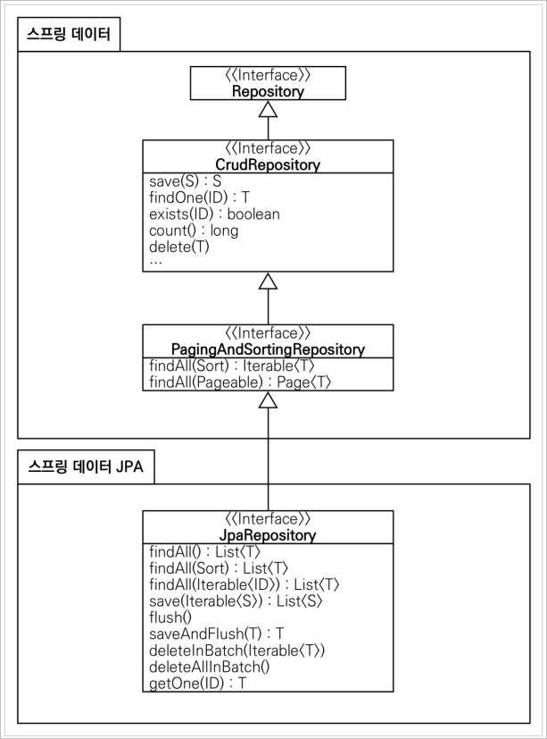

# SpringDataJPA
## 공통 인터페이스 설정
### JpaRepository는 인터페이슨데 구현체 없이 어떻게 동작하는가?
**스프링 데이터 JPA가 구현체 클래스를 대신 생성해준다.**
- `memberRepository.getClass() class com.sun.proxy.$ProxyXXX`
- `@Repository` 어노테이션 생략 가능
  - 스프링 데이터 JPA가 자동으로 컴포넌트 스캔 해준다.
  - JPA 예외를 스프링 예외로 변환하는 과정도 자동으로 처리한다.

## 공통 인터페이스 분석


## 쿼리 메소드 기능
### 메소드 이름으로 쿼리를 생성할 수 있다.
- 조회
  - `find...By`
  - `read...By`
  - `query...By`
  - `get...By`
- COUNT 
  - `count...By`
  - 반환 타입 `long`
- EXIST 
  - `exists...By`
  - 반환 타입 `boolean`
- 삭제
  - `delete...By`
  - `remove...By`
  - 반환 타입 `long`
- DISTINCT
  - `findDistinct`, `findMemberDistinctBy`
- LIMIT
  - `findFirst3`
  - `findFirst`
  - `findTop`
  - `findTop3`

> **참고** <br>
> 이 기능은 엔티티의 필드명이 변경되면 인터페이스에 정의한 메서드 이름도 꼭 함께 변경해야 한다. 그렇지 않으면 애플리케이션을 시작하는 시점에 오류가 발생한다.
> 
> [스프링 공식문서](https://docs.spring.io/spring-data/jpa/docs/current/reference/html/#jpa.query-methods.query-creation)

### `@Query` 기능
Repository에서 직접 쿼리를 작성해줄 수 있다.
```java
@Query("select m from Member m where m.username = :username and m.age = :age")
    List<Member> findUser(@Param("username") String username,
                          @Param("age") int age);
```
- 애플리케이션 로딩 시점에서 쿼리문 오류를 잡아줄 수 있다는 장점이 있다.

### `@Query`로 값, DTO를 조회
- 값 조회
    ```java
    @Query("select m.username from Member m")
    List<String> findUsernameList();
    ```
- DTO 조회
    ```java
    @Query("select new study.datajpa.dto.MemberDto(m.id, m.username, t.name) from Member m join m.team t")
    List<MemberDto> findMemberDto();
    ```

### 파라미터 바인딩
- 반드시 **이름 기반** 파리미터 바인딩으로 사용하자.
- 컬렉션 파라미터 바인딩
    ```java
    @Query("select m from Member m where m.username in :names")
    List<Member> findByNames(@Param("names") List<String> names);
    ```

### 반환 타입
스프링 데이터 JPA는 유연한 반환 타입을 지원한다.
```java
List<Member> findByUsername(String name); //컬렉션
Member findByUsername(String name); //단건
Optional<Member> findByUsername(String name); //단건 Optional
```
- 기존 JPA는 단건 조회 시 결과값이 없으면 `NoResultException`을 반환하지만 Spring Data JPA는 결과값이 없으면 `null`을 반환한다.
  - `Optional` 타입을 사용하면 결과 값이 없을 때 어떻게 처리할지 개발자가 정할 수 있다.
- 만약 단건을 조회했는데 결과값이 2개 이상이면 예외가 발생한다.
  - 기존 JPA - `NonUniqueResultException`
  - Spring Data JPA - `IncorrectResultSizeDataAccessException`
  - 스프링 데이터 JPA는 JPA의 예외를 스프링의 에러로 변환해준다.

## JPA 페이징과 정렬
### 페이징과 정렬 파라미터
- `org.springframework.data.domain.Sort` : 정렬 기능
- `org.springframework.data.domain.Pageable` : 페이징 기능 (내부에 Sort 포함
### 특별한 반환 타입
- `org.springframework.data.domain.Page` : 추가 count 쿼리 결과를 포함하는 페이징
- `org.springframework.data.domain.Slice` : 추가 count 쿼리 없이 다음 페이지만 확인 가능
(내부적으로 `limit` + 1조회)
- `List` (자바 컬렉션): 추가 count 쿼리 없이 결과만 반환

### 페이징과 정렬 사용 예제
```java
Page<Member> findByUsername(String name, Pageable pageable); //count 쿼리 사용
Slice<Member> findByUsername(String name, Pageable pageable); //count 쿼리 사용
안함
List<Member> findByUsername(String name, Pageable pageable); //count 쿼리 사용
안함
List<Member> findByUsername(String name, Sort sort);
```

### `Page<T>`와 `Slice<T>`
```java
Page<Member> findByAge(int age, Pageable pageable);
```
```java
//페이징 조건과 정렬 조건 설정
@Test
public void page() throws Exception {
    //given
    memberRepository.save(new Member("member1", 10));
    memberRepository.save(new Member("member2", 10));
    memberRepository.save(new Member("member3", 10));
    memberRepository.save(new Member("member4", 10));
    memberRepository.save(new Member("member5", 10));
    //when
    PageRequest pageRequest = PageRequest.of(0, 3, Sort.by(Sort.Direction.DESC,
    "username"));
    Page<Member> page = memberRepository.findByAge(10, pageRequest);
    //then
    List<Member> content = page.getContent(); //조회된 데이터
    assertThat(content.size()).isEqualTo(3); //조회된 데이터 수
    assertThat(page.getTotalElements()).isEqualTo(5); //전체 데이터 수
    assertThat(page.getNumber()).isEqualTo(0); //페이지 번호
    assertThat(page.getTotalPages()).isEqualTo(2); //전체 페이지 번호
    assertThat(page.isFirst()).isTrue(); //첫번째 항목인가?
    assertThat(page.hasNext()).isTrue(); //다음 페이지가 있는가?
}
```

#### Page 인터페이스
```java
public interface Page<T> extends Slice<T> {
    int getTotalPages(); //전체 페이지 수
    long getTotalElements(); //전체 데이터 수
    <U> Page<U> map(Function<? super T, ? extends U> converter); //변환기
}
```

#### Slice 인터페이스
```java
public interface Slice<T> extends Streamable<T> {
    int getNumber(); //현재 페이지
    int getSize(); //페이지 크기
    int getNumberOfElements(); //현재 페이지에 나올 데이터 수
    List<T> getContent(); //조회된 데이터
    boolean hasContent(); //조회된 데이터 존재 여부
    Sort getSort(); //정렬 정보
    boolean isFirst(); //현재 페이지가 첫 페이지 인지 여부
    boolean isLast(); //현재 페이지가 마지막 페이지 인지 여부
    boolean hasNext(); //다음 페이지 여부
    boolean hasPrevious(); //이전 페이지 여부
    Pageable getPageable(); //페이지 요청 정보
    Pageable nextPageable(); //다음 페이지 객체
    Pageable previousPageable();//이전 페이지 객체
    <U> Slice<U> map(Function<? super T, ? extends U> converter); //변환기
}
```

#### Count 쿼리 분리
```java
@Query(value = “select m from Member m”,
       countQuery = “select count(m.username) from Member m”)
Page<Member> findMemberAllCountBy(Pageable pageable);
```
- Page 반환 타입은 기본적으로 count 쿼리를 동시에 날리기 때문에 성능에 악영향을 줄 수 있다.
  - `count` 쿼리는 사실 `join`이 필요가 없다. 하지만 Page 반환 타입은 `Count` 쿼리를 날릴 때도 기본적으로 `join`을 모두 걸어버리기 때문에 페이징 쿼리가 복잡해질수록 성능이 느려진다.
- 따라서 `countQuery`문을 별도로 지정하여 `join`문을 제거하고 성능을 최적화할 수 있다.

#### Page를 유지하면서 엔티티를 DTO로 변환하기
```java
Page<Member> page = memberRepository.findByAge(10, pageRequest);
Page<MemberDto> dtoPage = page.map(m -> new MemberDto());
```

#### 벌크성 수정 쿼리
- 벌크 연산 시 주의사항
  - JPQL은 실행되기 직전에 강제로 `flush` 한다.
  - 따라서 벌크 연산( JPQL 실행 ) 이후에 해당 내용이 DB에 반영될 수 있게 추가적으로 `em.flush` 해줘야한다.
  - 해당 내용은 `@Modifying(clearAutomatically = true)` 속성으로 해결할 수 있다

> **참고** <br>
> 스프링 데이터 JPA에서 Update 쿼리를 `@Query` 로 실행할 경우 `@Modifying` 어노테이션을 붙여줘야한다.


## EntityGraph
- 간단하게 쿼리 메소드 기능을 사용하고 싶은데 패치 조인까지 곁들이고 싶을 때 사용하는 기능이다.
    ```java
    @Override
    @EntityGraph(attributePaths = {"team"})
    List<Member> findAll();
    ```
- 간단한 경우엔 `@EntityGraph` 를 사용하고 복잡한 쿼리에는 `@Query` 로 직접 JPQL을 작성해주는게 안전하다.

## JPA Hint & Lock
### Hint
- JPA는 기본적으로 `DirtyChecking` 을 위해 영속성 컨텍스트에 스냅샷을 만들어 놓는다.
- 하지만 데이터를 조회만 한다면 스냅샷을 따로 만들어 두는 것은 성능 저하로 이어질 수 있다.
- 따라서 조회용 쿼리에 `@QueryHints(value = @QueryHint(name = "org.hibernate.readOnly", value = "true"))` 속성을 주게되면 별도의 스냅샷을 생성하지 않게 만들 수 있다.

### Lock
```java
@Lock(LockModeType.PESSIMISTIC_WRITE)
List<Member> findLockByUsername(String username);
```

<br>

# 확장 기능
## 사용자 정의 리포지토리 구현
- 스프링 데이터 JPA 리포지토리는 인터페이스만 정의하고 구현체는 스프링이 자동으로 생성한다.
- 스프링 데이터 JPA가 제공하는 인터페이스를 직접 구현하면 구현해야하는 기능이 너무 많다.
- 다양한 이유로 인터페이스의 메서드를 직접 구현하고 싶다면?
  - JPA 직접 사용( `Entity Manager` )
  - 스프링 JDBC Template 사용
  - MyBatis 사용
  - Querydsl 사용
  - 데이터베이스 커넥션 직접 사용 등등

### 사용자 정의 구현 클래스
- 규칙: 리포지토리 인터페이스 이름 + `Impl`
- 스프링 데이터 JPA가 인식해서 스프링 빈으로 등록

> **참고** <br>
> 실무에서는 주로 QueryDSL 이나 SpringJdbcTemplate을 함께 사용할 때 사용자 정의 리포지토리 기능을 자주 사용한다.

> **참고** <br>
> 항상 사용자 정의 리포지토리가 필요한 것은 아니다. 그냥 임의의 리포지토리를 만들어도 된다. 예를 들어 `MemberQueryRepository`를 인터페이스가 아닌 클래스로 만들고 스프링 빈으로 등록해서 그냥 직접 사용해도 된다. 물론 이 경우 스프링 데이터 JPA와는 아무런 관계 없이 별도로 동작한다.

<br>

## Auditing
- 엔티티를 생성, 변경할 때 변경한 사람과 시간을 추적하고 싶으면?
  - 등록일
  - 수정일
  - 등록자
  - 수정자

### 설정
- `@EnableJpaAuditing` : 스프링 부트 설정 클래스에 적용해야함
- `@EntityListeners(AuditingEntityListener.class)` : 엔티티에 적용
- 등록자, 수정자를 처리해주는 `AuditorAware` 스프링 빈 등록
    ```java
    @Bean
    public AuditorAware<String> auditorProvider() {
        return () -> Optional.of(UUID.randomUUID().toString());
    }
    ```
    - 인터페이스에 메소드가 하나만 있다면 람다를 적용할 수 있다.
    - 실무에서는 세션 정보나 **스프링 시큐리티 로그인 정보**에서 ID를 받는다.

### 사용 어노테이션
- `@CreatedDate`
- `@LastModifiedDate`
- `@CreatedBy`
- `@LastModifiedBy`

> **참고** <br>
> 실무에서는 대부분의 엔티티는 등록 시간, 수정 시간이 필요하지만, 등록자, 수정자는 필요 없을 수도 있다. 그래서 다음과 같이 Base 타입을 분리하고, 원하는 타입을 선택해서 상속한다.

```java
public class BaseTimeEntity {
    @CreatedDate
    @Column(updatable = false)
    private LocalDateTime createdDate;

    @LastModifiedDate
    private LocalDateTime lastModifiedDate;
}
public class BaseEntity extends BaseTimeEntity {
    @CreatedBy
    @Column(updatable = false)
    private String createdBy;

    @LastModifiedBy
    private String lastModifiedBy;
}
```
> **참고** <br>
> 저장 시점에 등록일, 등록자는 물론이고 수정일, 수정자에도 같은 데이터가 저장된다. 데이터가 중복 저장되는 것 같지만 이렇게 해두면 변경 컬럼만 확인해도 마지막에 업데이트한 유저를 확인 할 수 있으므로 유지보수 관점에서 편리하다. 이렇게 하지 않으면 변경 컬럼이 `null` 일때 등록 컬럼을 또 조회해야한다. 참고로 저장 시점에 저장 데이터만 입력하고 싶으면 `@EnableJpaAuditing(modifyOnCreate = false)` 옵션을 사용하면 된다.

<br>

## Web 확장 - 도메인 클래스 컨버터
- HTTP 파라미터로 넘어온 엔티티의 아이디로 엔티티 객체를 찾아서 바인딩

### 도메인 클래스 컨버터 사용 전
```java
@RestController
@RequiredArgsConstructor
public class MemberController {

    private final MemberRepository memberRepository;
    
    @GetMapping("/members/{id}")
    public String findMember(@PathVariable("id") Long id) {
        Member member = memberRepository.findById(id).get();
        return member.getUsername();
    }
}
```

### 도메인 클래스 컨버터 사용 후
```java
@RestController
@RequiredArgsConstructor
public class MemberController {

    private final MemberRepository memberRepository;

    @GetMapping("/members/{id}")
    public String findMember(@PathVariable("id") Member member) {
        return member.getUsername();
    }
}
```
- HTTP 요청은 회원 `id` 를 받지만 도메인 클래스 컨버터가 중간에 동작해서 회원 엔티티 객체를 반환한다.

> **주의** <br>
> 도메인 클래스 컨버터로 엔티티를 파라미터로 받으면, 이 엔티티는 **단순 조회용**으로만 사용해야한다. 트랜잭션이 없는 범위에서 엔티티를 조회했으므로 엔티티를 변경해도 DB에 반영되지 않는다.( 영속성 컨텍스트의 관리를 받지 못함 )

## Web 확장 - 페이징과 정렬
### 페이징과 정렬 예제
```java
@GetMapping("/members")
public Page<Member> list(Pageable pageable) {
    Page<Member> page = memberRepository.findAll(pageable);
    return page;
}
```
- 파라미터로 `Pageable` 을 받을 수 있다.
- `Pageable` 은 인터페이스, 실제는 `org.springframework.data.domain.PageRequest` 객체를 생성한다.
- `Pageable` 을 Json으로 반환하면 다음 항목이 추가된다.
    ```json
    "pageable": {
        "sort": {
        "sorted": true,
        "unsorted": false,
        "empty": false
        },
        "offset": 5,
        "pageNumber": 1,
        "pageSize": 5,
        "paged": true,
        "unpaged": false
    },
    "last": false,
    "totalPages": 20,
    "totalElements": 100,
    "size": 5,
    "number": 1,
    "sort": {
        "sorted": true,
        "unsorted": false,
        "empty": false
    },
    "first": false,
    "numberOfElements": 5,
    "empty": false
    }
    ```

### 요청 파라미터
- 예) `/members?page=0&size=3&sort=id,desc&sort=username,desc`
- `page` : 현재 페이지, `0부터 시작한다.`
- `size` : 한 페이지에 노출할 데이터 건수
- `sort` : 정렬 조건을 정의한다.

#### 기본 값 설정
- 글로벌 설정 - 스프링 부트
```
spring.data.web.pageable.default-page-size=20 /# 기본 페이지 사이즈/
spring.data.web.pageable.max-page-size=2000 /# 최대 페이지 사이즈/
```
- 개별 설정 : `@PageableDefault` 어노테이션을 사용
```java
@GetMapping("/members")
public Page<MemberDto> list(@PageableDefault(size = 5, sort = "id") Pageable pageable) {
    Page<Member> page = memberRepository.findAll(pageable);
    return page.map(MemberDto::new);
}
```

### 접두사
- 페이징 정보가 둘 이상이면 접두사로 구분
```java
public String list(
    @Qualifier("member") Pageable memberPageable,
    @Qualifier("order") Pageable orderPageable, ...
```

### Page 내용을 DTO로 변환하기
- 엔티티를 API로 노출하면 다양한 문제가 발생한다. 따라서 엔티티를 반드시 `DTO`로 변환한 후에 반환해야 한다.
- Page는 `map()` 을 지원해서 내부 데이터를 다른 것으로 변경할 수 있다.

```java
@GetMapping("/members")
public Page<MemberDto> list(Pageable pageable) {
    return memberRepository.findAll(pageable).map(MemberDto::new);
}
```

# 스프링 데이터 JPA 구현체 분석
- 스프링 데이터 JPA가 제공하는 공통 인터페이스의 구현체
- `org.springframework.data.jpa.repository.support.SimpleJpaRepository`
    ```java
    @Repository
    @Transactional(readOnly = true)
    public class SimpleJpaRepository<T, ID> ...{

        @Transactional
        public <S extends T> S save(S entity) {
            if (entityInformation.isNew(entity)) {
                em.persist(entity);
                return entity;
            } else {
                return em.merge(entity);
            }
        }
    ...
    }
    ```
- `@Repository` 적용 : JPA 예외를 스프링이 추상화한 예외로 변환한다.
- `@Transactional` : 트랜잭션 적용
  - JPA의 모든 변경은 트랜잭션 안에서 동작한다.
  - 스프링 데이터 JPA는 변경( 등록, 수정, 삭제 ) 메서드를 트랜잭션 처리한다.
  - 서비스 계층에서 트랜잭션을 시작하지 않으면 리포지토리에서 트랜잭션 시작
  - 서비스 계층에서 트랜잭션을 시작하면 리포지토리는 해당 트랜잭션을 전파받아서 사용한다.
  - 그래서 스프링 데이터 JPA를 사용할 때 트랜잭션 없이도 데이터 등록, 변경이 가능했다.
- `@Transactional(readOnly = true)`
  - 데이터를 단순히 조회만 하고 변경하지 않는 트랜잭션에서 `readOnly = true` 옵션을 사용하면 플러시를 생략해서 약간의 성능 향상을 얻을 수 있음
- ***`save()` 메서드*** ( 매우 중요 )
  - 새로운 엔티티는 저장한다. ( `persist` )
  - 새로운 엔티티가 아니면 병합한다. ( `merge` )

<br>

## 새로운 엔티티를 구별하는 방법
- 새로운 엔티티를 판단하는 기본 전략
  - 식별자가 객체일 때 `null` 로 판단한다.
  - 식별자가 자바 기본 타입일 때 `0`으로 판단한다.
  - `Persistable` 인터페이스를 구현해서 판단 로직을 변경할 수 있다.

### Persistable
```java
package org.springframework.data.domain;

public interface Persistable<ID> {
    ID getId();
    boolean isNew();
}
```
- JPA 식별자 생성 전략이 `@GenerateValue` 면 `save()` 호출 시점에 식별자가 없으므로 새로운 엔티티로 인식해서 정상 동작한다. 
- 그런데 JPA 식별자 생성 전략이 `@Id` 만 사용해서 직접 할당이면 이미 식별자 값이 있는 상태로 `save()` 를 호출한다.
- 따라서 이 경우 `merge()` 가 호출된다.
- `merge()` 는 우선 DB를 호출해서 값을 확인하고 ( `select` ), DB에 값이 없으면 새로운 엔티티로 인지하므로 매우 비효율적이다. 
- 따라서 `Persistable` 를 사용해서 새로운 엔티티 확인 여부를 직접 구현하는게 효과적이다.
- 참고로 등록 시간( `@CreateDate` )을 조합해서 사용하면 이 필드로 새로운 엔티티 여부를 편리하게 확인할 수 있다.

### Persistable 구현
```java
@Entity
@EntityListeners(AuditingEntityListener.class)
@NoArgsConstructor(access = AccessLevel.PROTECTED)
public class Item implements Persistable<String> {

    @Id @Column(name = "item_id")
    private String id;

    @CreatedDate
    @Column(updatable = false)
    LocalDateTime createdDate;

    public Item(String id) {
        this.id = id;
    }

    @Override
    public String getId() {
        return null;
    }

    @Override
    public boolean isNew() {
        return createdDate == null;
    }
}
```

# 나머지 기능들
## Specifications( 명세 )
- 명세라는 개념 자체는 좋지만, 명세를 사용하기 위해 JPA Criteria를 활용해야한다는게 큰 문제다.
- JPA Criteria 는 너무 이론적인 기술이므로 실무에선 권장하지 않는다.

## Query By Example
- Example 객체로 엔티티를 조회하는 방법이다.
    ```java
    public class QueryByExampleTest {
    @Autowired MemberRepository memberRepository;
    @Autowired EntityManager em;
    @Test
        public void basic() throws Exception {
            //given
            Team teamA = new Team("teamA");
            em.persist(teamA);
            em.persist(new Member("m1", 0, teamA));
            em.persist(new Member("m2", 0, teamA));
            em.flush();
            
            //when
            //Probe 생성
            Member member = new Member("m1");
            Team team = new Team("teamA"); //내부조인으로 teamA 가능
            member.setTeam(team);

            //ExampleMatcher 생성, 조회 시 age 프로퍼티는 무시
            ExampleMatcher matcher = ExampleMatcher.matching().withIgnorePaths("age");
            Example<Member> example = Example.of(member, matcher);
            List<Member> result = memberRepository.findAll(example);
            
            //then
            assertThat(result.size()).isEqualTo(1);
        }
    }
    ```
    - `Probe` : 필드에 데이터가 있는 실제 도메인 객체
    - `ExampleMatcher` : 특정 필드를 일치시키는 상세한 정보 제공, 재사용 가능
    - `Example` : `Probe`와 `ExampleMatcher로` 구성, 쿼리를 생성하는데 사용
- 한계
  - 실무에서 사용하기에는 매칭 조건이 너무 단순하고, LEFT 조인이 안된다는 단점이 있다.
  - 실무에서는 QueryDSL 을 사용하는 것을 권장한다.

## Projections
- 엔티티 대신에 DTO를 편리하게 조회할 때 사용한다.
- 프로젝션 주의 사항
  - 프로젝션 대상이 root 엔티티면, JPQL SELECT 절 최적화가 가능하다.
  - 프로젝션 대상이 root가 아니면
    - `LEFT OUTER JOIN` 처리
    - 모든 필드를 `SELECT`에서 엔티티로 조회한 다음에 계산
- 정리
  - 프로젝션 대상이 root 엔티티면 유용하다.
  - 프로젝션 대상이 root 엔티티를 넘어가면 JPQL SELECT 최적화가 안된다.
  - 실무의 복잡한 쿼리를 해결하기에는 한계가 있다.
  - 실무에서는 단순할 때만 사용하고, 조금만 복잡해지면 QueryDSL을 사용하자

## 네이티브 쿼리
- **가급적 네이티브 쿼리는 사용하지 않는게 좋다.** 정말 어쩔 수 없을 때 사용하자.
  - 지원하는 반환 타입이 몇 없다.
  - Sort 파라미터를 통한 정렬이 정상 동작하지 않을 수 있다.
  - JPQL 처럼 애플리케이션 로딩 시점에 문법 오류 확인이 불가능하다.
    - JPQL은 이름 없는 `NameQuery`다.
    - JPQL은 애플리케이션 로딩 시점에 JPQL을 파싱해서 SQL 문으로 변환하는 과정을 거친다.
  - 동적 쿼리 불가능
- 네이티브 SQL을 DTO로 조회할 때는 JdbcTemplate 또는 myBatis를 권장한다.
- 최근에 나온 궁극의 방법 -> 스프링 데이터 Projections 활용


