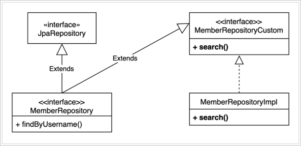

# 설정
```gradle
plugins {
    id 'org.springframework.boot' version ‘2.2.2.RELEASE'
    id 'io.spring.dependency-management' version '1.0.8.RELEASE'
    
    //querydsl 추가
    id "com.ewerk.gradle.plugins.querydsl" version "1.0.10"
    
    id 'java'
}

group = 'study'
version = '0.0.1-SNAPSHOT'
sourceCompatibility = '1.8'

configurations {
    compileOnly {
        extendsFrom annotationProcessor
    }
}

repositories {
    mavenCentral()
}

dependencies {
    implementation 'org.springframework.boot:spring-boot-starter-data-jpa'
    implementation 'org.springframework.boot:spring-boot-starter-web'
    
    //querydsl 추가
    implementation 'com.querydsl:querydsl-jpa'
    
    compileOnly 'org.projectlombok:lombok'
    runtimeOnly 'com.h2database:h2'
    annotationProcessor 'org.projectlombok:lombok'
    testImplementation('org.springframework.boot:spring-boot-starter-test') {
        exclude group: ‘org.junit.vintage’, module: ‘junit-vintage-engine'
    }
}

test {
    useJUnitPlatform()
}

//querydsl 추가 시작
def querydslDir = "$buildDir/generated/querydsl"

querydsl {
    jpa = true
    querydslSourcesDir = querydslDir
}
sourceSets {
    main.java.srcDir querydslDir
}

configurations {
    querydsl.extendsFrom compileClasspath
}

compileQuerydsl {
    options.annotationProcessorPath = configurations.querydsl
}
//querydsl 추가 끝
```

# 기본 문법
## 기본 Q-Type 활용
**Q 클래스 인스턴스를 사용하는 2가지 방법**
```java
QMember qMember = new QMember("m"); //별칭 직접 지정
QMember qMember = QMember.member; //기본 인스턴스 사용
```

**기본 인스턴스를 static import와 함께 사용**
```java
import static study.querydsl.entity.QMember.*;

@Test
public void startQuerydsl3() {
    //member1을 찾아라.
    Member findMember = queryFactory
        .select(member)
        .from(member)
        .where(member.username.eq("member1"))
        .fetchOne();

 assertThat(findMember.getUsername()).isEqualTo("member1");
}
```

<br>

## 검색 조건 쿼리
### JPQL이 제공하는 모든 검색 조건 제공
```java
member.username.eq("member1") // username = 'member1'
member.username.ne("member1") //username != 'member1'
member.username.eq("member1").not() // username != 'member1'
member.username.isNotNull() //이름이 is not null
member.age.in(10, 20) // age in (10,20)
member.age.notIn(10, 20) // age not in (10, 20)
member.age.between(10,30) //between 10, 30
member.age.goe(30) // age >= 30
member.age.gt(30) // age > 30
member.age.loe(30) // age <= 30
member.age.lt(30) // age < 30
member.username.like("member%") //like 검색
member.username.contains("member") // like ‘%member%’ 검색
member.username.startsWith("member") //like ‘member%’ 검색
...
```

### And 조건을 파라미터로 처리
```java
.where(
    member.username.eq("member1"),
    member.age.eq(10)
)
```

<br>

## 결과 조회
- `fetch()` : 리스트 조회, 데이터 없으면 빈 리스트 조회
- `fetchOne()` : 단 건 조회
  - 결과가 없으면 `null`
  - 결과가 둘 이상이면 `NonUniqueResultException`
- `fetchResults()` : 페이징 정보 포함, total count 쿼리 추가 실행
- `fetchCount()` : count 쿼리로 변경해서 count 수 조회

## 집합
```java
List<Tuple> result = queryFactory
        .select(
                member.count(),
                member.age.sum(),
                member.age.avg(),
                member.age.max(),
                member.age.min()
        )
        .from(member)
        .fetch();

Tuple tuple = result.get(0);

assertThat(tuple.get(member.count())).isEqualTo(4);
assertThat(tuple.get(member.age.sum())).isEqualTo(100);
assertThat(tuple.get(member.age.avg())).isEqualTo(25);
assertThat(tuple.get(member.age.max())).isEqualTo(40);
assertThat(tuple.get(member.age.min())).isEqualTo(10);
```
- 반환 타입이 여러가지이므로 Querydsl이 제공하는 `Tuple` 객체로 반환된다.
- 실무에선 `Tuple` 보단 `DTO` 로 조회하는 방법을 더 많이 사용한다.

```java
@Test
public void group() throws Exception {
    List<Tuple> result = queryFactory
            .select(
                    team.name,
                    member.age.avg()
            )
            .from(member)
            .join(member.team, team)
            .groupBy(team.name)
            .fetch();

    Tuple tupleA = result.get(0);
    Tuple tupleB = result.get(1);

    assertThat(tupleA.get(team.name)).isEqualTo("teamA");
    assertThat(tupleA.get(member.age.avg())).isEqualTo(15);

    assertThat(tupleB.get(team.name)).isEqualTo("teamB");
    assertThat(tupleB.get(member.age.avg())).isEqualTo(35);
}
```

<br>

## 정렬
```java
List<Member> result = queryFactory
    .selectFrom(member)
    .where(member.age.eq(100))
    .orderBy(
            member.age.desc(),
            member.username.asc().nullsLast()
    )
    .fetch();
```

<br>

## 페이징
```java
@Test
public void paging2() throws Exception {
    QueryResults<Member> queryResults = queryFactory
            .selectFrom(member)
            .orderBy(member.username.desc())
            .offset(1)
            .limit(2)
            .fetchResults();

    assertThat(queryResults.getTotal()).isEqualTo(4);
    assertThat(queryResults.getLimit()).isEqualTo(2);
    assertThat(queryResults.getOffset()).isEqualTo(1);
    assertThat(queryResults.getResults().size()).isEqualTo(2);
}
```

<br>

## 조인
- `join()`, `innerJoin()`: 내부 조인
- `leftJoin()` : left 외부 조인
- `rightJoin()` : right 외부 조인
- JPQL의 `on` 과 성능 최적화를 위한 `fetch` 조인 제공
  
### 세타 조인
**연관 관계가 없는 필드로 조인**
```java
@Test
public void theta_join() throws Exception {
    em.persist(new Member("teamA"));
    em.persist(new Member("teamB"));
    em.persist(new Member("teamC"));

    List<Member> result = queryFactory
            .select(member)
            .from(member, team)
            .where(member.username.eq(team.name))
            .fetch();

    assertThat(result)
            .extracting("username")
            .containsExactly("teamA", "teamB");
}
```

### 조인 on
- ON 절을 활용한 조인
  - 조인 대상 필터링
  - 연관관계가 없는 엔티티를 외부 조인

**조인 대상 필터링**
```java
@Test
public void join_on_filtering() throws Exception {
    List<Tuple> result = queryFactory
            .select(member, team)
            .from(member)
            .leftJoin(member.team, team)
            .on(team.name.eq("teamA"))
            .fetch();

    /*
    tuple = [Member(id=3, username=member1, age=10), Team(id=1, name=teamA)]
    tuple = [Member(id=4, username=member2, age=20), Team(id=1, name=teamA)]
    tuple = [Member(id=5, username=member3, age=30), null]
    tuple = [Member(id=6, username=member4, age=40), null]
        */
    for (Tuple tuple : result) {
        System.out.println("tuple = " + tuple);
    }
}
```
- `leftJoin` 인 경우에만 해당 내용이 의미가 있다.
- 일반적인 `join` 의 경우 `where` 절로 필터링해주면 된다.

**연관관계가 없는 엔티티를 외부 조인**
```java
@Test
public void join_on_no_relation() throws Exception {
    em.persist(new Member("teamA"));
    em.persist(new Member("teamB"));
    em.persist(new Member("teamC"));

    List<Tuple> result = queryFactory
            .select(member, team)
            .from(member)
            .leftJoin(team)
            .on(team.name.eq(member.username))
            .fetch();

    for (Tuple tuple : result) {
        System.out.println("tuple = " + tuple);
    }
}
```
- 일반 조인: `leftJoin(member.team, team)`
- on 조인: `leftJoin(team).on(...)`

### 패치 조인
```java
@PersistenceUnit
EntityManagerFactory emf;

@Test
public void fetchJoinUse() throws Exception {
    em.flush();
    em.clear();

    Member findMember = queryFactory
            .selectFrom(member)
            .join(member.team, team).fetchJoin()
            .where(member.username.eq("member1"))
            .fetchOne();

    boolean loaded = emf.getPersistenceUnitUtil().isLoaded(findMember.getTeam());
    assertThat(loaded).as("패치 조인 적용").isTrue();
}
```

<br>

## 서브 쿼리
**eq 사용**
```java
QMember memberSub = new QMember("memberSub");

List<Member> result = queryFactory
    .selectFrom(member)
    .where(member.age.eq(
        JPAExpressions
            .select(memberSub.age.max())
            .from(memberSub)
    ))
    .fetch();
```

**goe 사용**
```java
List<Member> result = queryFactory
    .selectFrom(member)
    .where(member.age.goe(
        JPAExpressions
            .select(memberSub.age.avg())
            .from(memberSub)
    ))
    .fetch();
```

**in 사용**
```java
List<Member> result = queryFactory
    .selectFrom(member)
    .where(member.age.in(
        JPAExpressions
            .select(memberSub.age)
            .from(memberSub)
            .where(memberSub.age.gt(10))
    ))
    .fetch();
```

**select 절에 서브쿼리**
```java
List<Tuple> result = queryFactory
    .select(
            member.username,
            JPAExpressions
                .select(memberSub.age.avg())
                .from(memberSub)
    )
    .from(member)
    .fetch();
```

**static import 사용**
```java
List<Member> result = queryFactory
    .selectFrom(member)
    .where(member.age.goe(
        select(memberSub.age.avg())
            .from(memberSub)
    ))
    .fetch();
```

### from 절의 서브쿼리 한계
JPA JPQL 서브쿼리의 한계점으로 from 절의 서브쿼리( 인라인 뷰 )는 지원하지 않는다. 당연히 Querydsl도 지원하지 않는다. 하이버네이트 구현체를 사용하면 select 절의 서브쿼리는 지원한다. Querydsl도 하이버네이트 구현체를 사용하면 select 절의 서브쿼리를 지원한다.

### from 절의 서브 쿼리 해결 방안
1. 서브 쿼리를 `join` 으로 변경한다.
2. 애플리케이션에서 쿼리를 2번 분리해서 실행한다.
3. nativeSQL을 사용한다.

<br>

## case
**basic case**
```java
List<String> result = queryFactory
    .select(member.age
            .when(10).then("열살")
            .when(20).then("스무살")
            .otherwise("기타")
    )
    .from(member)
    .fetch();
```

**complex case**
```java
List<String> result = queryFactory
    .select(new CaseBuilder()
            .when(member.age.between(0, 20)).then("0~20살")
            .when(member.age.between(21, 30)).then("21~30살")
            .otherwise("기타")
    )
    .from(member)
    .fetch();
```
- 가급적 `case` 문은 사용하지 않는 것을 권장한다.
- DB는 가급적 raw 데이터를 불러오는 용도로 사용하고 데이터를 새롭게 가공하는 것은 애플리케이션에서 진행하는 것이 좋다.

<br>

## 상수, 문자 더하기
**상수**
```java
List<Tuple> result = queryFactory
    .select(member.username, Expressions.constant("A"))
    .from(member)
    .fetch();
```
- JPQL 상에서는 표시되지 않는다.

**문자 더하기**
```java
List<String> result = queryFactory
    .select(member.username.concat("_").concat(member.age.stringValue()))
    .from(member)
    .where(member.username.eq("member1"))
    .fetch();
```
- `concat`은 문자열을 연결해주는 역할을 한다.
- 따라서 문자열이 아닌 다른 타입을 연결할 때는 `stringValue()`를 사용하자.
  - `stringValue()`는 주로 `enum` 타입을 다룰 때 많이 사용된다.

# 중급 문법
## 프로젝션과 결과 반환 - 기본
- 프로잭션 : `select` 대상 지정
  1. 프로젝션 대상이 하나
  2. 튜플 조회

### 튜플 조회
```java
List<Tuple> result = queryFactory
        .select(member.username, member.age)
        .from(member)
        .fetch();

for (Tuple tuple : result) {
    System.out.println("username = " + tuple.get(member.username));
    System.out.println("age = " + tuple.get(member.age));
}
```
- `Tuple` 객체는 querydsl 이 제공하는 객체다
- 따라서 `repository` 계층 내에서만 사용하는게 좋다.
  - 하부 기술을 Querydsl 에서 다른 기술로 바꾸더라도 다른 계층에는 변화를 주지 않도록 하는게 좋다.
  - 다른 계층이 Querydsl에 의존하도록 설계하는 것은 좋지 못한 방법!
- 다른 계층에서 사용하기 위해서는 DTO로 변환해서 사용하자.

## 프로젝션과 결과 반환 - DTO
- 프로퍼티 접근
- 필드 직접 접근
- 생성자 사용

### 프로퍼티 접근
```java
List<MemberDto> result = queryFactory
    .select(Projections.bean(MemberDto.class,
            member.username,
            member.age))
    .from(member)
    .fetch();
```

### 필드 직접 접근
```java
List<MemberDto> result = queryFactory
    .select(Projections.fields(MemberDto.class,
            member.username,
            member.age))
    .from(member)
    .fetch();
```

### 생성자 사용
```java
List<MemberDto> result = queryFactory
    .select(Projections.constructor(MemberDto.class,
            member.username,
            member.age))
    .from(member)
    .fetch();
```
- 컴파일 시점에서 실제 `MemberDto`의 생성자를 인식하지 못한다는 문제가 있다.
- 즉 컴파일 단계에서 오류를 잡지 못한다.

### DB 컬럼명과 DTO 필드명이 다를때 - 별칭 사용
```java
List<UserDto> result = queryFactory
    .select(Projections.constructor(UserDto.class,
            member.username.as("name"),
            member.age))
    .from(member)
    .fetch();
```

<br>

**서브 쿼리의 결과를 DTO의 삽입하고 싶을 때**
```java
List<UserDto> result = queryFactory
    .select(Projections.constructor(UserDto.class,
            member.username.as("name"),

            ExpressionUtils.as(JPAExpressions
                    .select(memberSub.age.max())
                    .from(memberSub), "age")
    ))
    .from(member)
    .fetch();
```

<br>

## 프로젝션 결과 반환 - @QueryProjection
```java
@QueryProjection
public MemberDto(String username, int age) {
    this.username = username;
    this.age = age;
}
```
- `MemberDto` 생성자에 `@QueryProjection` 어노테이션 부착 후 `compileQuerydsl` 실행
- `QMemberDto` 생성

<br>

**활용**
```java
List<MemberDto> result = queryFactory
    .select(new QMemberDto(member.username, member.age))
    .from(member)
    .fetch();
```

### 장점
- 생성자에 잘못된 값을 입력해도 컴파일 단계에서 오류를 잡을 수 있다.
- `Ctrl + P` (인텔리제이) 단축키로 생성자에 필요한 인자값을 확인할 수 있다.

### 단점
- Q 파일을 추가로 생성해줘야 한다.
- DTO가 순수하지 못하고 Querydsl에 의존적이다.
  - `@QueryProjection` 어노테이션은 Querydsl이 제공한다.

<br>

## 동적 쿼리 
### BooleanBuilder 사용
```java
@Test
public void dynamicQuery_booleanBuilder() throws Exception {
    String usernameParam = "member1";
    Integer ageParam = null;

    List<Member> result = searchMember1(usernameParam, ageParam);
    assertThat(result.size()).isEqualTo(1);
}

private List<Member> searchMember1(String usernameCond, Integer ageCond) {
    BooleanBuilder builder = new BooleanBuilder();
    if (usernameCond != null) {
        builder.and(member.username.eq(usernameCond));
    }

    if (ageCond != null) {
        builder.and(member.age.eq(ageCond));
    }

    return queryFactory
            .selectFrom(member)
            .where(builder)
            .fetch();
}
```
- `BooleanBuilder builder = new BooleanBuilder(member.username.eq(usernameCond));`로 초기 값을 설정해 줄 수 있다.

<br>

### Where 다중 파라미터 사용
```java
@Test
public void dynamicQuery_WhereParam() throws Exception {
    String usernameParam = "member1";
    Integer ageParam = 10;

    List<Member> result = searchMember2(usernameParam, ageParam);
    assertThat(result.size()).isEqualTo(1);
}

private List<Member> searchMember2(String usernameCond, Integer ageCond) {
    return queryFactory
            .selectFrom(member)
            .where(
                    usernameEq(usernameCond),
                    ageEq(ageCond)
            )
            .fetch();
}

private Predicate usernameEq(String usernameCond) {
    return usernameCond != null ? member.username.eq(usernameCond) : null;
}

private Predicate ageEq(Integer ageCond) {
    return ageCond != null ? member.age.eq(ageCond) : null;
}
```
- `where` 조건에서 `null` 값은 무시되기 때문에 위와 같은 방법을 사용할 수 있다.

<br>

**Where 파라미터 방식은 다음과 같이 메소드를 조립할 수 있다는 장점이 있다.**
```java
private BooleanExpression usernameEq(String usernameCond) {
    return usernameCond != null ? member.username.eq(usernameCond) : null;
}

private BooleanExpression ageEq(Integer ageCond) {
    return ageCond != null ? member.age.eq(ageCond) : null;
}

private BooleanExpression allEq(String usernameCond, Integer ageCond) {
    return usernameEq(usernameCond).and(ageEq(ageCond));
}
```
- BooleanBuilder 방식을 사용하면 조건이 복잡해졌을 때 쿼리문이 복잡해질 수 있다.
- 따라서 조건들을 조립해놓고 깔끔하게 사용할 수 있다. 물론 재사용도 가능하다.
  - 쿼리 자체의 가독성이 높아진다.
- `Predicate` 을 `BooleanExpression` 으로 변경해도 정상 동작한다.

**Where 파라미터 절과 BooleanBuilder를 조합해서 좀 더 깔끔하게 메서드를 조립하는 방법**
```java
private BooleanBuilder ageCond(Integer ageLoe, Integer ageGoe) {
    BooleanBuilder builder = new BooleanBuilder();
    return builder
            .and(ageGoe(ageGoe))
            .and(ageLoe(ageLoe));
}

private BooleanExpression ageGoe(Integer ageGoe) {
    return ageGoe != null ? member.age.goe(ageGoe) : null;
}

private BooleanExpression ageLoe(Integer ageLoe) {
    return ageLoe != null ? member.age.loe(ageLoe) : null;
}
```
- 메서드를 조립함과 동시에 `null` 을 고려할 수 있는 가장 깔끔한 방법이다.

<br>

## 수정, 삭제 배치 쿼리
### 수정
- 쿼리 한번으로 대량 데이터의 수정
```java
long count = queryFactory
    .update(member)
    .set(member.username, "비회원")
    .where(member.age.loe(20))
    .execute();
```

### 삭제
```java
long count = queryFactory
    .delete(member)
    .where(member.age.gt(18))
    .execute();
```

### 벌크 연산 시 주의사항
- Update나 Delete 쿼리문은 영속성 컨텍스트를 거치지 않고 바로 DB에 내용이 반영된다.
- 하지만 벌크 연산 후 바로 DB에서 데이터를 호출하면 영속성 컨텍스트의 1차 캐시에 저장된 데이터가 호출된다.
  - 영속성 컨텍스트가 항상 우선순위를 가진다.
- 따라서 벌크 연산 이후엔 `em.flush()`, `em.clear()`를 호출해줘야한다.

```java
// member1 = 10 -> member1
// member2 = 20 -> member2
// member3 = 30 -> member3
// member4 = 40 -> member4

long count = queryFactory
        .update(member)
        .set(member.username, "비회원")
        .where(member.age.loe(20))
        .execute();

em.flush();
em.clear();

// member1 = 10 -> 비회원
// member2 = 20 -> 비회원
// member3 = 30 -> member3
// member4 = 40 -> member4

List<Member> result = queryFactory
        .selectFrom(member)
        .fetch();

for (Member member1 : result) {
    System.out.println("member1 = " + member1);
}
```

### 벌크 연산 더하기, 곱하기
```java
long add = queryFactory
    .update(member)
    .set(member.age, member.age.add(1))
    .execute();

long multiply = queryFactory
    .update(member)
    .set(member.age, member.age.multiply(2))
    .execute();
```

<br>

## SQL Function 호출하기
```java
List<String> result = queryFactory
    .select(
            Expressions.stringTemplate(
            "function('replace', {0}, {1}, {2})",
            member.username, "member", "m"))
    .from(member)
    .fetch();
```

**`lower()` 처럼 ANSI 표준에 맞는 기본적인 함수는 Querydsl에서 제공한다.**
```java
List<String> result = queryFactory
    .select(member.username)
    .from(member)
//        .where(member.username.eq(
//                Expressions.stringTemplate("function('lower', {0})", member.username)))
    .where(member.username.eq(member.username.lower()))
    .fetch();
```

<br>

## Querydsl 리포지토리 사용
**JPAQueryFactory를 스프링 빈으로 등록해주면 코드를 줄일 수 있다.**
```java
@Bean
JPAQueryFactory jpaQueryFactory(EntityManager em) {
    return new JPAQueryFactory(em);
}
```
- 다만 빈으로 등록해주는 방법은 테스트 코드시 `EntityManager` 와 `JPAQueryFactory` 를 모두 주입해줘야하는 단점이있다.
- 스프링 빈으로 등록하면 동시성 문제가 발생하지 않는가?
  - 결론부터 말하자면 동시성 문제로부터 안전한 방법이다.
  - `JPAQueryFactory` 의 동시성 문제는 `EntityManger` 에 의존한다.
  - `EntityManager` 는 스프링과 같이 사용할 때 싱글톤이더라도 `Transaction` 단위마다 다르게 동작한다.
    - `Transaction` 마다 `EntityManager` 프록시 객체를 주입해준다.
    - `EntityManager` 프록시 객체는 실제 사용 시점에서 트랜잭션 단위로 실제 엔티티 매니저( 영속성 컨텍스트 )를 할당해주는 라우터 역할을 한다.

<br>

> **참고** <br>
> `StringUtils.hasText()`로 문자열의 `null` 과 `""` 조건을 한번에 처리할 수 있다. <br>
> 반대 급부로 `isEmpty()` 메서드가 있다.

<br>

### 로컬 환경에서 더미데이터 생성
```yml
spring:
  profiles:
    active: local
```
```java
@Profile("local")
@Component
@RequiredArgsConstructor
public class initMember {

    initMemberService initMemberService;

    @PostConstruct
    public void init() {
        initMemberService.init();
    }

    @Component
    static class initMemberService {
        @PersistenceContext
        private EntityManager em;

        @Transactional
        public void init() {
            Team teamA = new Team("teamA");
            Team teamB = new Team("teamB");
            em.persist(teamA);
            em.persist(teamB);

            for (int i = 0; i < 100; i++) {
                Team selectedTeam = i % 2 == 0 ? teamA : teamB;
                em.persist(new Member("member"+i, i, selectedTeam));
            }
        }
    }
}
```

> **참고** <br>
> `@PostConstruct` 와 `@Transactional` 어노테이션은 같이 사용할 수 없다. 스프링 라이프 사이클적으로 문제가 있기 때문이다!

<br>

## 사용자 정의 리포지토리 정의


<br>

**MemberRepository**
```java
public interface MemberRepository extends JpaRepository<Member, Long>, MemberRespositoryCustom{
    List<Member> findByUsername(String username);
}
```

**MemberRepositoryCustom**
```java
public interface MemberRespositoryCustom {
    List<MemberTeamDto> search(MemberSearchCondition condition);
}
```

**MemberRepositoryImpl( 구현체 )**
```java
@RequiredArgsConstructor
public class MemberRepositoryImpl implements MemberRespositoryCustom{

    private final JPAQueryFactory queryFactory;

    @Override
    public List<MemberTeamDto> search(MemberSearchCondition condition) {
        return queryFactory
                .select(new QMemberTeamDto(
                        member.id.as("memberId"),
                        member.username,
                        member.age,
                        team.id.as("teamId"),
                        team.name.as("teamName")))
                .from(member)
                .where(
                        usernameEq(condition.getUsername()),
                        teamEq(condition.getTeamName()),
                        ageCond(condition.getAgeLoe(), condition.getAgeGoe())
                )
                .leftJoin(member.team, team)
                .fetch();
    }

    private BooleanBuilder ageCond(Integer ageLoe, Integer ageGoe) {
        BooleanBuilder builder = new BooleanBuilder();
        return builder
                .and(ageGoe(ageGoe))
                .and(ageLoe(ageLoe));
    }

    private BooleanExpression teamEq(String teamName) {
        return StringUtils.hasText(teamName) ? team.name.eq(teamName) : null;
    }

    private BooleanExpression usernameEq(String username) {
        return StringUtils.hasText(username) ? member.username.eq(username) : null;
    }

    private BooleanExpression ageGoe(Integer ageGoe) {
        return ageGoe != null ? member.age.goe(ageGoe) : null;
    }

    private BooleanExpression ageLoe(Integer ageLoe) {
        return ageLoe != null ? member.age.loe(ageLoe) : null;
    }
}
```
- 위와 같이 Custom 인터페이스를 만들어주는게 항상 정답은 아니다.
- 재사용성이 높은 쿼리나 리포지토리의 경우에는 개별적으로 `@Repostory` 클래스를 생성해서 주입받아 사용하는 방식이 더 효과적이다.
- 기본적으로 Custom Repository 인터페이스를 활용하되, 애플리케이션이 커지고 기능이 많아졌을 때는 개별 리포지토리를 다양하게 두는 방법을 고려하자.

<br>

## 스프링 데이터 JPA - Querydsl 페이징 연동
### 간단한 페이징
```java
@Override
public Page<MemberTeamDto> searchPageSimple(MemberSearchCondition condition, Pageable pageable) {
    QueryResults<MemberTeamDto> results = queryFactory
            .select(new QMemberTeamDto(
                    member.id.as("memberId"),
                    member.username,
                    member.age,
                    team.id.as("teamId"),
                    team.name.as("teamName")))
            .from(member)
            .leftJoin(member.team, team)
            .where(
                    usernameEq(condition.getUsername()),
                    teamEq(condition.getTeamName()),
                    ageCond(condition.getAgeLoe(), condition.getAgeGoe())
            )
            .offset(pageable.getOffset())
            .limit(pageable.getPageSize())
            .fetchResults();

    List<MemberTeamDto> content = results.getResults();
    long total = results.getTotal();

    return new PageImpl<>(content, pageable, total);
}
```
### 페이징과 카운트 쿼리 분리
```java
@Override
public Page<MemberTeamDto> searchComplex(MemberSearchCondition condition, Pageable pageable) {
    List<MemberTeamDto> content = queryFactory
            .select(new QMemberTeamDto(
                    member.id.as("memberId"),
                    member.username,
                    member.age,
                    team.id.as("teamId"),
                    team.name.as("teamName")))
            .from(member)
            .leftJoin(member.team, team)
            .where(
                    usernameEq(condition.getUsername()),
                    teamEq(condition.getTeamName()),
                    ageCond(condition.getAgeLoe(), condition.getAgeGoe())
            )
            .offset(pageable.getOffset())
            .limit(pageable.getPageSize())
            .fetch();

    long total = queryFactory
            .selectFrom(member)
            .leftJoin(member.team, team)
            .where(
                    usernameEq(condition.getUsername()),
                    teamEq(condition.getTeamName()),
                    ageCond(condition.getAgeLoe(), condition.getAgeGoe())
            )
            .fetchCount();

    return new PageImpl<>(content, pageable, total);
}
```
- `fetchResults` -> `fetch` 로 변경
  - `fetchResults`를 사용하면 페이징과 동시에 카운트 쿼리도 같이 날리기 때문에 카운트 쿼리문 안에 불필요한 `join` 이 걸려 성능 문제를 일으킬 수 있다.

### 카운트 쿼리를 생략하고 싶을 때
**언제 카운트 쿼리를 생략하면 좋은가?**
1. 페이지 시작이면서 컨텐츠 사이즈가 페이지 사이즈보다 작을 때
2. 마지막 페이지일 때( `offset` + 컨텐츠 사이즈를 더해서 전체 사이즈를 구한다. )
```java
return PageableExecutionUtils.getPage(content, pageable, countQuery::fetchCount);
```
- 기존 `return new PageImpl<>(content, pageable, total);`에서 변경
- 위 조건에 부합하는 경우엔 `fetchCount()` 를 호출하지 않는다.
  - `() -> countQuery.fetchCount()`는 람다를 사용하기 때문에 호출이 지연되고, getPage 내부에서 실제 람다를 호출해야 해당 코드가 실행된다. 
  - `getPage` 내부에서 이 람다를 호출할지 말지 결정하기 때문에 최적화 메커니즘이 작동할 수 있다.

<br>

# 스프링 데이터 JPA가 제공하는 Querydsl 기능
- 여기서 소개하는 기능은 제약이 너무 많아서 복잡한 실무 환경에서는 사용하기 힘들다.
- 왜 실무 환경에서 사용하기 힘든가에 초점을 두고 학습할 것

## 인터페이스 지원 기능 - QuerydslPredicateExecutor
**`QuerydslPredicateExecutor<T>` 상속**
```java
public interface MemberRepository extends JpaRepository<Member, Long>, QuerydslPredicateExecutor<Member> {
    List<Member> findByUsername(String username);
}
```
**사용 예제**
```java
Iterable<Member> result = 
    memberRepository.findAll(member.age.between(10, 40).and(member.username.eq("member1")));
```

**한계점**
- 묵시적 조인은 가능하지만 `left join`이 불가능하다.
- 클라이언트가 Querydsl에 의존해야한다.
  - 서비스 클래스가 Querydsl이라는 구현 기술에 의존해야한다.
  - 메소드 인자로 Querydsl이 제공하는 `Predicate` 객체를 넘겨줘야 하기 때문이다.

<br>

## Querydsl Web 지원
- [공식 URL](https://docs.spring.io/spring-data/jpa/docs/2.2.3.RELEASE/reference/html/#core.web.type-safe)

**한계점**
- 단순한 조건만 가능
- 조건을 커스텀하는 기능이 복잡하고 명시적이지 않다.
- 컨트롤러가 Querydsl에 의존

<br>

## QuerydslRepositorySupport 기능
**장점**
- `getQuerydsl().applyPagination()` 스프링 데이터가 제공하는 페이징을 Querydsl로 편리하게 변환
가능(단! `Sort`는 오류발생)
- `from()` 으로 시작 가능(최근에는 `QueryFactory`를 사용해서 `select()` 로 시작하는 것이 더 명시적)
- `EntityManager` 제공

**한계점**
- Querydsl 3.x 버전을 대상으로 만듬
- Querydsl 4.x에 나온 `JPAQueryFactory`로 시작할 수 없음
- `select`로 시작할 수 없음 (`from`으로 시작해야함)
- QueryFactory 를 제공하지 않음
- 스프링 데이터 `Sort` 기능이 정상 동작하지 않음

<br>

## Querydsl 지원 클래스 직접 만들기
스프링 데이터가 제공하는 `QuerydslRepositorySupport` 가 지닌 한계를 극복하기 위해 직접 Querydsl 지원 클래스를 만들 수 있다.

<br>

```java
@Repository
public abstract class Querydsl4RepositorySupport {
    private final Class domainClass;
    private Querydsl querydsl;
    private EntityManager entityManager;
    private JPAQueryFactory queryFactory;

    public Querydsl4RepositorySupport(Class<?> domainClass) {
        Assert.notNull(domainClass, "Domain class must not be null!");
        this.domainClass = domainClass;
    }

    @Autowired
    public void setEntityManager(EntityManager entityManager) {
        Assert.notNull(entityManager, "EntityManager must not be null!");
        JpaEntityInformation entityInformation = 
            JpaEntityInformationSupport.getEntityInformation(domainClass, entityManager);
        SimpleEntityPathResolver resolver = SimpleEntityPathResolver.INSTANCE;
        EntityPath path = resolver.createPath(entityInformation.getJavaType());
        
        this.entityManager = entityManager;
        this.querydsl = new Querydsl(entityManager, new PathBuilder<>(path.getType(), path.getMetadata()));
        this.queryFactory = new JPAQueryFactory(entityManager);
    }

    @PostConstruct
    public void validate() {
        Assert.notNull(entityManager, "EntityManager must not be null!");
        Assert.notNull(querydsl, "Querydsl must not be null!");
        Assert.notNull(queryFactory, "QueryFactory must not be null!");
    }

    protected JPAQueryFactory getQueryFactory() {
        return queryFactory;
    }

    protected Querydsl getQuerydsl() {
        return querydsl;
    }

    protected EntityManager getEntityManager() {
        return entityManager;
    }

    protected <T> JPAQuery<T> select(Expression<T> expr) {
        return getQueryFactory().select(expr);
    }

    protected <T> JPAQuery<T> selectFrom(EntityPath<T> from) {
        return getQueryFactory().selectFrom(from);
    }

    protected <T> Page<T> applyPagination(Pageable pageable, 
        Function<JPAQueryFactory, JPAQuery> contentQuery) {
        
        JPAQuery jpaQuery = contentQuery.apply(getQueryFactory());
        List<T> content = getQuerydsl().applyPagination(pageable, jpaQuery).fetch();
        
        return PageableExecutionUtils.getPage(content, pageable, jpaQuery::fetchCount);
    }

    protected <T> Page<T> applyPagination(Pageable pageable, 
        Function<JPAQueryFactory, JPAQuery> contentQuery, Function<JPAQueryFactory, JPAQuery> countQuery) {
        
        JPAQuery jpaContentQuery = contentQuery.apply(getQueryFactory());
        List<T> content = getQuerydsl().applyPagination(pageable, jpaContentQuery).fetch();
        JPAQuery countResult = countQuery.apply(getQueryFactory());
        
        return PageableExecutionUtils.getPage(content, pageable, countResult::fetchCount);
    }
}
```

**장점**
- 스프링 데이터가 제공하는 페이징을 편리하게 변환
- 페이징과 카운트 쿼리 분리 가능
- 스프링 데이터 Sort 지원
- `select()`, `selectFrom()`으로 시작 가능
- `EntityManager`, `QueryFactory` 제공