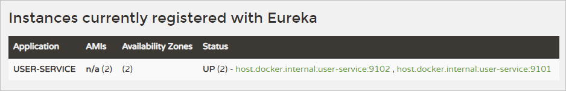
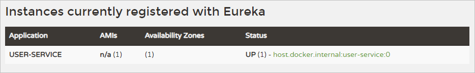
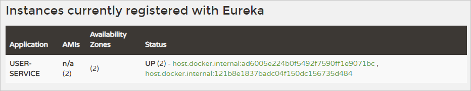

# Service Discovery
- 서비스를 등록하고 필요한 서비스를 검색할 수 있도록 도와준다.
- 사용자는 Load Balancer(API Gateway)로 필요한 정보를 요청한다.
- 해당 요청은 Service Discovery를 통해 적절히 분배된다.
- Spring Eureka Server를 통해 Discovery Service를 이용할 수 있다.

## Eureka Server
### Dependencies
- Eureka Server

### Application
```java
@SpringBootApplication
@EnableEurekaServer // 서버의 자격으로 등록해준다.
public class DiscoveryServiceApplication {
```

### application.yml
```yml
server:
  port: 8761

spring:
  application:
    name: discoveryservice

eureka:
  client:
    register-with-eureka: false
    fetch-registry: false
```
- `eureka.client.register-with-eureka`는 클라이언트로 자기 자신을 등록하지 않게 설정한다.
- `eureka.client.fetch-registry` 는 Eureka 서버로부터 인스턴스들의 정보를 주기적으로 가져올 것인지 설정한다.
- `true`로 설정하면 갱신된 정보를 받겠다는 뜻이다.

---

## User Service
### Dependencies
- Eureka Client
- Spring Boot DevTools
- Lombok
- Spring Web

### Application
```java
@SpringBootApplication
@EnableEurekaClient
public class UserServiceApplication {
```

### application.yml
```yml
server:
  port: 9101

spring:
  application:
    name: user-service

eureka:
  client:
    register-with-eureka: true
    fetch-registry: true
    service-url: 
      defaultZone: http://127.0.0.1:8761/eureka
```
- Eureka Server와 연결을 해주고, 해당 서비스의 위치 정보를 설정한다.

---

## User Service를 여러개 구동
1. Edit Configuration에서 UserServiceApplication을 복사, UserServiceApplication-2로 명명
2. UserServiceApplication-2를 실행하면 UserServiceApplication와 포트가 충돌하여 실행되지 않음
3. UserServiceApplication-2 Edit Configuration - Environment VM Options -> `-Dserver.port=9102` 추가
   - `-D`는 자바 클래스를 실행할 때 부가적인 파라미터 옵션을 부여할때 사용하는 방법이다.
  
<br>

**정상적으로 2개의 인스턴스가 구동된다.**


---

## 터미널에서 인스턴스 시작
- `mvnw spring-boot:run -Dspring-boot.run.jvmArguments='-Dserver.port=9103'`
- `mvn clean compile package`
- `mvn -jar -Dserver.port=9104 ./target/user-service-0.0.1-SNAPSHOT.jar`
  - jar 파일을 직접 실행

<br>

**하지만 새로운 인스턴스를 실행할 때 마다 포트번호를 수동으로 부여해줘야하는게 너무 번거롭다.**

---

## Load Balancer
### application.yml 수정
```yml
server:
  port: 0
```
- 랜덤 포트를 사용하겠다는 뜻이다.
- 설정 후 여러개의 인스턴스를 실행해보자.

<br>


- 하지만 다음과 같이 실행중인 인스턴스가 하나로 뜬다.
- 동적으로 할당된 포트번호가 아니라 yml 파일에 설정된 포트번호로만 인스턴스가 생성되는 문제가 발생한다. ( 네이밍 방식때문에 발생한 문제 )

<br>

```yml
eureka:
  instance:
    instance-id: ${spring.cloud.client.hostname}:${spring.application.instance_id:${random.value}}
```
- 인스턴스의 고유 값을 직접 지정해준다.

<br>

**정상적으로 작동한다.**

