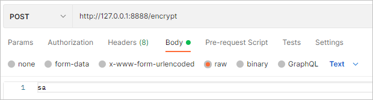

# 암호화 처리를 위한 Encryption과 Decryption
설정 파일에 평문으로 적혀있는 정보들을 암호화, 복호화하는 작업에 대해 배워본다.

## Encryption types
### Symmetric Encryption(Shared)
- 암호화, 복호화 간에 동일한 키를 사용한다.

<br>

### Asymmetric Encryption(RSA Keypair)
- 공개키(복호화)와 비공개키(암호화)를 사용한다.
- Java keytool을 활용한다.

> JCE(Java Cryptography Extension) 사용
> - Java 8을 사용한다면 별도의 JCE 파일을 설치해줘야한다.
>   - Java 11버전 이상은 별도의 설치없이 진행 가능하다.

<br>


---

## Symmetric Encryption
### Dependency
```xml
<dependency>
    <groupId>org.springframework.cloud</groupId>
    <artifactId>spring-cloud-starter-bootstrap</artifactId>
</dependency>
```
- bootstrap.yml을 사용하기 위해 의존 설정을 추가해준다.

<br>


### 암호화 키 설정
**config-server.bootstrap.yml**
```yml
encrypt:
  key: abcdefghijklmnopqrstuvwxyz1234567890
```

<br>

### 암호화
 <br>

- `/encrypt`엔드포인트를 호출하면 설정된 키값을 바탕으로 암호화가 진행된다.
- Request body에 text 형태로 암호화할 데이터를 전달해준다.


<br>


### 복호화
 <br>


### 암호화 정보 설정파일에 적용
```
'{cipher}8f68e1350a0496a88ee39760689bb153c2302ace7d08f4b3230240a4df02a87a'
```
- 위와 같이 싱글 쿼테이션으로 묶어준 후 {cipher} 접두어를 붙여 암호화된 데이터임을 명시해준다.


<br>


---

## Asymmetric Encryption
### Key, Key store 생성
- Public, Private Key 생성 (JDK keytool 이용)
- keystore directory 생성
  - $mkdir C:\05Studyspace\springcloud-config\keystore
- Key 생성
```
$ keytool -genkeypair -alias apiEncryptionKey -keyalg RSA \
  -dname "CN=Hanjun Kim, OU=API Development, O=joneconsulting.co.kr, L=Seoul, C=KR" \
  -keypass "1q2w3e4r" -keystore apiEncryptionKey.jks -storepass "1q2w3e4r"
```
- `-alias`는 키를 호출할 떄 사용하는 별칭
- `-keyalg`는 키를 생성할 때 사용하는 알고리즘
- `-dname`에 작성된 내용은 key 생성에 활용되는 부가 정보
- `-keypass`는 key를 생성할때 사용되는 비밀번호
- `-keystore`는 key값이 저장되는 데이터 타입
- `-storepass`는 저장되는 키파일의 패스워드


<br>


### Key store 정보 확인
- `keytool -list -keystore apiEncryptionKey.jks -`
```
Alias name: apiencryptionkey
Creation date: 2021. 10. 28.
Entry type: PrivateKeyEntry
Certificate chain length: 1
Certificate[1]:
Owner: CN=Hanjun Kim, OU=API Development, O=joneconsulting.co.kr, L=Seoul, C=KR
Issuer: CN=Hanjun Kim, OU=API Development, O=joneconsulting.co.kr, L=Seoul, C=KR
Serial number: 4d8d8aba
Valid from: Thu Oct 28 16:40:15 KST 2021 until: Wed Jan 26 16:40:15 KST 2022
Certificate fingerprints:
         SHA1: AE:5A:66:77:19:DD:9B:D4:F7:C4:27:8B:D7:34:71:00:9D:57:9F:90
         SHA256: 05:61:CC:41:5E:71:D8:AC:E1:8C:42:91:F8:42:78:A3:0B:73:9E:93:03:D0:FB:B9:E7:65:6E:71:6F:5B:C0:9D
Signature algorithm name: SHA256withRSA
Subject Public Key Algorithm: 2048-bit RSA key
Version: 3

Extensions:

#1: ObjectId: 2.5.29.14 Criticality=false
SubjectKeyIdentifier [
KeyIdentifier [
0000: 3D EF 20 8C DE 1B 32 59   DF 39 C0 37 7A 29 E9 25  =. ...2Y.9.7z).%
0010: C7 C3 71 CD             
```

<br>


### 공개키 추출
- `keytool -export -alias apiEncryptionKey -keystore apiEncryptionKey.jks -rfc -file trustServer.cer`
  - `-rfc` (request for comment)는 표준 출력 양식이다.

<br>

### 인증서 파일을 jks로 변경하기
`keytool -import -alias trustServer -file trustServer.cer -keystore publicKey.jks`

<br>


### Key store 활용
#### config-server의 bootstrap.yml 변경
```yml
encrypt:
#  key: abcdefghijklmnopqrstuvwxyz1234567890
  key-store:
    location: file:\\\C:\05Studyspace\springcloud-config\keystore\apiEncryptionKey.jks
    password: 1q2w3e4r
    alias: apiEncryptionKey
```

#### 암호화
 <br>


<br>

> 공개키 설정을 따로 해주지 않았는데 복호화가 정상적으로 이루어지는 이유? <br>
> 참고 : https://cloud.spring.io/spring-cloud-config/reference/html/#_key_management