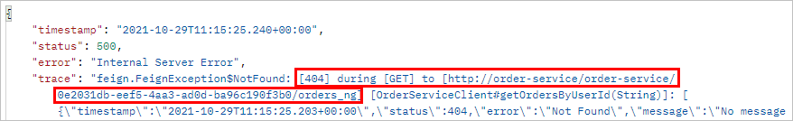
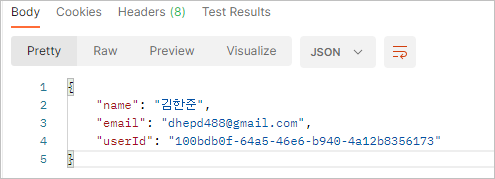
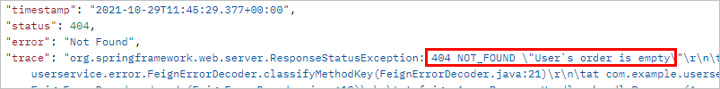

# 마이크로서비스간 통신
## RestTemplate API
### RestTemplate 사용 방법
#### RestTemplate 빈 등록
```java
@Bean
public RestTemplate getRestTemplate() {
    return new RestTemplate();
}
```

#### RestTemplate 활용
```java
@Override
public UserDto getUserByUserId(String userId) {
    UserEntity userEntity = userRepository.findByUserId(userId)
                                            .orElseThrow(IllegalArgumentException::new);
    UserDto userDto = mapper.mapEntityToDto(userEntity);
    String orderUrl = String.format(env.getProperty("order_service.url"), userId);

    ResponseEntity<List<ResponseOrder>> orderListResponse =
            restTemplate.exchange(orderUrl, HttpMethod.GET, null,
                                    new ParameterizedTypeReference<List<ResponseOrder>>() {
            });

    userDto.setOrders(orderListResponse.getBody());

    return userDto;
}
```
- 빈으로 등록한 `RestTemplate`을 주입받아 사용한다.
- 파라미터는 사용하지 않기 때문에 `null`을 입력한다.

<br>

### Rest Template 주소값 간소화
#### Rest Template 빈 주입 간 @LoadBalanced 어노테이션 활용
```java
@Bean
@LoadBalanced
public RestTemplate getRestTemplate() {
    return new RestTemplate();
}
```

#### 설정 파일인 user-service.yml 값 변경
```yml
order_service:
  url: http://ORDER-SERVICE/order-service/%s/orders
```
- 호출할 order-service의 엔드 포인트를 환경변수로 지정해서 호출해준다.
- IP와 포트번호 없이도 마이크로 서비스의 이름을 활용해서 원하는 마이크로 서비스를 호출할 수 있다.

---

## Feign Web Service Client
- REST Call을 추상화한 Spring Cloud Netflix 라이브러리
  - 호출하려는 HTTP Endpoint에 대한 Interface를 생성
  - `@FeignClient` 선언
- Load balance 지원
- RestTemplate보다 직관적이고 간편한 방법이다.

### Dependency 추가
```xml
<dependency>
    <groupId>org.springframework.cloud</groupId>
    <artifactId>spring-cloud-starter-openfeign</artifactId>
</dependency>
```

<br>

### @EnableFeignClient 어노테이션 추가
```java
@SpringBootApplication
@EnableEurekaClient
@EnableFeignClients
public class UserServiceApplication {
```

<br>

### FeignClient 인터페이스 생성
```java
@FeignClient(name = "order-service")
public interface OrderServiceClient {
    
    @GetMapping("/order-service/{userId}/orders")
    List<ResponseOrder> getOrdersByUserId(@PathVariable String userId);
}
```
- `name` 속성에는 등록된 마이크로 서비스 이름을 명시해준다.
- 실제 order-service에 명시된 메소드명을 적어준다.

<br>

### FeignClient 활용
```java
@Service
@RequiredArgsConstructor
public class UserServiceImpl implements UserService{

    private final UserMapper mapper;
    private final UserRepository userRepository;
    private final OrderServiceClient orderServiceClient;

    @Override
    public UserDto getUserByUserId(String userId) {
        UserEntity userEntity = userRepository.findByUserId(userId)
                                              .orElseThrow(IllegalArgumentException::new);
        UserDto userDto = mapper.mapEntityToDto(userEntity);
        userDto.setOrders(orderServiceClient.getOrdersByUserId(userId));

        return userDto;
    }
```
- FeignClient를 사용하면 좀 더 간편하게 마이크로 서비스 간의 통신을 구현할 수 있다.
- 하지만 FeignClient는 해당 코드를 직접 개발한 사람이 아니라면 한 눈에 그 의미를 파악하기 힘들다는 단점이 있다.

<br>

### FeignClient 사용 시 발생한 로그를 추적하는 방법
#### user-service.application.yml
```yml
logging:
  level:
    com.example.userservice.client: debug
```

#### UserServiceApplication에 Logger 빈 등록
```java
@Bean
public Logger.Level feignLoggerLevel() {
    return Logger.Level.FULL;
}
```

### 호출된 로그
```
[OrderServiceClient#getOrdersByUserId] ---> GET http://order-service/order-service/0e2031db-eef5-4aa3-ad0d-ba96c190f3b0/orders_ng HTTP/1.1
[OrderServiceClient#getOrdersByUserId] ---> END HTTP (0-byte body)
[OrderServiceClient#getOrdersByUserId] <--- HTTP/1.1 404 (97ms)
[OrderServiceClient#getOrdersByUserId] connection: keep-alive
[OrderServiceClient#getOrdersByUserId] content-type: application/json
[OrderServiceClient#getOrdersByUserId] date: Fri, 29 Oct 2021 11:15:25 GMT
[OrderServiceClient#getOrdersByUserId] keep-alive: timeout=60
[OrderServiceClient#getOrdersByUserId] transfer-encoding: chunked
[OrderServiceClient#getOrdersByUserId] vary: Access-Control-Request-Headers
[OrderServiceClient#getOrdersByUserId] vary: Access-Control-Request-Method
[OrderServiceClient#getOrdersByUserId] vary: Origin
[OrderServiceClient#getOrdersByUserId] 
[OrderServiceClient#getOrdersByUserId] {"timestamp":"2021-10-29T11:15:25.203+00:00","status":404,"error":"Not Found","message":"No message available","path":"/order-service/0e2031db-eef5-4aa3-ad0d-ba96c190f3b0/orders_ng"}
[OrderServiceClient#getOrdersByUserId] <--- END HTTP (182-byte body)
```

<br>

### FeignClient 예외처리
- 마이크로 서비스의 핵심은 하나의 마이크로 서비스에 장애가 생긴다고 전체 프로세스에 영향을 주면 안된다는 것이다.
- 따라서 `user-service`에서 `order-service`를 호출할 때 문제가 생긴다고 `user-serivce`가 제공하는 정보도 모두 출력되지 못하게 막아버리면 안된다.

#### user-service에서 잘못된 order-service 엔드포인트 호출했을 때
```java
@FeignClient(name = "order-service")
public interface OrderServiceClient {

    @GetMapping("/order-service/{userId}/orders_ng")
    List<ResponseOrder> getOrdersByUserId(@PathVariable String userId);
}
```
- `/order-service/{userId}/orders_ng` 라는 잘못된 엔드포인트 호출

<br>



<br>

#### 프로세스 전체에 영향을 주지 않도록 예외 처리
```java
@Override
    public UserDto getUserByUserId(String userId) {
        UserEntity userEntity = userRepository.findByUserId(userId)
                                              .orElseThrow(IllegalArgumentException::new);
        UserDto userDto = mapper.mapEntityToDto(userEntity);

        List<ResponseOrder> orders = null;
        try {
            orders = orderServiceClient.getOrdersByUserId(userId);
        } catch (FeignException e) {
            log.error(e.getMessage());
        }

        userDto.setOrders(orders);

        return userDto;
    }
```
- `try ~ catch` 문으로 `FeignException` 예외 처리

<br>

#### 예외 처리 후 유저 정보 반환 결과

- 에러가 발생한 orders 데이터를 제외한 나머지 유저 정보를 정상적으로 불러온다.

<br>

### ErrorDecoder 인터페이스를 활용한 예외처리
#### FeignErrorDecoder 구현
```java
public class FeignErrorDecoder implements ErrorDecoder {

    @Override
    public Exception decode(String methodKey, Response response) {
        if (response.status() == 404) {
            return classifyMethodKey(methodKey, response);
        } else {
            return new Exception(response.reason());
        }
    }

    private ResponseStatusException classifyMethodKey(String methodKey, Response response) {
        if (methodKey.contains("getOrders")) {
            return new ResponseStatusException(HttpStatus.valueOf(response.status()),
                                               "User`s order is empty");
        }
        return null;
    }
}
```
- HTTP 상태 코드와 호출된 메소드 이름을 바탕으로 예외처리할 수 있다.
- `ErrorDecoder`를 구현받아 `decode` 메소드를 오버라이딩 해준다.

<br>

#### FeignErrorDecoder 빈 등록
```java
@Bean
public FeignErrorDecoder feignErrorDecoder() {
    return new FeignErrorDecoder();
}
```
- 구현한 `FeignErrorDecoder`를 빈으로 등록해준다.
- 빈으로 등록해주면 `FeignClient`에서 예외가 발생했을 때 해당 디코더가 작동한다.

<br> 

#### ErrorDecoder 적용 후 잘못된 엔드포인트 호출

- 기존 500 Error가 아니라 의도한대로 404 Error가 반환되었다.
- User`s order is empty 문구도 제대로 반환됐다.

---

## 데이터 동기화
- 하나의 마이크로 서비스가 여러개 가동되고있을 때
- 인스턴스마다 서로 다른 DB를 사용하고 있으면 데이터가 각 인스턴스에 분산된다.
- 같은 사용자 정보를 조회해도 각기 다른 데이터가 조회되는 문제가 발생할 수 있다.

<br>

### 문제를 해결하는 방법
1. 하나의 Database 사용
2. Database 간의 동기화
   - Message Queuing Server를 활용해서 데이터를 동기화한다.
   - Apache Kafka or RabbitMQ

<br>


