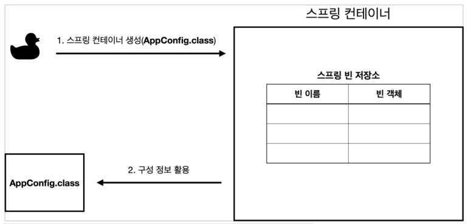
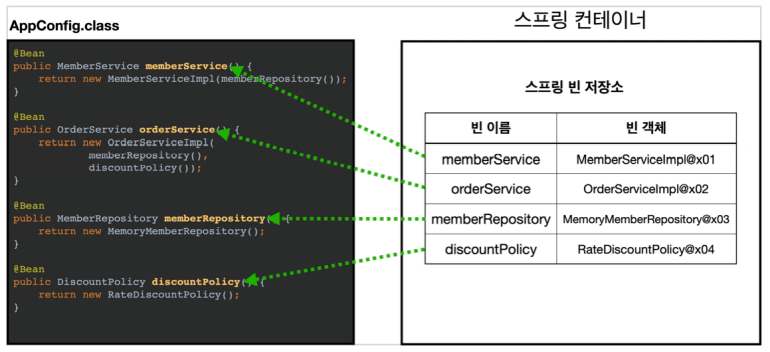
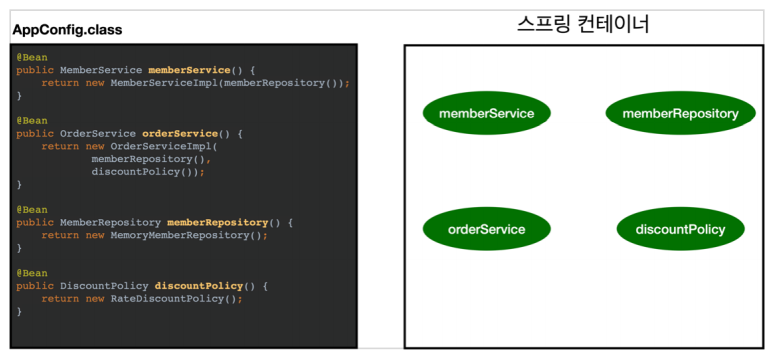
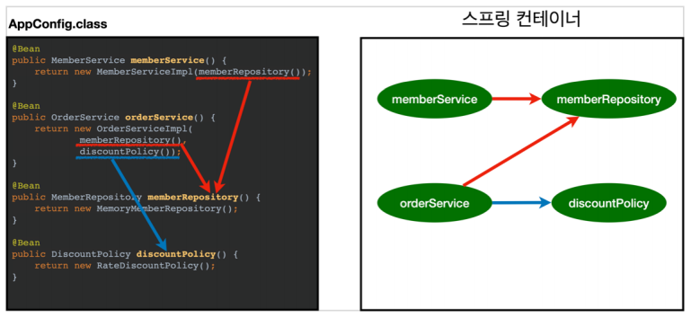
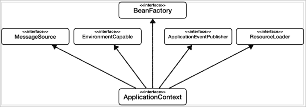
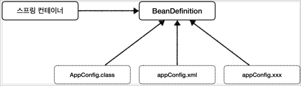
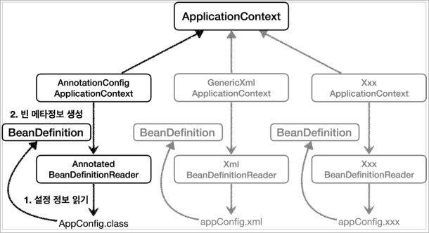

## 제어의 역전 IoC(Inversion of Contol)

기존 프로그램은 클라이언트 구현 객체가 스스로 필요한 서버 구현 객체를 생성하고, 연결하고, 실행했다. 한마디로 구현 객체가 프로그램의 모든 제어 흐름을 스스로 조종했다. 

반면에 `AppConfig`가 등장한 이후 구현 객체는 자신의 로직을 실행하는 역할만 담당한다. 
  - 프로그램의 제어 흐름은 이제 `AppConfig`가 가져간다. 
  - 예를 들어 `OrderServiceImpl`은 필요한 인터페이스(`Repository`, `DiscountPolicy`)들을 호출하지만, 어떤 구현객체들이 실행될 지 모른다.

프로그램에 대한 제어 흐름 권한은 모두 `AppConfig`가 가지고있다. 심지어 `OrderServiceImpl`도 AppConfig가 생성한다. 그리고 AppConfig는 `OrderServiceImpl`이 아닌 `OrderService` 인터페이스의 다른 구현 객체를 생성하고 실행할 수도 있다. 그런 사실도 모른채 `OrderServiceImpl`은 묵묵히 자신의 로직을 실행할 뿐이다.

이렇듯 프로그램의 제어 흐름을 외부에서 관리하는 것을 **제어의 역전**(IoC)이라 한다.

### 프레임워크 vs 라이브러리

- **프레임워크**는 내가 작성한 코드를 제어하고, 대신 실행한다.(ex. JUnit)
  - 테스트코드 설계시 작성했던 어노테이션에 따라 프레임워크가 알아서 실행을 해준다.
  - 프레임워크는 스스로 라이프 사이클을 가지고있으며, 개발자는 로직만 작성해주면 된다.
- 반면에 내가 작성한 코드가 직접 제어의 흐름을 담당한다면 그것은 프레임워크가 아니라 **라이브러리**다.

## 의존관계 주입 DI( Dependency Injection )

- `OrderServiceImpl`은 `DiscountPolicy` 인터페이스에 의존한다. 실제 어떤 구현 객체가 사용될지는 모른다.
- 의존 관계는 **정적인 클래스 의존 관계**와, **실행 시점에서 결정되는 동적인 객체( 인스턴스 ) 의존 관계** 둘을 분리해서 생각해야 한다.

### 정적인 클래스 의존 관계

- 클래스가 의존하고있는 인터페이스와의 관계를 의미한다.
- 클래스가 사용하는 `import` 코드만 보고 의존 관계를 쉽게 판단할 수 있다.
- 정적인 의존 관계는 애플리케이션을 실행하지 않아도 분석할 수 있다.(<u>컴파일 단계에서 분석 가능</u>)
- `OrderServiceImpl`은 `MemberRepository`, `DiscountPolicy`에 의존한다는 것을 알 수 있다.
- 그런데 이러한 클래스 의존관계 만으로는 실제 어떤 객체가 `OrderServiceImpl`에 주입 될지 알 수 없다.

### 동적인 객체 인스턴스 의존 관계

- 클래스가 의존하고있는 인터페이스의 구현체와의 관계를 의미한다.
- 애플리케이션 실행 시점에서 **실제 생성된 객체 인스턴스의 참조가 연결된 의존 관계**다.
- 애플리케이션 실행 시점(런타임)에 외부에서 실제 구현 객체를 생성하고 클라이언트에 전달해서 클라이언트와 서버의 의존 관계가 연결되는 것을 의존 관계 주입이라 한다.
- 객체 인스턴스를 생성하고, 그 참조값을 전달해서 연결된다.
- 의존 관계 주입을 사용하면 클라이언트 코드를 변경하지 않고, 클라이언트가 호출하는 대상의 타입 인스턴스를 변경할 수 있다.
- 의존 관계 주입을 사용하면 **정적인 클래스 의존 관계를 변경하지 않고, 동적인 객체 인스턴스 의존 관계를 쉽게 변경할 수 있다.**

## IoC, DI 그리고 컨테이너

- `AppConfig` 처럼 **객체를 생성하고 관리**하면서 **의존 관계를 연결**해 주는 것을 **IoC 컨테이너**, **DI 컨테이너**라 한다.
- 의존 관계 주입에 초점을 맞추어 최근에는 주로 DI 컨테이너라 한다.
- 또는 어셈블리, 오브젝트 팩토리 등으로 불리기도 한다.

## 스프링 컨테이너

- `ApplicationContext`를 스프링 컨테이너라 한다.
- 기존에는 개발자가 `AppConfig`를 사용해서 직접 객체를 생성하고 DI를 했지만, 이제부터는 스프링 컨테이너를 통해서 사용한다.
- 스프링 컨테이너는 `@Configuration`이 붙은 `AppConfig`를 설정(구성) 정보로 사용한다. 
  - 여기서 `@Bean`이라 적힌 메서드를 모두 호출해서 반환된 객체를 스프링 컨테이너에 등록한다. 
  - 이렇게 스프링 컨테이너에 등록된 객체를 **스프링 빈**이라 한다.
- 스프링 빈은 `@Bean`이 붙은 메서드의 이름을 스프링 빈의 이름으로 사용한다.
- 이전에는 개발자가 필요한 객체를 `AppConfig`를 사용해서 직접 조회했지만, 이제부터는 스프링 컨테이너를 통해서 필요한 스프링 빈(객체)을 찾아야 한다. 
  - 스프링 빈은 `applicationContext.getBean()` 메서드를 사용해서 찾을 수 있다.
- 기존에는 개발자가 직접 자바 코드로 모든 것을 했다면 이제부터는 스프링 컨테이너에 객체를 스프링 빈으로 등록하고, 스프링 컨테이너에서 스프링 빈을 찾아서 사용하도록 변경되었다.

- 하지만 스프링 컨테이너를 사용하고 코드가 더 복잡해진것 같다. 스프링 컨테이너를 사용하면 어떤 장점이 있을까?

### 스프링 컨테이너 생성

- `ApplicationContext`를 스프링 컨테이너라 한다.
  - 엄밀히 말하면 스프링 컨테이너는 `BeanFactory`와 `ApplicationContext`로 구분해서 이야기 한다.
  - `BeanFactory`를 직접 사용하는 경우는 거의 없으므로 일반적으로 `ApplicationContext`를 스프링 컨테이너라 한다.
- `ApplicationContext`는 인터페이스다.
- 스프링 컨테이너는 XML을 기반으로 만들 수 있고, 어노테이션 기반의 자바 설정 클래스로 만들 수도 있다.
- 직전에 `AppConfig`를 사용했던 방식이 어노테이션 기반의 자바 설정 클래스로 스프링 컨테이너를 만든 것이다.
- 자바 설정 클래스를 기반으로 스프링 컨테이너 `ApplicationContext`를 만들어보자.
  - `new AnnotationConfigApplicationContext(AppConfig.class);`
  - 이 클래스는 `ApplicationContext` 인터페이스의 구현체이다.

### 스프링 컨테이너의 생성 과정

1. 스프링 컨테이너 생성

     - `new AnnotationConfigApplicationContext(AppConfig.class);`
     - 스프링 컨테이너를 생성할 때는 구성 정보를 지정해주어야 한다.
     - 여기서는 `AppConfig.class`를 구성 정보로 지정했다.

2. 스프링 빈 등록

     - 스프링 컨테이너는 파라미터로 넘어온 설정 클래스 정보를 사용해서 스프링 빈을 등록한다.
     - **빈 이름**
       - 빈 이름은 매서드 이름을 사용한다.
       - 빈 이름을 직접 부여할 수도 있다.
        - `@Bean(name="memberService2")`

3. 스프링 빈 의존 관계 설정 - 준비


4. 스프링 빈 의존 관계 설정 - 완료

      - 스프링 컨테이너는 설정 정보를 참고해서 의존 관계를 주입한다.
      - 단순히 자바 코드를 호출하는 것 같지만, 차이가 있다. (싱글톤 컨테이너 참고)   

> **참고** <br/>
> 실제 스프링에선 빈을 생성하고 의존 관계를 주입하는 단계가 나누어져 있다.

## 스프링 빈 조회

### 가장 기본적인 조회 방법

- `ac.getBean(빈이름, 타입)`
- `ac.getBean(타입)`
  - `NoSuchBeanDefinitionException`

```java
ApplicationContext ac = new AnnotationConfigApplicationContext(AppConfig.class);

String[] beanDefinitionNames = ac.getBeanDefinitionNames();
for (String beanDefinitionName : beanDefinitionNames) {
	Object bean = ac.getBean(beanDefinitionName);
	System.out.println("beanDefinitionName = " + beanDefinitionName + " object = " + bean);
}
```

### 동일한 타입이 둘 이상

타입으로 조회 시 같은 타입의 스프링 빈이 둘 이상이면 오류가 발생한다.
- `NoUniqueBeanDefinitionException`

**빈 이름을 지정해주면 해결할 수 있다.**

```java
ac.getBeansOfType() // 해당 타입의 모든 빈을 조회한다.
```

### 상속 관계

- 부모 타입으로 조회하면 자식 타입이 모두 조회된다.
  - `NoUniqueBeanDefinitionException` 발생 조심
  - 빈 이름으로 조회하면 해결할 수 있다.
- `Object` 타입으로 조회하면 모든 스프링 빈을 조회한다.

## BeanFactory

- **BeanFactory**는 스프링 컨테이너의 최상위 인터페이스다.
- 스프링 빈을 조회하고 관리하는 역할을 담당한다.

### ApplicationContext

- BeanFactory의 기능을 모두 상속받아서 제공한다.

그렇다면 BeanFactory 와 ApplicationContext 은 무슨 차이가 있는가?

### ApplicationContext의 부가기능

ApplicationContext 는 BeanFactory 가 제공하는 기능 이외에 부가적인 기능을 제공한다.



- 메시지 소스를 활용한 국제화 기능
- 환경 변수
  - 로컬, 개발, 운영 등을 구분해서 처리
- 애플리케이션 이벤트
  - 이벤트를 발행하고 구독하는 모델을 편리하게 지원
- 편리한 리소스 조회
  - 파일, 클래스 패스 등의 외부 리소스를 편리하게 조회하도록 지원

## 스프링 빈 설정 메타 정보 : BeanDefinition

스프링은 어떻게 XML, 어노테이션과 같은 다양한 정보를 인식할 수 있는 걸까?




- 역할과 구현이 철저하게 분리되었기 때문에 가능하다.
- 새로운 형식의 설정 정보가 추가될 때 마다 `XxxBeanDefinitionReader` 를 생성해서 `BeanDefinition` 을 만들면 된다.