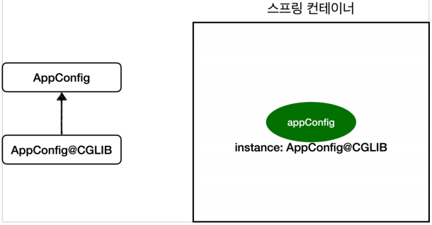

# 웹 애플리케이션과 싱글톤

## 싱글톤이 왜 필요할까

- 스프링 없이 구현했던 순수 DI 컨테이너인 `AppConfig` 는 새로운 요청이 들어올 때마다 객체를 새롭게 생성한다.
- 트래픽이 늘어날 수록 초당 생성해야하는 객체의 수가 많아지고, 결국 메모리 낭비가 심해진다.
- 해당 문제는 객체가 하나만 생성되도록하고 해당 객체를 공유하도록 설계하면 해결된다.

### 순수 자바 코드로 싱글톤 구현하기

```java
public class SingletonService {

	private static final SingletonService instance = new SingletonService();

	private SingletonService() {
	}

	public static SingletonService getInstance() {
		return instance;
	}
}
```

## 싱글톤 패턴의 문제점

- 싱글톤 패턴을 구현하는 코드 자체가 많이 들어간다.
- 의존 관계상 클라이언트가 구현 클래스에 의존한다.
  - `private static final SingletonService instance = new SingletonService();`
  - DIP 를 위반한다.
  - OCP 를 위반할 가능성도 높아진다.
- 테스트하기가 어렵다.
- 내부 속성을 변경하거나 초기화 하기 어렵다.
- `private` 생성자 때문에 자식 클래스를 만들기 어렵다.
- 유연성이 떨어지기 때문에 안티 패턴으로 불리기도 한다.

<u>스프링 프레임워크는 싱글톤 패턴이 지닌 단점을 모두 해결하면서 객체를 싱글톤으로 관리 할 수 있게 해준다.</u>

> 스프링은 싱글톤 컨테이너 기술을 사용한다.

## 싱글톤 방식의 주의점

싱글톤 패턴이든, 스프링 같은 싱글톤 컨테이너를 사용하든, 객체 인스턴스를 하나만 생성해서 공유하는 싱글톤 방식은 여러 클라이언트가 하나의 같은 객체 인스턴스를 공유한다는 특징이 있다. 따라서 **싱글톤 객체는 상태를 유지(Statefule)하게 설계하면 안된다.**

### 싱글톤은 무상태( Stateless )로 설계해야 한다.

- 특정 클라이언트에 의존적인 필드가 있으면 안된다.
- 특정 클라이언트가 값을 변경할 수 있는 필드가 있으면 안된다.
- 가급적 읽기만 가능해야한다.
- 필드 대신에 자바에서 공유되지 않는 지역변수, 파라미터, ThreadLocal 등을 사용해야한다.

> ### 중요!
- ***<u>스프링 빈의 필드에 공유 값을 설정하면 정말 큰 장애가 발생할 수 있다.</u>***
- ***<u>스프링 빈에 등록된 객체는 반드시 무상태로 관리해줘야 한다.</u>***


## `@Configuration`과 바이트코드 조작의 마법

```java
// MemoryMemberRepository() 객체는 3번 생성되는 게 아닌가?
@Configuration
public class AppConfig {
    @Bean
    public MemberService memberService() {
        //1번
        System.out.println("call AppConfig.memberService");
        return new MemberServiceImpl(memberRepository());
    }
    @Bean
    public OrderService orderService() {
        //1번
        System.out.println("call AppConfig.orderService");
        return new OrderServiceImpl(memberRepository(), discountPolicy());
    }
    @Bean
    public MemberRepository memberRepository() {
        // 1번 (빈으로 등록할 때 한번)
        System.out.println("call AppConfig.memberRepository");
        return new MemoryMemberRepository();
    }
    @Bean
        public DiscountPolicy discountPolicy() {
        return new RateDiscountPolicy();
    }
}
```
- 하지만 에상과 달리 `MemoryMemberRepository()` 는 한번만 호출된다.

스프링 컨테이너는 싱글톤 레지스트리다. 따라서 스프링 빈이 싱글톤이 되도록 보장해주어야한다. 그런데 스프링이 순수 자바 코드 까지 어떻게 하기는 어렵다. `AppConfig.class`에 작성한 자바 코드를 보면 `memberRepository` 객체가 분명 3번 생성되어야 하는 것이 맞다. 그래서 스프링은 클래스의 바이트 코드를 조작하는 라이브러리를 사용한다. 모든 비밀은 `@Configuration`을 적용한 `AppConfig`에 있다.

> 싱글톤 레지스트리는 싱글톤 객체를 생성하고 관리하는 기능을 의미한다.

### `@Configuration`과 CGLIB 클래스

```java
@Test
void configurationDeep() {
    ApplicationContext ac = new AnnotationConfigApplicationContext(AppConfig.class);
    //AppConfig도 스프링 빈으로 등록된다.
    AppConfig bean = ac.getBean(AppConfig.class);

    System.out.println("bean = " + bean.getClass());
    //출력: bean = class hello.core.AppConfig$$EnhancerBySpringCGLIB$$bd479d70
}
```

- 사실 `AnnotationConfigApplicationContext`에 파라미터로 넘긴 값은 스프링 빈으로 등록된다. 그래서 `AppConfig`도 스프링 빈이 된다.
- 그런데 여기서 `AppConfig` 스프링 빈을 조회해서 클래스 정보를 출력해보면 기존과 다른 것을 알 수 있다.
  - `bean = class hello.core.AppConfig$$EnhancerBySpringCGLIB$$bd479d70`
  - 기존 클래스 출력: `class hello.core.AppConfig`
- 예상과 달리 클래스 명에 xxxCGLIB이 붙으면서 상당히 복잡해진 것을 볼 수 있다. 이것은 내가 만든 클래스가 아니라 스프링이 **CGLIB**이라는 **바이트 코드 조작 라이브러리**를 사용해서 `AppConfig` 클래스를 상속받은 임의의 다른 클래스를 만들고, 그 다음 클래스를 스프링 빈으로 등록한 것이다.

    

### AppConfig@CGLIB 예상 코드

```java
@Bean
public MemberRepository memberRepository() {
    if (MemoryMemberRepository가 이미 스프링 컨테이너에 등록되어 있으면?) {
        return 스프링 컨테이너에서 찾아서 반환;
    } else { //스프링 컨테이너에 없으면
        기존 로직을 호출해서 MemoryMemberRepository를 생성하고 스프링 컨테이너에 등록
        return 반환
    }
}
```

- `@Bean`이 붙은 메서드마다 이미 스프링 빈이 존재하면 존재하는 빈을 반환하고, 스프링 빈이 없으면 생성해서 스프링 빈으로 등록하고 반환하는 코드가 동적으로 만들어진다.
- 덕분에 **싱글톤이 보장**되는 것이다.

> **참고** <br/>
> `AppConfig@CGLIB`는 `AppConfig`의 자식 타입이므로, `AppConfig` 타입으로 조회 할 수 있다.

### `@Configuration`을 적용하지 않고, `@Bean`만 적용하면 어떻게 될까?

- `@Bean`만 사용해도 <u>스프링 빈으로 등록되지만 **싱글톤을 보장하지 않는다.**</u>
  - `AppConfig`의 자바코드 그대로 `new`를 할때마다 새로운 객체가 생성된다.
- 싱글톤 보장을 위해 스프링 설정 정보는 항상 `@Configuration`을 사용하는 것이 좋다.

`@Configuration` 을 붙이면 바이트코드를 조작하는 **CGLIB** 기술이 적용된다.