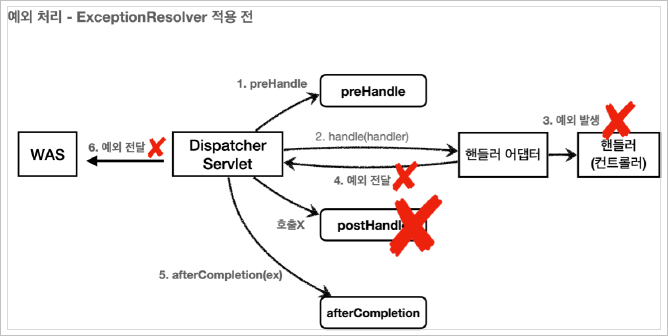

# 목차
- ## [기본 Exception](#exception-기본-)
  - ### [BasicErrorController](#스프링-부트-예외-처리)
- ## [API Exception](#api-exception---시작)
  - ### [@ExceptionHandler](#api-예외-처리---exceptionhandler)

<br>


<br>

# Exception
예외가 발생했을 때 
## 서블릿 예외 처리
- `Exception`
  - `throw new RuntimeException("예외 발생!");`
- `response.sendError`(HTTP 상태 코드, 오류 메시지)
  - `response.sendError(404, "404 오류!");`
  - `response.sendError(500);`

<br>

### Exception( 기본 )
#### 웹 애플리케이션
웹 애플리케이션은 사용자 요청별로 별도의 쓰레드가 할당되고, 서블릿 컨테이너 안에서 실행된다. 애플리케이션에서 예외가 발생했는데, 어디선가 `try ~ catch`로 예외를 잡아서 처리하면 아무런 문제가 없다. 그런데 만약에 애플리케이션에서 예외를 잡지 못하고, 서블릿 밖으로 까지 예외가 전달되면 어떻게 동작할까?

#### Exception 발생 흐름
    WAS(여기까지 전파) <- 필터 <- 서블릿 <- 인터셉터 <- 컨트롤러(예외발생)

<br>

#### sendError 흐름
    WAS(sendError 호출 기록 확인) <- 필터 <- 서블릿 <- 인터셉터 <- 컨트롤러(response.sendError())
- `response.sendError()` 를 호출하면 `response` 내부에는 오류가 발생했다는 상태를 저장해둔다.
- 서블릿 컨테이너는 고객에게 응답 전에 `response` 에 `sendError()` 가 호출되었는지 확인한다.
- 호출되었다면 설정한 오류 코드에 맞추어 **기본 오류 페이지**를 보여준다.

<br>

#### 문제점
서블릿 컨테이너가 제공하는 기본 예외 처리 화면은 사용자 친화적이지 않다.

<br>

### 서블릿 - 오류 화면 제공
과거에는 web.xml 이라는 파일에 오류 화면을 등록했다. 스프링 부트를 통해서 서블릿 컨테이너를 실행하기 때문에, 스프링 부트가 제공하는 기능을 사용해서 서블릿 오류 페이지를 등록하면 된다.<br>
```java
@Component
public class WebServerCustomizer implements WebServerFactoryCustomizer<ConfigurableWebServerFactory> {
    @Override
    public void customize(ConfigurableWebServerFactory factory) {
        ErrorPage errorPage404 = new ErrorPage(HttpStatus.NOT_FOUND, "/error-page/404");
        ErrorPage errorPage500 = new ErrorPage(HttpStatus.INTERNAL_SERVER_ERROR, "/error-page/500");
        ErrorPage errorPageEx = new ErrorPage(RuntimeException.class, "/error-page/500");
        
        factory.addErrorPages(errorPage404, errorPage500, errorPageEx);
    }
}
```
- 오류 페이지는 예외를 다룰 때 **해당 예외와 그 자식 타입의 오류를 함께 처리한다.**
- 오류가 발생했을 때 처리할 수 있는 컨트롤러가 필요하다.
- 예를 들어서 `RuntimeException` 예외가 발생하면 `/error-page/500` 이 호출된다.

<br>

```java
@Controller
public class ErrorPageController {
    @RequestMapping("/error-page/404")
    public String errorPage404(HttpServletRequest request, HttpServletResponse response) {
        return "error-page/404";
    }

    @RequestMapping("/error-page/500")
    public String errorPage500(HttpServletRequest request, HttpServletResponse response) {
        return "error-page/500";
    }
}
```
- 오류가 발생했을 때 해당 컨트롤러가 호출되고 매핑된 요청명에 따라 설정된 오류 페이지로 이동한다.

<br>

### 서블릿 - 오류 페이지 작동 원리
서블릿은 예외가 발생해서 서블릿 밖( WAS )으로 전달되거나 또는 `response.sendError()`가 호출되었을 때 설정된 오류페이지를 찾는다.<br>

- 예를 들어서 `RuntimeException` 예외가 WAS까지 전달되면, WAS는 오류 페이지 정보를 확인한다.
- `RuntimeException` 의 오류 페이지로 `/error-page/500` 이 지정되어 있다.
- WAS는 오류 페이지를 출력하기 위해 `/error-page/500` 를 **다시 요청한다.**

<br>

#### 예외 발생과 오류 페이지 요청 흐름
    1. WAS(여기까지 전파) <- 필터 <- 서블릿 <- 인터셉터 <- 컨트롤러(예외발생)
    2. WAS `/error-page/500` 다시 요청 -> 필터 -> 서블릿 -> 인터셉터 -> 컨트롤러(/errorpage/3) -> View


중요한 점은 웹 브라우저(클라이언트)는 서버 내부에서 이런 일이 일어나는지 전혀 모른다는 점이다. 오직 서버 내부에서 오류 페이지를 찾기 위해 추가적인 호출을 한다. <br>

이떄 오류 페이지 경로로 필터, 서블릿, 인터셉터, 컨트롤러가 모두 다시 호출된다.

<br>

### 서블릿 - 오류 정보 추가
WAS는 오류 페이지를 단순히 다시 요청만 하는 것이 아니라, 오류 정보를 `request` 의 `attribute` 에
추가해서 넘겨준다. 필요하면 WAS로 부터 전달된 오류 정보를 에러페이지에서 사용할 수 있다.<br>

```java
@Slf4j
@Controller
public class ErrorPageController {

    //RequestDispatcher 상수로 정의되어 있음
    public static final String ERROR_EXCEPTION = "javax.servlet.error.exception";
    public static final String ERROR_EXCEPTION_TYPE = "javax.servlet.error.exception_type";
    public static final String ERROR_MESSAGE = "javax.servlet.error.message";
    public static final String ERROR_REQUEST_URI = "javax.servlet.error.request_uri";
    public static final String ERROR_SERVLET_NAME = "javax.servlet.error.servlet_name";
    public static final String ERROR_STATUS_CODE = "javax.servlet.error.status_code";

    @RequestMapping("/error-page/404")
    public String errorPage404(HttpServletRequest request, HttpServletResponse response) {
        printErrorInfo(request);
        return "error-page/404";
    }

    @RequestMapping("/error-page/500")
    public String errorPage500(HttpServletRequest request, HttpServletResponse response) {
        printErrorInfo(request);
        return "error-page/500";
    }

    private void printErrorInfo(HttpServletRequest request) {

        log.info("ERROR_EXCEPTION= {}", request.getAttribute(ERROR_EXCEPTION));
        log.info("ERROR_EXCEPTION_TYPE= {}", request.getAttribute(ERROR_EXCEPTION_TYPE));
        log.info("ERROR_MESSAGE= {}", request.getAttribute(ERROR_MESSAGE));
        log.info("ERROR_REQUEST_URI= {}", request.getAttribute(ERROR_REQUEST_URI));
        log.info("ERROR_SERVLET_NAME= {}", request.getAttribute(ERROR_SERVLET_NAME));
        log.info("ERROR_STATUS_CODE= {}", request.getAttribute(ERROR_STATUS_CODE));

        log.info("dispatcherType= {}", request.getDispatcherType());
    }
}
```
- `javax.servlet.error.exception` : 예외
- `javax.servlet.error.exception_type` : 예외 타입
- `javax.servlet.error.message` : 오류 메시지
- `javax.servlet.error.request_uri` : 클라이언트 요청 URI
- `javax.servlet.error.servlet_name` : 오류가 발생한 서블릿 이름
- `javax.servlet.error.status_code` : HTTP 상태 코드

<br>

### 서블릿 예외 처리 - 필터
예외 처리에 따른 필터와 인터셉터, 그리고 서블릿이 제공하는 `DispatcherType` <br>

오류가 발생하면 오류 페이지를 출력하기 위해 WAS 내부에서 다시 한번 호출이 발생한다. 이때 필터, 서블릿, 인터셉터도 모두 다시 호출된다. 그런데 로그인 인증 체크 같은 경우를 생각해보면, 이미 한번 필터나, 인터셉터에서 로그인 체크를 완료했다. 따라서 **서버 내부에서 오류 페이지를 호출한다고 해서 해당 필터나 인터셉트가 한번 더 호출되는 것은 매우 비효율적이다.** <br>

**결국 클라이언트로 부터 발생한 정상 요청인지, 아니면 오류 페이지를 출력하기 위한 내부 요청인지 구분할 수 있어야 한다.** 서블릿은 이런 문제를 해결하기 위해 **`DispatcherType`** 이라는 추가 정보를 제공한다.

<br>

#### `DispatcherType`
`javax.servlet.DispatcherType`
```java
public enum DispatcherType {
    FORWARD,
    INCLUDE,
    REQUEST,
    ASYNC,
    ERROR
}
```
- `REQUEST` : 클라이언트 요청
- `ERROR` : 오류 요청( 오류 페이지 요청 )
- `FORWARD` : MVC에서 배웠던 서블릿에서 다른 서블릿이나 JSP를 호출할 때
  - `RequestDispatcher.forward(request, response);`
- `INCLUDE` : 서블릿에서 다른 서블릿이나 JSP의 결과를 포함할 때
  - `RequestDispatcher.include(request, response);`
- `ASYNC` : 서블릿 비동기 호출

<br>

#### 필터와 `DispatcherType`
**필터 등록**
```java
@Configuration
public class WebConfig implements WebMvcConfigurer {
    @Bean
    public FilterRegistrationBean logFilter() {
        FilterRegistrationBean<Filter> filterRegistrationBean = new FilterRegistrationBean<>();
        
        filterRegistrationBean.setFilter(new LogFilter());
        filterRegistrationBean.setOrder(1);
        filterRegistrationBean.addUrlPatterns("/*");
        filterRegistrationBean.setDispatcherTypes(DispatcherType.REQUEST, DispatcherType.ERROR);
        
        return filterRegistrationBean;
    }
}
```
- `.setDispatcherTypes(DispatcherType.REQUEST, DispatcherType.ERROR);`
  - 클라이언트 요청과 오류 페이지 요청에 대해 필터가 호출되도록 설정했다.
  - 아무것도 넣지 않으면 기본 값이 `DispatcherType.REQUEST` 이다.
  - 즉 클라이언트의 요청이 있는 경우에만 필터가 적용된다.

<br>

### 서블릿 예외 처리 - 인터셉터
**인터셉터에서의 중복 호출 제거 처리**<br>
앞서 필터의 경우에는 필터를 등록할 때 어떤 `DispatcherType` 인 경우에 필터를 적용할 지 선택할 수
있었다. 그런데 인터셉터는 서블릿이 제공하는 기능이 아니라 스프링이 제공하는 기능이다. **따라서 `DispatcherType` 과 무관하게 항상 호출된다.**<br>

대신에 인터셉터는 다음과 같이 요청 경로에 따라서 추가하거나 제외하기 쉽게 되어 있기 때문에, 이러한 설정을 사용해서 **오류 페이지 경로를 `excludePathPatterns` 를 사용해서 빼주면 된다.**<br>
```java
@Configuration
public class WebConfig implements WebMvcConfigurer {
    @Override
    public void addInterceptors(InterceptorRegistry registry) {

        registry.addInterceptor(new LogInterceptor())
        .order(1)
        .addPathPatterns("/**")
        .excludePathPatterns( "/css/**", "/*.ico", "/error", "/error-page/**"); // 오류 페이지 경로
    }
}
```
- `excludePathPatterns`에서 `/error-page/**` 를 제거하면 `error-page/500` 같은 내부 호출의 경우에도 인터셉터가 호출된다.

<br>

#### 흐름 정리
    1. WAS(/error-ex, dispatchType=REQUEST) -> 필터 -> 서블릿 -> 인터셉터 -> 컨트롤러
    2. WAS(여기까지 전파) <- 필터 <- 서블릿 <- 인터셉터 <- 컨트롤러(예외발생)
    3. WAS 오류 페이지 확인
    4. WAS(/error-page/500, dispatchType=ERROR) -> 필터(x) -> 서블릿 -> 인터셉터(x) -> 컨트롤러(/error-page/500) -> View

<br>

***
## 스프링 부트 예외 처리
### 스프링 부트 - 오류 페이지
지금까지 예외 처리 페이지를 만들기 위해서 다음과 같은 복잡한 과정을 거쳤다.
- `WebServerCustomizer` 를 만들고
- 예외 종류에 따라서 `ErrorPage` 를 추가하고
- 예외 처리용 컨트롤러 `ErrorPageController` 를 만들었다.

<br>

**스프링 부트는 이런 과정을 모두 기본으로 제공한다.**
- `ErrorPage`를 자동으로 등록한다. 이때 `/error` 라는 경로로 기본 오류 페이지를 설정한다.
  - 서블릿 밖으로 예외가 발생하거나, `response.sendError()` 가 호출되면 모든 오류는 `/error` 를 호출하게 된다.
- **`BasicErrorController` 라는 스프링 컨트롤러를 자동으로 등록한다.**
  - `ErrorPage` 에서 등록한 `/error` 를 매핑해서 처리하는 **컨트롤러**다.
  - `BasicErrorController`의 기본 경로는 `server.error.path` 로 수정 가능하다.
<br>

> **참고**<br>
> `ErrorMvcAutoConfiguration` 이라는 클래스가 오류 페이지를 자동으로 등록하는 역할을 한다.

<br>

`BasicErrorController` 에는 기본적인 로직이 모두 개발되어 있다. **개발자는 오류 페이지 화면만 `BasicErrorController` 가 제공하는 룰과 우선순위에 따라서 등록하면 된다.** 정적 HTML이면 **정적 리소스**, 뷰 템플릿을 사용해서 동적으로 오류 화면을 만들고 싶으면 **뷰 템플릿** 경로에 오류 페이지 파일을 만들어서 넣어두기만 하면 된다.

<br>

#### 뷰 선택 우선 순위
**`BasicErrorController` 의 처리 순서**
1. 뷰 템플릿
   - `resources/templates/error/500.html`
     - **상세한 경로일 수록 우선순위가 높다.**
   - `resources/templates/error/5xx.html`
2. 정적 리소스( `static`, `public` )
   - `resources/static/error/400.html`
   - `resources/static/error/404.html`
   - `resources/static/error/4xx.html`
3. 적용 대상이 없을 때 뷰 이름( error )
   - `resources/templates/error.html`

<br>

### 스프링 부트 - 오류 정보 전달
`BasicErrorController` 컨트롤러는 다음 정보를 `model`에 담아서 뷰에 전달한다. 뷰 템플릿은 이 값을
활용해서 출력할 수 있다.<br>

```
* timestamp: Fri Feb 05 00:00:00 KST 2021
* status: 400
* error: Bad Request
* exception: org.springframework.validation.BindException
* trace: 예외 trace
* message: Validation failed for object='data'. Error count: 1
* errors: Errors(BindingResult)
* path: 클라이언트 요청 경로 (`/hello`)
```

<br>

#### View에서의 오류 정보 활용
```html
<li>오류 정보</li>
<ul>
    <li th:text="|timestamp: ${timestamp}|"></li>
    <li th:text="|path: ${path}|"></li>
    <li th:text="|status: ${status}|"></li>
    <li th:text="|message: ${message}|"></li>
    <li th:text="|error: ${error}|"></li>
    <li th:text="|exception: ${exception}|"></li>
    <li th:text="|errors: ${errors}|"></li>
    <li th:text="|trace: ${trace}|"></li>
</ul>
```
- 오류 관련 내부 정보들을 고객에게 노출하는 것은 좋지 않다. 
  - 고객이 해당 정보를 읽어도 혼란만 더해진다.
  - 보안상 문제가 될 수도 있다. 
- 그래서 `BasicErrorController` 오류 컨트롤러에서 다음 오류 정보를 `model` 에 포함할지 여부 선택할 수 있다.

<br>

`application.properties`
- `server.error.include-exception=false` : exception 포함 여부( true , false )
- `server.error.include-message=never` : message 포함 여부
- `server.error.include-stacktrace=never` : trace 포함 여부
- `server.error.include-binding-errors=never` : errors 포함 여부

<br>

`application.properties`
- `server.error.include-exception=true`
- `server.error.include-message=on_param`
- `server.error.include-stacktrace=on_param`
- `server.error.include-binding-errors=on_param`
    - `never` : 사용하지 않음( 기본 값 )
    - `always` :항상 사용
    - `on_param`
      - `on_param` 은 파라미터가 있으면 해당 정보를 노출한다.
      - 개발 서버에서 사용할 수 있지만, 운영 서버에서는 권장하지 않는다.
      - HTTP 요청시 파라미터를 전달하면 해당 정보들이 model 에 담겨서 뷰 템플릿에서 출력된다.
        -`message=&errors=&trace=`

<br>

#### 확장 포인트
에러 공통 처리 컨트롤러의 기능을 변경하고 싶으면 `ErrorController` 인터페이스를 상속 받아서
구현하거나 `BasicErrorController` 상속 받아서 기능을 추가하면 된다.

<br>

***
## API Exception
HTML 페이지의 경우 4xx, 5xx와 같은 오류 페이지만 있으면 `BasicErrorController`를 통해 대부분의 문제를 해결할 수 있었다.<br>
하지만 API는 문제가 더 복잡하다. 오류 페이지는 단순히 고객에게 오류 화면을 보여주면 끝이지만, **API는 각 오류 상황에 맞는 오류 응답 스펙을 정하고, JSON으로 데이터를 내려줘야한다.**<br>

### API Exception - 시작
#### ApiExceptionController - API 예외 컨트롤러
```java
@RestController
public class ApiExceptionController {
  
  @GetMapping("/api/members/{id}")
  public MemberDto getMember(@PathVariable("id") String id) {
    if (id.equals("ex")) {
      throw new RuntimeException("잘못된 사용자");
    }
    return new MemberDto(id, "hello " + id);
  }

  @Data
  @AllArgsConstructor
  static class MemberDto {
    private String memberId;
    private String name;
  }
}
```
- 예외 테스트를 위해 URL에 전달된 `id`의 값이 `ex`이면 예외가 발생하도록 코드를 설정했다.

<br>

#### **API를 요청했을 때**
- 정상인 경우 API로 JSON 형식으로 데이터가 정상 반환된다.
- 그런데 오류가 발생하면 기존에 만들어둔 오류 페이지의 HTML이 반환된다.
- 클라이언트는 정상 요청이든, 오류 요청이든 JSON이 반환되기를 기대한다.
- 문제를 해결하기 위해 오류 페이지 컨트롤러도 JSON 응답을 할 수 있도록 수정해야 한다.

<br>

#### ErrorPageController - API 응답 추가
```java
@RequestMapping(value = "/error-page/500", produces = MediaType.APPLICATION_JSON_VALUE)
public ResponseEntity<Map<String, Object>> errorPage500Api( HttpServletRequest request, HttpServletResponse response) {

    Map<String, Object> result = new HashMap<>();
    Exception ex = (Exception) request.getAttribute(ERROR_EXCEPTION);
    result.put("status", request.getAttribute(ERROR_STATUS_CODE));
    result.put("message", ex.getMessage());

    Integer statusCode = (Integer) request.getAttribute(RequestDispatcher.ERROR_STATUS_CODE);

    return new ResponseEntity<>(result, HttpStatus.valueOf(statusCode));
}
```
- **`produces = MediaType.APPLICATION_JSON_VALUE`**
  - 클라이언트가 요청하는 HTTP Header의 `Accept`의 값이 `application/json` 일 때 해당 메서드가 호출된다.
- Jackson 라이브러리는 `Map` 을 JSON 구조로 변환할 수 있다.
- `ResponseEntity` 를 사용해서 응답하기 때문에 메시지 컨버터가 동작하면서 클라이언트에 JSON이 반환된다.

<br>

### API 예외 처리 - 스프링 부트 기본 오류 처리
API 예외 처리도 스프링 부트가 제공하는 기본 오류 방식을 사용할 수 있다.
#### BasicErrorController
```java
@RequestMapping(produces = MediaType.TEXT_HTML_VALUE)
public ModelAndView errorHtml(HttpServletRequest request, HttpServletResponse response) {}
@RequestMapping
public ResponseEntity<Map<String, Object>> error(HttpServletRequest request) {}
```
- `/error` 동일한 경로를 처리하는 `errorHtml()` , `error()` 두 메서드를 확인할 수 있다.
- `errorHtml()`
  - **`produces = MediaType.TEXT_HTML_VALUE`**: 클라이언트 요청의 `Accept` 해더 값이 `text/html` 인 경우에는 `errorHtml()` 을 호출해서 view를 제공한다.
- `error()`
  - 그외 경우에 호출되고 `ResponseEntity` 로 HTTP Body에 JSON 데이터를 반환한다.

<br>

### HTML 페이지 vs API 오류
스프링 부트가 제공하는 `BasicErrorController` 는 HTML 페이지를 제공하는 경우에는 매우 편리하다. `BasicErrorController` 를 확장하면 JSON 오류 메시지도 변경할 수 있다.<br>

그런데 API 오류 처리는 다른 차원의 이야기이다. API 마다, 각각의 컨트롤러나 예외마다 서로 다른 응답 결과를 출력해야 할 수도 있다. 예를 들어 회원 관련 API에서 예외가 발생할 때의 응답과, 상품과 관련된 API에서 예외가 발생했을 때의 결과는 달라질 수 있다.<br>

`BasicErrorController`는 이런 복잡한 메커니즘에 적용하기엔 적절하지 않다. 따라서 `BasicErrorController`는 HTML 화면( 오류 페이지 )를 처리할 때 사용하고, API 오류 처리는 `@ExceptionHandler`를 사용하면된다.

<br>

### API 예외처리 - `HandlerExceptionResolver` 시작
예외가 발생해서 서블릿을 넘어 WAS까지 예외가 전달되면 HTTP 상태코드가 500으로 처리된다. 생각해보면 `IllegalArgumentException` 예외의 경우 클라이언트의 입력 오류로 발생하는 경우가 더 많기 때문에 상태코드를 500이 아닌 400으로 처리하는게 더 적절하다. HTTP 상태 코드를 개발자가 원하는대로 변경하고싶을 땐 어떻게 해야할까?

<br>

#### ApiExceptionController - 수정
```java
@GetMapping("api/members/{id}")
public MemberDto getMember(@PathVariable("id") String id) {
    if (id.equals("ex")) {
        throw new RuntimeException("잘못된 사용자");
    }
    if (id.equals("bad")) {
        throw new IllegalArgumentException("잘못된 입력 값");
    }
    if (id.equals("user-ex")) {
        throw new UserException("사용자 오류");
    }

    return new MemberDto(id,"hello " + id);
}
```
<br>

#### 실행 결과
`http://localhst:8080/api/members/bad`
```json
{
    "status": 500,
    "error": "Internal Server Error",
    "exception": "java.lang.IllegalArgumentException",
    "path": "/api/members/bad"
}
```

<br>

#### `HandlerExceptionResolver`
스프링 MVC는 컨트롤러(핸들러) 밖으로 예외가 던져진 경우 예외를 해결하고, 동작을 새로 정의할 수 있는 방법을 제공한다. 컨트롤러 밖으로 던져진 예외를 해결하고, 동작 방식을 변경하고 싶으면 `HandlerExceptionResolver` 를 사용하면 된다. 줄여서 `ExceptionResolver` 라 한다.

<br>



<br>


- `ExceptionResolver`로 예외를 해결해도 `postHandle()`은 호출되지 않는다.

<br>

**`HandlerExceptionResolver` - 인터페이스**
```java
public interface HandlerExceptionResolver {
    
    ModelAndView resolveException( HttpServletRequest request, HttpServletResponse response, Object handler, Exception ex);
}
```
- `handler` : 핸들러(컨트롤러) 정보
- `Exception ex` : 핸들러(컨트롤러)에서 발생한 발생한 예외
- `ExceptionResolver` 가 `ModelAndView` 를 반환하는 이유는 마치 `try ~ catch`를 하듯이, `Exception` 을 처리해서 **정상 흐름 처럼 변경하는 것이 목적이다. 이름 그대로 Exception 을 Resolver(해결)하는 것이 목적이다.**

<br>

**`HandlerExceptionResolver` - 구현**
```java
@Slf4j
public class MyHandlerExceptionResolver implements HandlerExceptionResolver {

    @Override
    public ModelAndView resolveException(HttpServletRequest request, HttpServletResponse response, Object handler, Exception ex) {

        try {
            if (ex instanceof IllegalArgumentException) {
                response.sendError(HttpServletResponse.SC_BAD_REQUEST);
                return new ModelAndView();
            }

        } catch (IOException e) {
            log.error("resolver ex", e);
        }

        return null;
    }
}
```
- `IllegalArgumentException`이 발생하면 `response.sendError(400)`를 호출해서 HTTP 상태 코드를 400으로 지정한다.
- 빈 `ModelAndView`을 반환한다.

<br>

**`HandlerExceptionResolver` 의 반환 값에 따른 `DispatcherServlet` 의 동작 방식**
- 빈 `ModelAndView`
  - `ModelAndView` 를 반환하면 뷰를 렌더링 하지않고, 정상 흐름으로 서블릿이 리턴된다.
- `ModelAndView` 지정
  - `ModelAndView` 에 `View` , `Model` 등의 정보를 지정해서 반환하면 뷰를 렌더링한다.
- `null`
  - `null` 을 반환하면, **다음 `ExceptionResolver` 를 찾아서 실행한다.** 만약 처리할 수 있는
`ExceptionResolver` 가 없으면 예외 처리가 안되고, 기존에 발생한 예외를 서블릿 밖으로 던진다.

<br>

**`ExceptionResolver` 활용**
- 예외 상태 코드 변환
  - 예외를 `response.sendError(xxx)` 호출로 변경해서 **서블릿에서 상태 코드에 따른 오류를 처리하도록 위임**
  - 이후 WAS는 서블릿 오류 페이지를 찾아서 내부 호출한다.
- 뷰 템플릿 처리
  - `ModelAndView` 에 값을 채워서 예외에 따른 새로운 오류 화면 뷰 렌더링 해서 고객에게 제공한다.
- API 응답 처리
  - `response.getWriter().println("hello");` 처럼 HTTP 응답 바디에 직접 데이터를 넣어주는
것도 가능하다. 여기에 JSON 으로 응답하면 API 응답 처리를 할 수 있다.

<br>

**`WebMvcConfigurer` 를 통해 `ExceptionResolver` 구현체 등록**
```java
@Override
public void extendHandlerExceptionResolvers(List<HandlerExceptionResolver> resolvers) {
    resolvers.add(new MyHandlerExceptionResolver());
}
```
- `configureHandlerExceptionResolvers(..)` 를 사용하면 스프링이 기본으로 등록하는 `ExceptionResolver` 가 제거되므로 주의, `extendHandlerExceptionResolvers` 를 사용하자.

<br>

### API 예외 처리 - `HandlerExceptionResolver` 활용
생각해보면 예외가 발생했을 때 `ExceptionResolver`를 제대로 활용하면 WAS에서 오류 페이지 정보를 다시 찾아서 `/error` 를 호출하는 복잡한 과정을 생략할 수 있다. 즉, 예외를 `ExceptionResolver`내에서 마무리할 수 있다. <br>

#### `UserHandlerExceptionResolver`
```java
@Slf4j
public class UserHandlerExceptionResolver implements HandlerExceptionResolver {

    private final ObjectMapper objectMapper = new ObjectMapper();

    @Override
    public ModelAndView resolveException(HttpServletRequest request, HttpServletResponse response, Object handler, Exception ex) {

        try {
            if (ex instanceof UserException) {
                String acceptHeader = request.getHeader("accept");
                response.setStatus(HttpServletResponse.SC_BAD_REQUEST);

                if ("application/json".equals(acceptHeader)) {
                    Map<String, Object> errorResult = new HashMap<>();
                    errorResult.put("ex", ex.getClass());
                    errorResult.put("message", ex.getMessage());

                    String result = objectMapper.writeValueAsString(errorResult);

                    response.setContentType("application/json");
                    response.setCharacterEncoding("utf-8");
                    response.getWriter().write(result);

                    return new ModelAndView();

                } else {
                    // TEXT/HTML
                    return new ModelAndView("error/500");
                }
            }
        } catch (IOException e) {
            log.error("resolver ex", e);
        }
        return null;
    }
}
```
- HTTP 요청 해더의 `ACCEPT` 값이 `application/json` 이면 JSON으로 오류를 내려주고, 그 외 경우에는
`error/500`에 있는 HTML 오류 페이지를 보여준다.

<br>

#### `WebConfig`에 `UserHandlerExceptionResolver` 추가
```java
@Override
public void extendHandlerExceptionResolvers(List<HandlerExceptionResolver> resolvers) {
    resolvers.add(new MyHandlerExceptionResolver());
    resolvers.add(new UserHandlerExceptionResolver());
}
```

<br>

#### 정리
`ExceptionResolver` 를 사용하면 컨트롤러에서 예외가 발생해도 `ExceptionResolver` 에서 예외를
처리해버린다. 따라서 예외가 발생해도 서블릿 컨테이너까지 예외가 전달되지 않고, 스프링 MVC에서 예외 처리는 끝이 난다. <br>

결과적으로 WAS 입장에서는 정상 처리가 된 것이다. **이렇게 예외를 `ExceptionResolver`에서 모두 처리할 수 있다는 것이 핵심이다.** 서블릿 컨테이너까지 예외가 올라가면 복잡하고 지저분하게 추가 프로세스가 실행된다. 반면에 `ExceptionResolver` 를 사용하면 예외처리가 상당히 깔끔해진다.<br>

그런데 직접 `ExceptionResolver` 를 구현하려고 하니 상당히 복잡하다. 지금부터 스프링이 제공하는
`ExceptionResolver` 들을 알아보자.

<br>

### API 예외 처리 - 스프링이 제공하는 `ExceptionResolver`
스프링 부트가 기본으로 제공하는 ExceptionResolver 는 다음과 같다.<br>
`HandlerExceptionResolverComposite` 에 다음 순서로 등록된다.
1. `ExceptionHandlerExceptionResolver`
   - `@ExceptionHandler`를 처리한다.
   - **API 예외 처리는 대부분 이 기능으로 해결한다.**
2. `ResponseStatusExceptionResolver`
   - HTTP 상태 코드를 지정해준다.
   - `@ResponseStatus(value = HttpStatus.NOT_FOUND)`
3. `DefaultHandlerExceptionResolver`: 우선 순위가 가장 낮다.
   - 스프링 내부 기본 예외를 처리한다.

<br>

#### `ResponseStatusExceptionResolver`
`ResponseStatusExceptionResolver` 는 예외에 따라서 HTTP 상태 코드를 지정해주는 역할을 한다.<br>
**`@ResponseStatus` 가 달려있는 예외**
```java
@ResponseStatus(code = HttpStatus.BAD_REQUEST, reason = "error.bad")
public class BadRequestException extends RuntimeException {
}
```
- `BadRequestException` 예외가 컨트롤러 밖으로 넘어가면 `ResponseStatusExceptionResolver` 예외가
해당 애노테이션을 확인한다.
- 그리고 오류 코드를 `HttpStatus.BAD_REQUEST` (400)으로 변경하고, 설정된 메시지도 담는다.
- `@ResponseStatus`를 사용하면 내부적으로 `response.sendError(statusCode, resolvedReason)`를 호출하는 방식으로 설계되어 있다.
- `reason` 을 `MessageSource` 에서 찾는 기능도 제공한다. `reason = "error.bad"`
  - `messages.properties` -> `error.bad=잘못된 요청 오류입니다.`

<br>

**`ResponseStatusException`**
- `@ResponseStatus` 는 개발자가 직접 변경할 수 없는 예외에는 적용할 수 없다.
- 추가로 애노테이션을 사용하기 때문에 조건에 따라 동적으로 변경하는 것도 어렵다.
- 이럴 때는 `ResponseStatusException` 예외를 사용하면 된다.

```java
@GetMapping("/api/response-status-ex2")
public String responseStatusEx2() {
    throw new ResponseStatusException(HttpStatus.NOT_FOUND, "error.bad", new IllegalArgumentException());
}
```
- `IllegalArgumentException`을 던지고 상태코드를 `HttpStatus.NOT_FOUND`( 404 )로 설정한다.
- 예외는 `ResponseStatusException`로 표시된다.

<br><br>

#### `DefaultHandlerExceptionResolver`
`DefaultHandlerExceptionResolver` 는 스프링 내부에서 발생하는 스프링 예외를 해결한다.<br>
대표적으로 파라미터 바인딩 시점에 타입이 맞지 않으면 내부에서 `TypeMismatchException` 이 발생하는데, 이 경우 예외가 발생했기 때문에 그냥 두면 서블릿 컨테이너까지 오류가 올라가고, 결과적으로 `500` 오류가 발생한다.<br>
그런데 파라미터 바인딩은 대부분 클라이언트가 HTTP 요청 정보를 잘못 호출해서 발생하는 문제이다.
HTTP 에서는 이런 경우 HTTP 상태 코드 `400`을 사용하도록 되어 있다. `DefaultHandlerExceptionResolver` 는 이것을 `500` 오류가 아니라 HTTP 상태 코드 `400` 오류로
변경한다. <br>
이처럼 `DefaultHandlerExceptionResolver`는 스프링 내부 오류를 어떻게 처리할 지에 대한 수많은 내용이 정의되어 있다.

- `DefaultHandlerExceptionResolver.handleTypeMismatch` 내부 코드
  - `response.sendError(HttpServletResponse.SC_BAD_REQUEST)` 호출
  - `sendError(400)` 를 호출했기 때문에 WAS에서 다시 오류 페이지( /error )를 내부 요청한다.

<br>

#### 문제점
- `HandlerExceptionResolver` 를 직접 사용하는 것은 너무 복잡하다.
  - API 오류 응답의 경우 `response`에 직접 데이터를 넣어야 해서 매우 불편하고 번거롭다.
    - `response.setContentType("application/json");`
    - `response.setCharacterEncoding("utf-8");`
    - `response.getWriter().write(result);`
- `ModelAndView` 를 반환해야 하는 것도 API에는 잘 맞지 않는다.
- 스프링은 이 문제를 해결하기 위해 `@ExceptionHandler` 라는 매우 혁신적인 예외 처리 기능을 제공한다.

<br>

### API 예외 처리 - `@ExceptionHandler`
#### API 예외 처리의 어려운점
- `HandlerExceptionResolver` 를 떠올려 보면 `ModelAndView` 를 반환해야 했다. 이것은 API 응답에는
필요하지 않다.
- API 응답을 위해서 `HttpServletResponse` 에 직접 응답 데이터를 넣어주었다. 이것은 매우 불편하다.
스프링 컨트롤러에 비유하면 마치 과거 서블릿을 사용하던 시절로 돌아간 것 같다.
- 특정 컨트롤러에서만 발생하는 예외를 별도로 처리하기 어렵다. 예를 들어서 회원을 처리하는 컨트롤러에서 발생하는 `RuntimeException` 예외와 상품을 관리하는 컨트롤러에서 발생하는 동일한 `RuntimeException` 예외를 서로 다른 방식으로 처리하고 싶다면 어떻게 해야할까?

<br>

#### `@ExceptionHandler`
스프링은 API 예외 처리 문제를 해결하기 위해 `@ExceptionHandler` 라는 애노테이션을 사용하는 매우 편리한 예외 처리 기능을 제공하는데, 이것이 바로 `ExceptionHandlerExceptionResolver` 이다. 스프링은 `ExceptionHandlerExceptionResolver` 를 기본으로 제공하고, 기본으로 제공하는 `ExceptionResolver` 중에 우선순위도 가장 높다. 실무에서 API 예외 처리는 대부분 이 기능을 사용한다.

<br>

#### 예제
**ErrorResult**
```java
@Data
@AllArgsConstructor
public class ErrorResult {
    private String code;
    private String message;
}
```
<br>

**ApiExceptionController**
```java
@Slf4j
@RestController
public class ApiExceptionV2Controller {

    @ResponseStatus(HttpStatus.BAD_REQUEST)
    @ExceptionHandler(IllegalArgumentException.class)
    public ErrorResult illegalExHandle(IllegalArgumentException e) {
        return new ErrorResult("BAD", e.getMessage());
    }

    @ExceptionHandler
    public ResponseEntity<ErrorResult> userExHandle(UserException e) {
        ErrorResult errorResult = new ErrorResult("USER-EX", e.getMessage());
        return new ResponseEntity<>(errorResult, HttpStatus.BAD_REQUEST);
    }

    @ResponseStatus(HttpStatus.INTERNAL_SERVER_ERROR)
    @ExceptionHandler
    public ErrorResult exHandle(Exception e) {
        return new ErrorResult("EX", "내부 오류");
    }

    @GetMapping("/api2/members/{id}")
    public MemberDto getMember(@PathVariable("id") String id) {
        if (id.equals("ex")) {
            throw new RuntimeException("잘못된 사용자");
        }
        if (id.equals("bad")) {
            throw new IllegalArgumentException("잘못된 입력 값");
        }
        if (id.equals("user-ex")) {
            throw new UserException("사용자 오류");
        }
        return new MemberDto(id, "hello " + id);
    }
    @Data
    @AllArgsConstructor
    static class MemberDto {
        private String memberId;
        private String name;
    }
}
```
<br>

#### `@ExceptionHandler` 예외 처리 방법
- `@ExceptionHandler` 애노테이션을 선언하고, 해당 컨트롤러에서 처리하고 싶은 예외를 지정해준다.
- 해당 컨트롤러에서 예외가 발생하면 이 메서드가 호출된다.
- 지정한 예외 또는 그 예외의 자식 클래스는 모두 잡을 수 있다.

<br>

#### 우선순위
```java
@ExceptionHandler(부모예외.class)
public String 부모예외처리()(부모예외 e) {}

@ExceptionHandler(자식예외.class)
public String 자식예외처리()(자식예외 e) {}
```
- `@ExceptionHandler` 에 지정한 **부모 클래스는 자식 클래스까지 처리할 수 있다.**
- 따라서 자식예외가 발생하면 `부모예외처리()` , `자식예외처리()` 둘다 호출 대상이 된다.
- 그런데 둘 중 더 자세한 것이 우선권을 가지므로 `자식예외처리()` 가 우선적으로 호출된다.
- 부모예외가 호출되면 `부모예외처리()` 만 호출 대상이 되므로 `부모예외처리()` 가 호출된다.

<br>

#### 다양한 예외
다음과 같이 다양한 예외를 한번에 처리할 수 있다.
```java
@ExceptionHandler({AException.class, BException.class})
public String ex(Exception e) {
    log.info("exception e", e);
}
```

<br>

#### 예외 생략
`@ExceptionHandler` 에 예외를 생략할 수 있다. **생략하면 메서드 파라미터의 예외가 지정된다.**
```java
@ExceptionHandler
public ResponseEntity<ErrorResult> userExHandle(UserException e) {}
```

<br>

#### 파라미터와 응답
`@ExceptionHandler` 에는 마치 스프링의 컨트롤러의 파라미터 응답처럼 다양한 파라미터와 응답을 지정할 수 있다.
- [파라미터 응답 공식 메뉴얼](https://docs.spring.io/spring-framework/docs/current/reference/html/web.html#mvc-annexceptionhandler-args)

<br>

#### 실행 흐름
```java
@ResponseStatus(HttpStatus.BAD_REQUEST)
@ExceptionHandler(IllegalArgumentException.class)
public ErrorResult illegalExHandle(IllegalArgumentException e) {
    return new ErrorResult("BAD", e.getMessage());
}
```
1. 컨트롤러를 호출한 결과 `IllegalArgumentException` 예외가 컨트롤러 밖으로 던져진다.
2. 예외가 발생했으로 `ExceptionResolver` 가 작동한다.
   - 가장 우선순위가 높은 `ExceptionHandlerExceptionResolver`가 실행된다.
3. `ExceptionHandlerExceptionResolver` 는 해당 컨트롤러에 `IllegalArgumentException` 을 처리할 수 있는 `@ExceptionHandler` 가 있는지 확인한다.
4. `illegalExHandle()`( 매핑된 메서드 ) 를 실행한다.
   - `@RestController` 이므로` illegalExHandle()` 에도 `@ResponseBody` 가 적용된다.
   - HTTP 컨버터가 적용되어 응답이 JSON으로 반환된다.
5. `@ResponseStatus(HttpStatus.BAD_REQUEST)` 를 지정했으므로 HTTP 상태 코드 `400`으로 응답한다.

<br>

**실행 결과**
```json
{
    "code": "BAD",
    "message": "잘못된 입력 값"
}
```
- 컨트롤러에서 `throw new IllegalArgumentException("잘못된 입력 값");`를 실행해서 message 값이 위와 같이 출력된 것이다.

<br>

#### `ModelAndView` 반환
다음과 같이 `ModelAndView`를 반환해서 오류 화면( HTML )을 응답하는데 사용할 수도 있다.
```java
@ExceptionHandler(ViewException.class)
public ModelAndView ex(ViewException e) {
    return new ModelAndView("error");
}
```
- 단, `@RestController` 는 주석처리 해야한다.

<br><br>

### API 예외 처리 - `@ControllerAdvice`
`@ExceptionHandler` 를 사용해서 예외를 깔끔하게 처리할 수 있게 되었지만, 정상 코드와 예외 처리
코드가 하나의 컨트롤러에 섞여 있다.<br>
`@ControllerAdvice` 또는 `@RestControllerAdvice` 를 사용하면 둘을 분리할 수 있다.<br>

#### 예제
**`ExControllerAdvice`**
```java
@Slf4j
@RestControllerAdvice(basePackages = "hello.exception.api")
public class ExControllerAdvice {

    @ResponseStatus(HttpStatus.BAD_REQUEST)
    @ExceptionHandler(IllegalArgumentException.class)
    public ErrorResult illegalExHandler(IllegalArgumentException e) {
        return new ErrorResult("BAD", e.getMessage());
    }

    @ExceptionHandler
    public ResponseEntity<ErrorResult> userExHandler(UserException e) {
        ErrorResult errorResult = new ErrorResult("USER-EX", e.getMessage());
        return new ResponseEntity<>(errorResult, HttpStatus.BAD_REQUEST);
    }

    @ExceptionHandler
    @ResponseStatus(HttpStatus.INTERNAL_SERVER_ERROR)
    public ErrorResult exHandler(Exception e) {
        return new ErrorResult("EX", e.getMessage());
    }
}
```
<br>

#### `@ControllerAdvice`
- `@ControllerAdvice` 는 대상으로 지정한 여러 컨트롤러에 `@ExceptionHandler` , [`@InitBinder`](#initbinder란) 기능을 부여해주는 역할을 한다.
- `@ControllerAdvice` 에 대상을 지정하지 않으면 모든 컨트롤러에 적용된다. (글로벌 적용)
- `@RestControllerAdvice` 는 `@ControllerAdvice` 와 같고, `@ResponseBody` 가 추가되어 있다.
  - `@Controller` , `@RestController` 의 차이와 같다.

<br>

#### 대상 컨트롤러 지정 방법
```java
// Target all Controllers annotated with @RestController
@ControllerAdvice(annotations = RestController.class)
public class ExampleAdvice1 {}

// Target all Controllers within specific packages
@ControllerAdvice("org.example.controllers")
public class ExampleAdvice2 {}

// Target all Controllers assignable to specific classes
@ControllerAdvice(assignableTypes = {ControllerInterface.class, AbstractController.class})
public class ExampleAdvice3 {}
```
- [스프링 공식 문서](https://docs.spring.io/spring-framework/docs/current/reference/html/web.html#mvc-anncontroller-advice)

***
## 부록
### `@InitBinder`란?
**파라미터의 수집은 다른 용어로 binding(바인딩) 이라고 한다.** 대부분 데이터타입은 자동으로 스프링이 변환해서 처리해주지만 경우에 따라서는 **파라미터를 직접 변환해주어야 할때가 있다.**
<br>

예를 들어 문자열로 '2020-06-23' 이라고 전달되었을 때 얘를 `Date`타입으로 변환하는 작업이 있겠다. 이처럼 특정 컨트롤러에서 바인딩 또는 검증 설정을 변경하고 싶을 때 `@InitBinder`를 사용한다.

<br>

#### 바인딩 여부
```java
@Controller 
@SessionAttributes("event") 
public class EventController { 
    @InitBinder 
    public void initBinder(WebDataBinder webDataBinder) { 
        webDataBinder.setDisallowedFields("id"); //받고 싶지 않은 필드를 설정할수있다.
        webDataBinder.addValidators(new EventValidator()); 
    } 

    @InitBinder("event") 
    public void initEventBinder(WebDataBinder webDataBinder) { 
        webDataBinder.setDisallowedFields("id"); //받고 싶지 않은 필드를 설정할수있다.
        webDataBinder.addValidators(new EventValidator()); 
    } 

    @GetMapping("/events/form/name") 
    public String eventFormName(Model model) { 
        model.addAttribute("event", new Event()); 
        return "/events/form-name"; 
    } 

    @PostMapping("/events/form/name") 
    public String eventsFromNameSubmit(@Validated @ModelAttribute Event event, BindingResult bindingResult) {
         if (bindingResult.hasErrors()) {
              return "/events/form-name"; 
         } 
         return "redirect:/events/form/limit"; 
    } 
}
```
- `@InitBinder`만 사용하면 모든 메소드에 바인딩 된다.
- `@InitBinder("event")`: 특정 객체( `event` )의 바인딩에 대해서만 적용이 된다.

<br>

#### 바인딩 데이터 형식 변환
```java
@InitBinder
public void initBinder(WebDataBinder binder) {
	SimpleDateFormat dateFormat = new SimpleDateFormat("yyyy-MM-dd");
	binder.registerCustomEditor(java.util.Date.class, new CustomDateEditor(dateFormat, false));
}
```
- `Date`로 바인딩되는 모든 값의 형식을 `"yyyy-MM-dd"`로 설정해주었다.
  
<br>

#### 날짜 데이터 변환은 어노테이션으로 해결할 수 있다.
```java
@Data
public class TodoDTO {
	private String title;
	
	@DateTimeFormat(pattern = "yyyy-MM-dd")
	private Date dueDate;
}
```
- 변환할 곳이 많지 않다면 `@InitBinder` 보다 `@DateTimeFormat` 방식이 더 편리하다.

<br>

### `WebDataBinder`란?
`@ModelAttribute`로 객체를 받아올때 바로 누군가 사용자가 입력한 값들을 `@ModelAttribute` 객체에 바인딩해준다. 이 일을 하는 친구가 바로 `WebDataBinder`이다.<br>

> **참고**<br>
> `WebDataBinder`의 바인딩 결과가 `BindingResult`에 담기게된다.