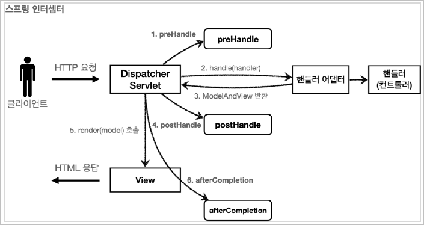

# Filter, Interceptor
예를 들어 상품 관리 페이지로 접근하기 위해선 로그인 여부가 필요하다고 가정해보자. 기능 구현을 위해 상품 관리 컨트롤러에서 로그인 여부를 체크하는 로직을 하나하나 작성해도 되겠지만, 만약 등록, 수정, 삭제, 조회 등등 상품관리의 모든 컨트롤러 로직에 공통으로 로그인 여부를 확인해야 한다면 어떡해야할까. 더 큰 문제는 향후 로그인과 관련된 로직이 변경될 때 마다 로그인 기능을 구현한 모든 로직을 변경해줘야하는 문제가 발생한다.<br><br>
이렇게 애플리케이션 여러 로직에서 공통으로 관심이 있는 있는 것을 공통 관심사(cross-cutting concern)라고 한다. 여기서는 등록, 수정, 삭제, 조회 등등 여러 로직에서 공통으로 인증에 대해서 관심을 가지고 있다.<br><br>
이러한 공통 관심사는 스프링의 AOP로도 해결할 수 있지만, **웹과 관련된 공통 관심사는 지금부터 설명할 서블릿 필터 또는 스프링 인터셉터를 사용하는 것이 좋다.** 웹과 관련된 공통 관심사를 처리할 때는 HTTP의 헤더나 URL의 정보들이 필요한데, 서블릿 필터나 스프링 인터셉터는 `HttpServletRequest` 를 제공한다.<br><br>
## Filter
필터는 서블릿이 지원하는 수문장이다.<br>

### 서블릿 필터란?
#### 필터의 흐름
    HTTP 요청 -> WAS -> 필터 -> dispatcher servlet -> 컨트롤러

- 필터에서 적절하지 않은 요청이라 판단되면 dispatcher servlet이 호출되지 않는다.<br>

#### 필터 체인
    HTTP 요청 -> WAS -> 필터1 -> 필터2 -> 필터3 -> 서블릿 -> 컨트롤러

- 필터는 체인으로 구성되는데, 중간에 필터를 자유롭게 추가할 수 있다.
- 필터 체인이 모두 작동한 뒤에 dispatcher servlet이 호출된다.<br>

#### 필터 인터페이스
**필터 인터페이스를 구현하고 필터를 등록하면 서블릿 컨테이너가 필터를 싱글톤 객체로 생성하고 관리한다.**
```java
public interface Filter {
    public default void init(FilterConfig filterConfig) throws ServletException {}
    
    public void doFilter(ServletRequest request, ServletResponse response, FilterChain chain) throws IOException, ServletException;

    public default void destroy() {}
}
```
- `init()`: 필터 초기화 메서드, 서블릿 컨테이너가 생성될 때 호출된다.
- `doFilter()`: 고객의 요청이 올 때 마다 해당 메서드가 호출된다. 필터의 로직을 구현하면 된다.
- `destroy()`: 필터 종료 메서드, 서블릿 컨테이너가 종료될 때 호출된다.

<br>

#### 로그인 필터 구현
**`LoginCheckFilter`**<br>
```java
@Slf4j
public class LoginCheckFilter implements Filter {

    private static final String[] whiteList = {"/", "members/add", "/login", "/logout", "/css/*"};

    @Override
    public void doFilter(ServletRequest request, ServletResponse response, FilterChain chain) throws IOException, ServletException {

        HttpServletRequest httpRequest = (HttpServletRequest) request;
        HttpServletResponse httpResponse = (HttpServletResponse) response;

        String requestURI = httpRequest.getRequestURI();

        try {
            log.info("인층 체크 필터 시작 {}", requestURI);

            if (isLoginCheckPath(requestURI)) {
                log.info("인증 체크 로직 실행");
                HttpSession session = httpRequest.getSession(false);

                if (session == null || session.getAttribute(SessionConst.LOGIN_MEMBER) == null) {
                    log.info("미인증 사용자 요청 {}", requestURI);
                    httpResponse.sendRedirect("/login?redirectURL=" + requestURI);
                    return;
                }
            }

            chain.doFilter(request, response);
        } catch (Exception e){
            throw e;
        } finally {
            log.info("인증 체크 필터 종료 {}", requestURI);
       }
    }

    //화이트 리스트의 경우 인증 체크 X
    private boolean isLoginCheckPath(String requestURI) {
        return !PatternMatchUtils.simpleMatch(whiteList, requestURI);
    }
}
```
- 필터를 사용하기 위해선 `Filter` 인터페이스를 구현해야한다.
- HTTP 요청이 오면 `doFilter` 가 호출된다.
- `ServletRequest request` 는 **HTTP 요청이 아닌 경우까지 고려해서 만든 인터페이스이다.** HTTP를
사용하면 `ServletRequest`를 다운캐스팅해서 사용해야한다.
- `chain.doFilter(request, response);`
  - 해당 필터 다음에 필터가 또 있으면 해당 필터를 호출하고, 없으면 dispatcher servlet을 호출한다.
  - **`chain.doFilter`를 호출하지 않으면 다음 단계가 진행되지 않는다.**
- `whitelist = {...}`
  - 인증 필터를 사용해도 홈, 회원가입, 로그인, css 같은 리소스에는 접근할 수 있어야한다.
  - 화이트 리스트 경로는 인증과 무관하게 항상 접근을 허용하는 경로를 의미한다.
  - 화이트 리스트 경로를 제외한 모든 경로에 인증 체크 로직을 적용하도록 구현했다.
- `httpResponse.sendRedirect("/login?redirectURL=" + requestURI);`
  - 미인증 사용자는 로그인 화면으로 리다이렉트 한다.
  - 리다이렉트 동시에 기존에 요청받았던 경로를 쿼리 파라미터로 함께 전달한다.
  - 이후 인증 완료 후에 클라이언트가 원했던 경로로 이동할 수 있게 컨트롤러에서 추가로 로직을 구성해주면 고객 사용성이 증가한다.
- `return`
  - `doFilter()` 로직 중간에 `return`을 사용하면 필더는 더이상 진행되지 않는다.
  - 이후 필터는 물론 서블릿, 컨트롤러 또한 호출되지 않는다.
  - `redirect`를 사용했기 때문에 `redirect`가 응답으로 적용되고 요청이 끝난다.

<br>

#### 필터 등록
`@Configuration WebConfig - loginCheckFilter()` 추가<br>
```java
@Bean
public FilterRegistrationBean loginCheckFilter() {
    FilterRegistrationBean<Filter> filterRegistrationBean = new FilterRegistrationBean<>();
    filterRegistrationBean.setFilter(new LoginCheckFilter());
    filterRegistrationBean.setOrder(2);
    filterRegistrationBean.addUrlPatterns("/*");

    return filterRegistrationBean;
}
```
- `setFilter(new LoginCheckFilter())` : 로그인 필터를 등록한다.
- `setOrder(2)` : 순서를 2번으로 잡았다. 로그 필터 다음에 로그인 필터가 적용된다.
- `addUrlPatterns("/*")` : 모든 요청에 로그인 필터를 적용한다.

<br>

> **인터셉터 보다 필터를 사용해야하는 경우**<br>
> 필터는 인터셉터는 갖고있지 않은 강력한 기능을 제공한다. `chain.doFilter(request, response);` 를 
> 호출해서 다음 필터 또는 서블릿을 호출할 때 `request` , `response` 를 다른 객체로 바꿀 수 있다.
> ( 예를 들면 `request로` 넘어온 파라미터를 중간에 변경해서 다음 단계로 넘겨줄 수 있다. )
> ServletRequest , ServletResponse 를 구현한 다른 객체를 만들어서 넘기면 해당 객체가 다음 필터 
> 또는 서블릿에서 사용된다.

<br>

### Interceptor
스프링 인터셉터도 서블릿 필터와 같이 **웹과 관련된 공통 관심 사항을 효과적으로 해결할 수 있는 기술**이다. 서블릿 필터가 서블릿이 제공하는 기술이라면, 스프링 인터셉터는 스프링 MVC가 제공하는 기술이다. **둘다 웹과 관련된 공통 관심 사항을 처리하지만, 적용되는 순서와 범위, 그리고 사용방법이 다르다.**

<br>

#### 인터셉터 흐름
    HTTP 요청 -> WAS -> 필터 -> 서블릿 -> 스프링 인터셉터 -> 컨트롤러

- 스프링 인터셉터는 디스패처 서블릿과 컨트롤러 사이에서 컨트롤러 호출 직전에 호출된다.
- 스프링 인터셉터는 **스프링 MVC가 제공하는 기능이기 때문에 디스패처 서블릿 이후에 등장하게 된다.** 스프링 MVC의 시작점이 디스패처 서블릿이기 때문이다.
- 스프링 인터셉터의 URL 패턴은 서블릿 URL 패턴과는 다르다. 굉장히 정밀하게 설정할 수 있다.

<br>

#### 인터셉터 체인
    HTTP 요청 -> WAS -> 필터 -> 서블릿 -> 인터셉터1 -> 인터셉터2 -> 컨트롤러

- 인터셉터는 필터와 동일하게 체인으로 구성된다.
- 중간에 인터셉터를 자유롭게 추가할 수 있다.

<br>

#### 인터셉터 인터페이스
스프링의 인터셉터를 사용하려면 `HandlerInterceptor` 인터페이스를 구현하면 된다.<br>
```java
public interface HandlerInterceptor {
    default boolean preHandle(HttpServletRequest request, HttpServletResponse response, Object handler) throws Exception {}

    default void postHandle(HttpServletRequest request, HttpServletResponse response, Object handler, @Nullable ModelAndView modelAndView) throws Exception {}

    default void afterCompletion(HttpServletRequest request, HttpServletResponse response, Object handler, @Nullable Exception ex) throws Exception {}
}
```
- 서블릿 필터의 경우 단순하게 doFilter() 하나만 제공된다.
- 인터셉터는 단계적으로 세분화되어 있다. 
  - 컨트롤러 호출 전( `preHandle` )
  - 컨트롤러 호출 이후( `postHandle` )
  - 요청 완료( `afterCompletion` ) 
- 인터셉터는 어떤 컨트롤러( `handler` )가 호출되는지 호출 정보도 받을 수 있다. 
- 그리고 어떤 `modelAndView` 가 반환되는지 응답 정보도 받을 수 있다.

<br>

#### 인터셉터 호출 흐름

- `preHandle` : 컨트롤러 호출 전에 호출된다. (더 정확히는 핸들러 어댑터 호출 전에 호출된다.)
  - `preHandle` 의 응답값이 `true` 이면 다음으로 진행한다.
  - `preHandle` 의 응답값이 `false` 이면 더는 진행하지 않는다. 
  - `false` 인 경우 나머지 인터셉터는 물론이고, 핸들러 어댑터도 호출되지 않는다.
- `postHandle` : 컨트롤러 호출 후에 호출된다. (더 정확히는 핸들러 어댑터 호출 후에 호출된다.)
- `afterCompletion` : 뷰가 렌더링 된 이후에 호출된다.

<br>

#### 인터셉터의 예외 처리
- `preHandle` : 컨트롤러 호출 전에 호출되기 때문에 예외처리를 하지 않는다.
- `postHandle` : 컨트롤러에서 예외가 발생하면 `postHandle` 은 호출되지 않는다.
- `afterCompletion`
  - `afterCompletion` 은 항상 호출된다. 이전 단계에서 예외가 발생해도 호출되는 것을 보장한다.
  - 예외( `ex` )를 파라미터로 받아서 어떤 예외가 발생했는지 로그로 출력할 수 있다.

<br>

#### 인터셉터로 로그인 인증 처리
**`LoginCheckInterceptor`**
```java
@Slf4j
public class LoginCheckInterceptor implements HandlerInterceptor {

    @Override
    public boolean preHandle(HttpServletRequest request, HttpServletResponse response, Object handler) throws Exception {

        String requestURI = request.getRequestURI();
        log.info("인증 체크 인터셉터 실행 {}", requestURI);

        HttpSession session = request.getSession();
        if (session == null || session.getAttribute(SessionConst.LOGIN_MEMBER) == null) {
            log.info("미인증 사용자 요청");

            //로그인으로 redirect
            response.sendRedirect("/login?redirectURL=" + requestURI);
            return false;
        }
        return true;
    }
}
```
- 인터셉터를 사용하기 위해서는 `HandlerInterceptor`를 구현해야한다.
- 스프링 인터셉터에서 데이터를 공유하는 방법
  - 스프링 인터셉터는 호출 시점이 완전히 분리되어 있다.
  - `preHandle` 에서 지정한 값을 `postHandle` , `afterCompletion` 에서 함께 사용하려면 어딘가에 담아두어야 한다.
  - `LoginCheckInterceptor`도 싱글톤처럼 사용되기 때문에 멤버 변수를 사용하면 위험하다.
  - 따라서 `request`에 담아두고 필요할 때 `.getAttribute`로 찾아서 사용하면 된다.
- `return true;`
  - `true` 값을 반환하면 다음 인터셉터나 컨트롤러가 호출된다.

<br>

#### `HandlerMethod`
- 핸들러 정보는 어떤 핸들러 매핑을 사용하는가에 따라 달라진다.
- 스프링을 사용하면 일반적으로 `@Controller` ,` @RequestMapping`을 활용한 핸들러 매핑을 사용한다.
- 이 경우 핸들러 정보로 `HandlerMethod` 가 넘어온다.

<br>

#### `ResourceHttpRequestHandler`
`@Controller` 가 아니라 `/resources/static`와 같은 정적 리소스가 호출 되는 경우<br>
`ResourceHttpRequestHandler` 가 핸들러 정보로 넘어오기 때문에 타입에 따라서 처리가 필요하다.

<br>

#### 인터셉터 등록
**`WebConfig`**
```java
@Configuration public class WebConfig implements WebMvcConfigurer {
    @Override
    public void addInterceptors(InterceptorRegistry registry) {
        registry.addInterceptor(new LogInterceptor())
                .order(1)
                .addPathPatterns("/**")
                .excludePathPatterns("css/**", "/*.ico", "/error");

        registry.addInterceptor(new LoginCheckInterceptor())
                .order(2)
                .addPathPatterns("/**")
                .excludePathPatterns("/", "members/add", "/login", "/logout", "/css/*");
    }
}
```
- 인터셉터 등록을 위해 설정 파일에 `WebMvcConfigurer`를 구현해준다.
    ```java
    @Configuration
    public class WebConfig implements WebMvcConfigurer { ... }
    ```
- `WebMvcConfigurer` 가 제공하는 `addInterceptors()` 를 사용해서 인터셉터를 등록할 수 있다.
- `registry.addInterceptor(new LoginCheckInterceptor())` : 인터셉터를 등록한다.
- `order(1)` : 인터셉터의 호출 순서를 지정한다. 낮을 수록 먼저 호출된다.
- `addPathPatterns("/**")` : 인터셉터를 적용할 URL 패턴을 지정한다.
- `excludePathPatterns("...")` : 인터셉터에서 제외할 패턴을 지정한다.

<br>

#### 스프링 URL 경로 설정
[**PathPattern** 공식 문서](https://docs.spring.io/spring-framework/docs/current/javadoc-api/org/springframework/web/util/pattern/PathPattern.html)
    
    ? 한 문자 일치
    * 경로(/) 안에서 0개 이상의 문자 일치
    ** 경로 끝까지 0개 이상의 경로(/) 일치
    {spring} 경로(/)와 일치하고 spring이라는 변수로 캡처
    {spring:[a-z]+} matches the regexp [a-z]+ as a path variable named "spring"
    {spring:[a-z]+} regexp [a-z]+ 와 일치하고, "spring" 경로 변수로 캡처
    {*spring} 경로가 끝날 때 까지 0개 이상의 경로(/)와 일치하고 spring이라는 변수로 캡처
    /pages/t?st.html — matches /pages/test.html, /pages/tXst.html but not /pages/
    toast.html
    /resources/*.png — matches all .png files in the resources directory
    /resources/** — matches all files underneath the /resources/ path, including /
    resources/image.png and /resources/css/spring.css
    /resources/{*path} — matches all files underneath the /resources/ path and
    captures their relative path in a variable named "path"; /resources/image.png
    will match with "path" → "/image.png", and /resources/css/spring.css will match
    with "path" → "/css/spring.css"
    /resources/{filename:\\w+}.dat will match /resources/spring.dat and assign the
    value "spring" to the filename variable


***
## 부록
### `ArgumentResolver` 활용
로그인 기능을 좀 더 편리하게 활용하기 위해 `ArgumentResolver`를 활용해본다.<br>
#### HomeController
```java
@GetMapping("/")
public String homeLoginV3AragumentResolver(@Login Member member, Model model) {

    // 로그인
    if (member == null) {
        return "home";
    }

    model.addAttribute("member", member);
    return "loginHome";
}
```
- 기존 `@SessionAttribute(name = SessionConst.LOGIN_MEMBER, required = false) Member member`을 통해 세션 데이터를 받아오던 방식을 `@Login Member member`로 간소화 했다.

<br>

#### @Login 애노테이션 생성
```java
@Target(ElementType.PARAMETER)
@Retention(RetentionPolicy.RUNTIME)
public @interface Login {
}
```
- `@Target(ElementType.PARAMETER)` : 해당 어노테이션은 파라미터에만 사용한다.
- `@Retention(RetentionPolicy.RUNTIME)` : 리플렉션 등을 활용할 수 있도록 런타임까지 애노테이션
정보가 남아있음

<br>

#### `ArgumentResolver` 생성
`LoginMemberArgumentResolver`
```java
public class LoginMemberArgumentResolver implements HandlerMethodArgumentResolver {

    @Override
    public boolean supportsParameter(MethodParameter parameter) {

        boolean hasLoginAnnotation = parameter.hasParameterAnnotation(Login.class);
        boolean hasMemberType = Member.class.isAssignableFrom(parameter.getParameterType());

        return hasLoginAnnotation && hasMemberType;
    }

    @Override
    public Object resolveArgument(MethodParameter parameter, ModelAndViewContainer mavContainer, NativeWebRequest webRequest, WebDataBinderFactory binderFactory) throws Exception {

        HttpServletRequest request = (HttpServletRequest) webRequest.getNativeRequest();
        HttpSession session = request.getSession(false);

        if (session == null) {
            return null;
        }

        return session.getAttribute(SessionConst.LOGIN_MEMBER);
    }
}
```
- 새로운 `ArgumentResolver`를 생성하기 위해서는 `HandlerMethodArgumentResolver`를 구현해야한다.
- `supportsParameter()`
  - `boolean hasLoginAnnotation = parameter.hasParameterAnnotation(Login.class);`
    - 파라미터로 넘어온 값에 `@Login` 애노테이션이 있으면 `true`를 반환한다. 
    - `Login.class`는 새롭게 생성한` @Login` 어노테이션이다.
  - `boolean hasMemberType = Member.class.isAssignableFrom(parameter.getParameterType());`
    - `Member member = parameter` 가 가능하냐고 묻는 코드이다. 
    - 즉 `parameter`로 넘어온 데이터의 타입이 `member`에 할당 가능한지 묻고있다.
- `resolveArgument()`
  - 컨트롤러 호출 직전에 호출되어서 필요한 파리미터 정보를 생성해준다.
  - 여기서는 로그인 회원 정보인 member 객체를 찾아서 반환해준다.
  - 이후 스프링 MVC는 컨트롤러의 메소드를 호출하면 여기서 반환된 `member` 객체를 파라미터에 전달해준다.

<br>

#### `ArgumentResolver` 등록
**WebMvcConfigurer**
```java
@Configuration
public class WebConfig implements WebMvcConfigurer {
  
    @Override
    public void addArgumentResolvers(List<HandlerMethodArgumentResolver> resolvers) {
        resolvers.add(new LoginMemberArgumentResolver());
    }
}
```

<br>

### JAVA8의 default 타입
인터페이스에서 메소드 타입을 default로 설정해주면 해당 인터페이스를 구현할 때 default가 붙은 메소드는 오버라이드해주지 않아도 정상적으로 인터페이스를 구현할 수 있게된다.

<br>

### 스프링 빈 등록 ( 메서드에 @Bean이 붙었을 때 )
@Bean이 붙은 메서드명이 각각의 bean 이름이된다. 해당 메서드가 반환하는 객체가 스프링 빈으로 등록된다.

<br>

### `addInterceptors` 메서드를 오버라이딩 해주는것만으로 인터셉터가 등록되는 것인가?
`WebMvcConfigurer` 인터페이스에 대해서 더 공부해볼 필요가 있다. 

### `Deletegation` 구조란 무엇인가?

<br>

### `@RequestParam`의 `defaultValue` 속성
`@RequestParam(defaultValue = "/") String redirectURL`<br>
파라미터로 넘어온 값이 없으면 `redirectURL`에 "/"를 기본값으로 설정한다.

<br>

### resolveArgument() 관련 궁금증
`resolveArgument()` 메소드가 `Object` 타입의 객체를 반환하는데 어떻게 `Member` 타입의 변수에 해당 값을 저장할 수 있는 것인가?

