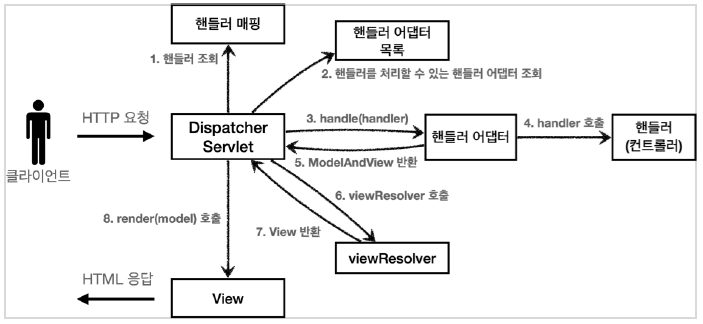
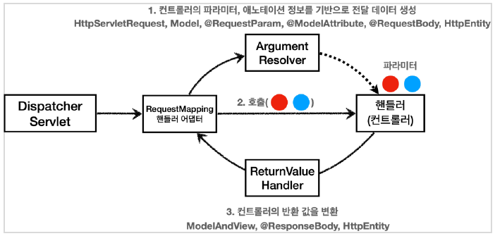
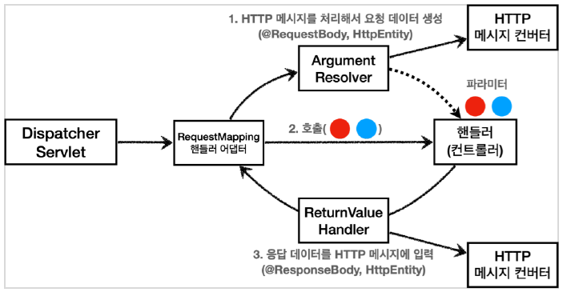

# SpringMVC 구조


## `RequestMappingHandlerAdapter`
HTTP 메시지 컨버터는 스프링 MVC 어디쯤에서 사용되는 것일까? 모든 비밀은 애노테이션 기반의 컨트롤러, `@RequestMapping`을 처리하는 핸들러 어댑터인 
`RequestMappingHandlerAdapter`에 있다.
<br>
<br>

### `RequestMappingHandlerAdapter` 동작 방식

<br>
<br>

#### `ArgumentResolver`
애노테이션 기반의 컨트롤러는 매우 다양한 파라미터를 사용할 수 있다. `HttpServletRequest`, `Model` 은 물론이고, `@RequestParam` , `@ModelAttribute` 같은 애노테이션 그리고 `@RequestBody`, `HttpEntity` 같은 HTTP 메시지를 처리하는 부분까지 매우 큰 유연함을 보여주었다. 이렇게 파라미터를 유연하게 처리할 수 있는 이유가 바로 `ArgumentResolver` 덕분이다.
<br>
<br>

애노테이션 기반 컨트롤러를 처리하는 `RequestMappingHandlerAdaptor` 는 바로 이 `ArgumentResolver` 를 호출해서 컨트롤러( 핸들러 )가 필요로 하는 다양한 파라미터의 값(객체)을 생성한다.
<br>
<br>

그리고 이렇게 파리미터의 값이 모두 준비되면 컨트롤러를 호출하면서 값을 넘겨준다. 스프링은 30개가 넘는 `ArgumentResolver` 를 기본으로 제공한다.
> **참고**
> 가능한 파라미터 목록은 다음 공식 메뉴얼에서 확인할 수 있다.
> 
> https://docs.spring.io/spring-framework/docs/current/reference/html/web.html#mvc-annarguments

> 정확히는 `HandlerMethodArgumentResolver` 인데 줄여서 `ArgumentResolver` 라고 부른다.
```java
public interface HandlerMethodArgumentResolver {
    boolean supportsParameter(MethodParameter parameter);

    @Nullable
    Object resolveArgument(
        MethodParameter parameter, 
        @Nullable ModelAndViewContainer mavContainer,
        NativeWebRequest webRequest, 
        @Nullable WebDataBinderFactory binderFactory) throws Exception;
}
```
#### `ArgumentResolver` 동작 방식
- `ArgumentResolver` 의 `supportsParameter()` 를 호출해서 해당 파라미터를 지원하는지 체크한다.
- 지원하면 `resolveArgument()` 를 호출해서 실제 객체를 생성한다. 
- 그리고 이렇게 생성된 객체가 컨트롤러 호출 시 넘어가는 것
- 그리고 원한다면 직접 이 인터페이스를 확장해서 원하는 `ArgumentResolver` 를 만들 수도 있다.
<br>
<br>

### `ReturnValueHandler`
`HandlerMethodReturnValueHandler` 를 줄여서 `ReturnValueHandle` 라 부른다.
`ArgumentResolver` 와 비슷한데, 이것은 **응답 값을 변환하고 처리한다.**

컨트롤러에서 `String`으로 뷰 이름을 반환해도, 동작하는 이유가 바로 `ReturnValueHandler` 덕분이다.

스프링은 10여개가 넘는 `ReturnValueHandler` 를 지원한다.
- 예) `ModelAndView` , `@ResponseBody` , `HttpEntity` , `String`

> **참고**
> 가능한 응답 값 목록은 다음 공식 메뉴얼에서 확인할 수 있다.
> 
> https://docs.spring.io/spring-framework/docs/current/reference/html/web.html#mvc-annreturn-types

<br>
<br>

### HTTP 메시지 컨버터
#### HTTP 메시지 컨버터의 위치


**요청의 경우** `@RequestBody` 를 처리하는 `ArgumentResolver` 가 있고, `HttpEntity` 를 처리하는 `ArgumentResolver` 가 있다. 이 `ArgumentResolver` 들이 HTTP 메시지 컨버터를 사용해서 필요한 객체를 생성하는 것이다. 
<br>
<br>

**응답의 경우** `@ResponseBody` 와 `HttpEntity` 를 처리하는 `ReturnValueHandler` 가 있다. 그리고 여기에서 HTTP 메시지 컨버터를 호출해서 응답 결과를 만든다.
<br>
<br>

스프링 MVC는 `@RequestBody` `@ResponseBody` 가 있으면
`RequestResponseBodyMethodProcessor` (ArgumentResolver)
`HttpEntity` 가 있으면 `HttpEntityMethodProcessor` (ArgumentResolver)를 사용한다.
<br>
<br>

### 확장
스프링은 다음을 모두 인터페이스로 제공한다. 따라서 필요하면 언제든지 기능을 확장할 수 있다.
- `HandlerMethodArgumentResolver`
- `HandlerMethodReturnValueHandler`
- `HttpMessageConverter`

기능을 확장하고 싶다면 `WebMvcConfigurer` 를 상속 받아서 스프링 빈으로 등록하면 된다.

#### `WebMvcConfigurer` 확장
```java
@Bean
public WebMvcConfigurer webMvcConfigurer() {
return new WebMvcConfigurer() {
    @Override
    public void addArgumentResolvers(List<HandlerMethodArgumentResolver>
    resolvers) {
        //...
    }
    @Override
    public void extendMessageConverters(List<HttpMessageConverter<?>>
    converters) {
        //...
    }
```