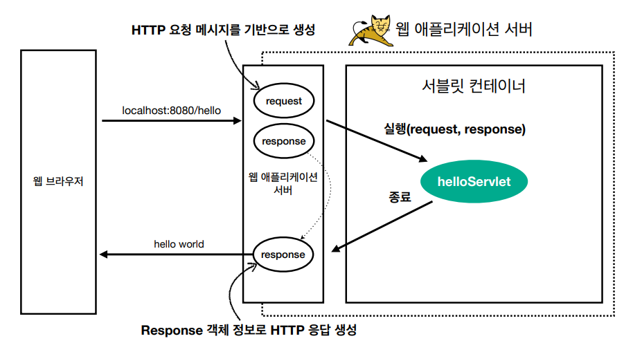
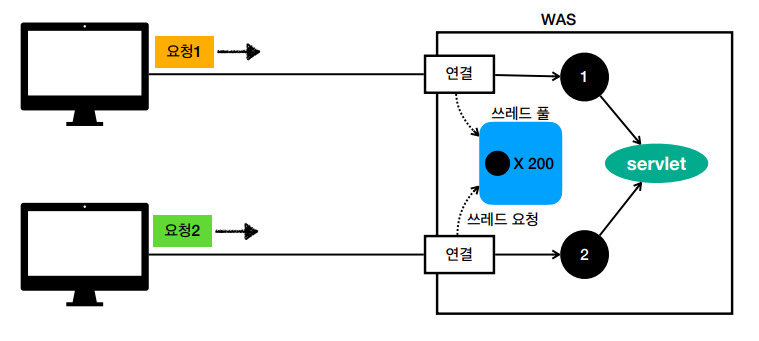

# Web Application
## 웹 서버( Web Server ) vs 웹 애플리케이션 서버( WAS - Web Application Server )
### 웹 서버
- HTTP 기반으로 동작한다.
- 정적 리소스를 제공한다.
### WAS
- HTTP 기반으로 동작한다.
- 웹 서버의 기능을 포함한다.
- 프로그램 코드를 실행해서 애플리케이션 로직을 실행할 수 있다.
  - 동적 HTML, HTTP API( JSON )
  - 이러한 특성 덕분에 WAS는 사용자마다 서로 다른 페이지를 보여줄 수 있다.
- **WAS는 애플리케이션 코드를 실행하는데 더 특화되어 있다.**

***
## 웹 시스템 구성
### WEB, WAS, DB
- 정적 리소스는 웹 서버가 처리한다.( WAS의 업무 부담을 줄여준다. )
- **웹 서버는 애플리케이션 로직같은 동적인 처리가 필요하면 WAS에 요청을 위임한다.**
- WAS는 중요한 애플리케이션 로직 처리를 전담한다.
- 이로인해 효율적으로 리소스를 관리할 수 있다.
  - 정적 리소스가 많이 사용되면 WEB 서버를 증설한다.
  - 애플리케이션 리소스가 많이 사용되면 WAS를 증설한다.
- WEB 서버는 정적 리소스만 제공하면 되기 때문에 잘 다운되지 않는다.
- 반면에 WAS는 애플리케이션 로직을 수행하기 때문에 잘 죽는다.
- WAS, DB에서 장애가 발생하면 WEB 서버가 오류 화면을 제공할 수 있다.
  - WEB 서버 없이 WAS, DB로만 구성하면 WAS가 죽었을때 오류 화면도 보여줄 수 없다.

***
## 서블릿( Servlet )
- 서블릿은 서버에서 처리해야하는 업무의 상당 부분을 알아서 처리해준다.
  - TCP/IP 소켓 연결
  - HTTP 요청 메시지를 파싱해서 분석
  - HTTP 응답 메시지 생성
  - TCP/IP 응답 전달, 소켓 종료 등등
### 특징
```java
@WebServlet(name = "helloServlet", urlPatterns = "/hello")
public class HelloServlet extends HttpServlet {
  @Override
    protected void service(HttpServletRequest request, HttpServletResponse response){
    //애플리케이션 로직
  }
}
```
- ```HttpServletRequest``` 
  - 서블릿으로 인해 개발자는 서블릿이 파싱해준 HTTP 요청 정보를 편리하게 사용할 수 있다.
- ```HttpServletRespose```
  - 개발자는 서블릿이 제공해준 응답 객체를 통해 HTTP 응답 정보를 편리하게 제공할 수 있다.

### 서블릿 HTTP 요청, 응답 흐름

- HTTP 요청시
  - WAS는 Request, Response 객체를 새로 만들어서 서블릿 객체를 호출한다.
  - 개발자는 Request 객체에서 HTTP 요청 정보를 편리하게 꺼내서 사용한다.
  - 개발자는 Response 객체에 HTTP 응답 정보를 편리하게 입력한다.
  - WAS는 Response 객체에 담겨있는 내용으로 HTTP 응답 정보를 생성한다.

### 서블릿 컨테이너
- 톰켓처럼 **서블릿을 지원하는 WAS를 서블릿 컨테이너**라고 한다.
- **서블릿 컨테이너는 서블릿 객체를 생성, 초기화, 호출, 종료하는 생명주기를 관리한다.**
- 서블릿 객체는 **싱글톤**으로 관리된다.
  - 서블릿 컨테이너 종료시 함께 소멸된다.
- JSP도 서블릿으로 변환되어 사용된다.
- ***서블릿은 동시 요청을 위한 멀티 쓰레드를 지원한다.***

***
## 동시요청( Multi Thread )
### 쓰레드란?
- 애플리케이션 코드를 하나하나 순차적으로 실행하는 것은 쓰레드가 담당한다.
- 자바 메인 메서드를 처음 실행하면 ```main``` 이라는 이름의 하나의 쓰레드가 실행된다.
- 즉, 쓰레드가 없다면 자바 애플리케이션 실행이 불가능하다.
- 쓰레드는 한번에 하나의 코드 라인만 수행할 수 있다.
- 동시 처리가 필요하면 쓰레드를 추가로 생성한다.

### 요청마다 쓰레드를 생성할 떄
- 장점
  - 동시 요청을 처리할 수 있다.
  - 리소스( CPU, 메모리 )가 허용할 떄 까지 처리할 수 있다.
  - 하나의 쓰레드가 지연되어도 나머지 쓰레드는 정상 동작한다.
- 단점
  - 쓰레드는 생성 비용이 매우 비싸다.
    - 고객 요청이 들어올 때 마다 쓰레드를 생성하면 응답 속도가 늦어진다.
  - 쓰레드는 컨텍스트 스위칭 비용이 발생한다.
    - **컨텍스트 스위칭 비용**: CPU 코어가 쓰레드 간 이동할 때 발생하는 비용
  - 쓰레드 생성에 제한이 없다.
    - 고객 요청이 너무 많으면 CPU, 메모리 임계점을 넘게되고 결국 서버가 죽을 수 있다.
- **쓰레드 풀**을 사용하면 이러한 단점들을 보완할 수 있다.

### 쓰레드 풀

#### 특징
- 필요한 쓰레드를 쓰레드 풀에 보관하고 관리한다.
- 쓰레드 풀에 생성 가능한 쓰레드의 최대치를 관리한다. 톰캣은 최대 200개가 기본 설정이다.
#### 사용
- 쓰레드가 필요하면 이미 생성되어있는 쓰레드 풀에서 꺼내서 사용하면 된다.
- 사용을 종료하면 쓰레드 풀에 해당 쓰레드를 반납한다.
- 최대 쓰레드가 모두 사용중이라면?
  - 기다리는 요청은 거절하거나
  - 특정 숫자만큼만 대기하도록 설정할 수 있다.
#### 장점
- 쓰레드가 미리 생성되어 있으므로, 쓰레드를 생성하고 종료하는 비용( CPU )이 절약되고, 응답시간이 빠르다.
- 생성 가능한 쓰레드의 최대치가 있으므로 너무 많은 요청이 들어와도 기존 요청은 안전하게 처리할 수 있다.

### 쓰레드풀 실무 팁
- WAS의 주요 튜닝 포인트는 최대 쓰레드( max thread ) 수 이다.
- 최대 쓰레드 수가 너무 낮으면
  - 동시 요청이 많아졌을 때 서버 리소스는 여유롭지만, 클라이언트는 금방 응답 지연이 발생하게된다.
- 최대 쓰레드 수가 너무 많으면
  - 동시 요청이 많아졌을 때 CPU, 메모리 리소스 임계점 초과로 서버가 다운될 수 있다.
- 장애가 발생했을 때?
  - 클라우드 환경이라면 일단 서버부터 늘리고 튜닝을 한다.
  - 그렇지 않다면 튜닝을 열심히 한다.

#### 쓰레드 풀의 적정 수는 어떻게 찾을까?
- **쓰레드 풀의 적정수는 상황에 따라 다르다.**
  - 애플리케이션 로직의 복잡도
    - DB를 몇번 거쳐야 하는 로직인지
  - CPU, 메모리, IO 리소스 상황 등등
- 따라서 **서버의 성능 테스트 이후 결정해야 한다.**
  - 네이버의 nGrinder 오픈소스

### WAS의 멀티 쓰레드 지원
- 멀티 쓰레드에 대한 부분은 WAS가 처리해준다.
- **개발자가 멀티 쓰레드 관련 코드를 신경쓰지 않아도 된다.**
- 개발자는 마치 **싱글 쓰레드 프로그래밍을 하듯** 편리하게 소스 코드를 개발할 수 있다.
- 다만, 멀티 쓰레드 환경이므로 **싱글톤 객체( 서블릿, 스프링빈 )는 주의해서 사용해야한다.**
