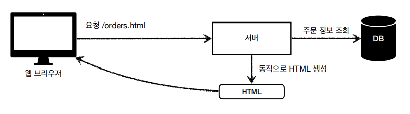
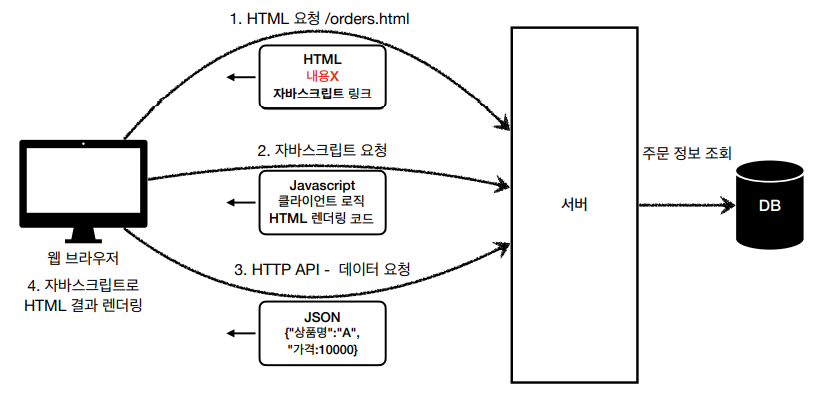

# HTML,HTTP API,CSR,SSR 
백엔드 개발자가 서비스를 제공해야할 떄 고민해야하는 포인트 3가지
- 정적 리소스를 어떻게 제공할 것인가?
- 동적 HTML 페이즈를 어떻게 제공할 것인가?
- HTTP API를 어떻게 제공할 것인가?

## 정적 리소스
- 고정된 HTML 파일, CSS, JS, 이미지, 영상들을 제공한다.
- 주로 웹브라우저( Web Server의 역할 )가 해당 업무를 담당한다.( 캐시 )

## HTML 페이지
- 동적으로 필요한 HTML 파일을 생성해서 전달한다.
- 웹 브라우저는 서버로 부터 전달받은 HTML을 해석하는 역할을 담당한다.

## HTTP API
- HTML이 아니라 JSON 데이터를 전달한다.
- 웹 브라우저 뿐만 아니라 다양한 시스템에서 호출할 수 있다.
  - 웹 클라이언트 to 서버
    - 웹 브라우저에서 자바스크립트를 통한 HTTP API 호출
    - React, Vue같은 웹 클라이언트에서 HTTP API 요청
  - 앱 클라이언트 to 서버
  - 서버 to 서버
    - 예를 들어 주문 서버 -> 결제 서버
    - 기업 간 데이터 통신

## 서버 사이드 렌더링( SSR )

- HTML 최종 결과를 서버에서 만들어서 웹 브라우저에 전달한다.
- HTML 최종 렌더링을 서버에서 담당하는 것이다.
- 주로 정적인 화면에 사용된다.

## 클라이언트 사이드 렌더링( CSR )

- HTML 결과를 자바 스크립트를 사용해서 웹 브라우저 내에서 동적으로 생성하고 적용할 수 있다.
- 웹 환경을 마치 앱 처럼 필요한 부분부분 변경할 수 있다.
- 주로 동적인 화면에서 사용한다.

