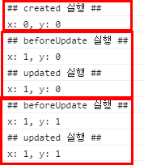

# Vue - LifeCycleHook
## LifeCycleHook
Vue 인스턴스의 생성부터 소멸까지의 과정을 말한다. 모든 프로그래밍 언어에서는 생애 주기가 존재한다.

> ### (before)Create
- ```beforeCreate()```: Vue 인스턴스가 생성된 다음 데이터가 초기화 되는 시점에 호출된다.
- ```create()```: Vue 인스턴스가 생성된 후 데이터 초기화 작업이 끝난 시점에 호출된다.

> ### (before)Mount
- ```beforeMount()```: 인스턴스가 DOM 요소에 마운트 되기 전에 호출된다.
- ```mount```: 인스턴스가 DOM 요소에 마운트된 후에 호출된다.

> ### (before)Update
- ```beforeUpdate()```: 먼저 데이터( 변수 )가 수정되고 이후 DOM 요소에 반영되기 전에 호출된다.
- ```update```: 먼저 데이터( 변수 )가 수정되고 이후 DOM 요소에 반영된 후에 호출된다.

> ### (before)Destroy
- ```beforeDestroy()```: 인스턴스가 폐기되기 전에 호출된다.
- ```destroy()```: 인스턴스가 폐기된 후에 호출된다.

***
## 예제
> ### 예제 코드
```javascript
new Vue({
    el:"#app",
    data:{
        msg: "Vue.js의 Lifecycle",
        x:0, y:0
    },
    created(){
        console.log("## created 실행 ##");
        console.log("x: " + this.x + ", y: " + this.y);
    },
    beforeUpdate() {
        console.log("## beforeUpdate 실행 ##");
        console.log("x: " + this.x + ", y: " + this.y);
    },
    updated() {
        console.log("## updated 실행 ##");
        console.log("x: " + this.x + ", y: " + this.y);
    },
    computed: {
        sum: function(){
            let result = Number(this.x) + Number(this.y);
            if(isNaN(result))
                return 0;
            else
                return result;
        }   
    }
});
```
> ### 실행 결과
1. 실행시 자동으로 created() 호출
2. 이후 x 값을 1로 변경
3. 이후 y 값을 1로 변경
    
    

