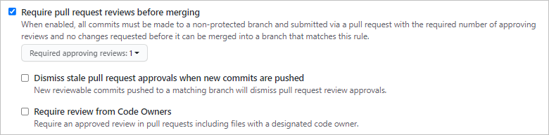
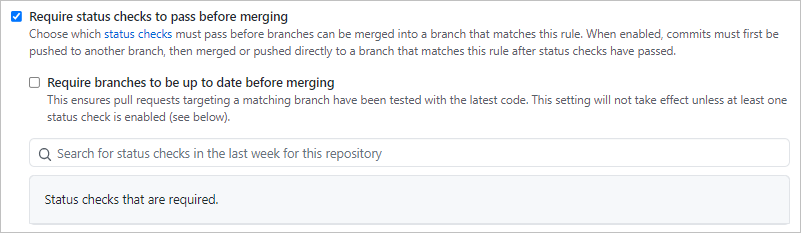
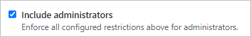

# 브랜치 정책
repository -> settings -> branch -> branch protection rule

## 1. Require pull request reviews before merging
`merge` 전에 PR은 필수적이고, 설정한 인원 수만큼 승인이 이루어져야 merge되도록 설정한다.

 

## 2. Require status checks to pass before merging
`merge` 전에 빌드가 정상적으로 진행됐는지 Action을 통해 체크해준다.

## 3. Include administrators
관리자 권한이 있더라도 해당 `branch rule`을 위반할 수 없다.
