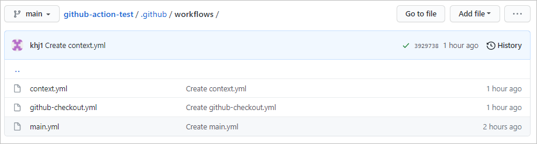

# Github Action
Github에서는 [CI( continuous Integration )](../CS/Compile,%20Build,%20Deploy.md#ci)를 위한 툴인 Action을 제공하고 있다. **Github Action이란** 가상의 컴퓨터를 만들어서 github 내부에서 이루어지는 활동들에 의미있는 로직을 수행할 수 있게 해주는 기능이다.

<br>

## 기본 문법
    workflow > job > step > action
### workflow
**github respoitory에 대해 일련의 작업들을 수행하는 자동화된 프로세스이다.** repository의 root에서 `./github/workflows/` 아래에 workflow에 대한 `yml` 형식의 설정 파일이 있어야한다.<br>
**Workflows는 Actions를 포괄한다.**



<br>

### job
`job`은 여러개의 `step`으로 이루어질 수 있으며 단일한 가상 환경을 가진다.

<br>

### step
job 안에서 순차적으로 실행되는 프로세스 단위이다.<br>
```yml
name: github checkout

on: [push]

jobs:
  build:
    runs-on: ubuntu-latest

    steps:
      - uses: actions/checkout@v2

      - name: Run pwd
        run: pwd

      - name: Run ls -al
        run: ls -al
```
- 다른 사람이 작성한 action을 사용하고 싶을 때 `uses` 를 사용한다.
  - [github.com/actions/checkout](https://github.com/actions/checkout) 참고
    - 대표적인 예로 [todo-actions](https://github.com/marketplace/actions/todo-actions)가 있다.
  - `actions/checkout@v2`
    1. 가상 컴퓨터에 현재 액션이 실행되고 있는 저장소를 `clone`하고 `checkout` 한다. 
    2. 앞으로 등장할 명령어들을 해당 repository의 내용에 적용할 수 있게 해준다.

<br>

## env
환경 변수를 의미한다. github에서 제공하는 각종 객체를 활용해서 출력할 수 있다.
```yml
on: push

jobs:
  one:
    runs-on: ubuntu-latest
    steps:
      - name: Dump GitHub context
        env:
          GITHUB_CONTEXT: ${{ toJSON(github) }}
        run: echo "$GITHUB_CONTEXT"
      - name: Dump job context
        env:
          JOB_CONTEXT: ${{ toJSON(job) }}
        run: echo "$JOB_CONTEXT"
      - name: Dump steps context
        env:
          STEPS_CONTEXT: ${{ toJSON(steps) }}
        run: echo "$STEPS_CONTEXT"
      - name: Dump runner context
        env:
          RUNNER_CONTEXT: ${{ toJSON(runner) }}
        run: echo "$RUNNER_CONTEXT"
      - name: Dump strategy context
        env:
          STRATEGY_CONTEXT: ${{ toJSON(strategy) }}
        run: echo "$STRATEGY_CONTEXT"
      - name: Dump matrix context
        env:
          MATRIX_CONTEXT: ${{ toJSON(matrix) }}
        run: echo "$MATRIX_CONTEXT"
```

> 참고<br>
> [Context and expression syntax for GitHub Actions](https://docs.github.com/en/actions/reference/context-and-expression-syntax-for-github-actions#github-context)

<br>

## secret
yml 파일에서 비밀번호와 같은 보안이 중요한 정보들을 사용해야 할 때 secret을 사용한다.
1. repository의 settings
2. Secrets
3. New reposiotory secret
4. Name과 Value 작성

<br>

예를 들어 Name = "password", Value = "1234"라고 Secrets를 추가했을 때 다음과 같이 사용할 수 있다.<br>

```yml
steps:
    - name: password
    env:
        GITHUB_PASSWORD: ${{ password }}
    run: echo "My password is $GITHUB_PASSWORD"
```

### event
추후 학습 예정

<br>

## code
추후 학습 예정

<br>

## 아티팩트를 활용한 job 연결
### built-in artifact storage
서로 다른 2개의 job은 독립적이다. 예를 들어 A라는 job과 B라는 job이 있다고 가정해보자. A의 결과물을 바탕으로 B를 실행해야한다면 어떻게 해야할까?

```yml
jobs:
  A:
    - uses: actions/upload-artifact@master
      with:
        name: webpack artifacts
        path: public/
  B:
    - uses: actions/download-artifact@master
      with:
        name: webpack artifacts
        path: public/
```
- `A`에서 아티팩트를 업로드해주고
- `B`에서 해당 아티팩트를 다운받아 사용하는 방식

### 문제점 발생
`A`가 모두 실행되고 `B`가 진행되어야하는데, `A`와 `B`가 동시에 실행되는 문제가 발생한다.

### 해결책
`needs:`를 사용해서 `A`가 먼저 실행된 이후 `B`가 실행되도록 설계한다.
```yml
jobs:
  A:
    - uses: actions/upload-artifact@master
      with:
        name: webpack artifacts
        path: public/
  B:
    - needs: A
    - uses: actions/download-artifact@master
      with:
        name: webpack artifacts
        path: public/
```
- `needs: A`를 추가하면 `A`가 모두 실행된 이후에 `B`가 진행된다.( 종속성 추가 )

***
## 템플릿을 통한 코드/빌드/테스트 자동화
```yml
name: Java CI with Gradle

on:
  push:
    branches: [ develop ]
  pull_request:
    branches: [ develop ]

jobs:
  build:

    runs-on: ubuntu-latest

    steps:
    - uses: actions/checkout@v2
    - name: Set up JDK 11
      uses: actions/setup-java@v2
      with:
        java-version: '11'
        distribution: 'adopt'
    - name: Grant execute permission for gradlew
      run: chmod +x gradlew
    - name: Build with Gradle
      run: ./gradlew **build**
```
- 자바를 설치하고 빌드와 테스트를 자동으로 수행한다.

<br>


***
## Auto PR
```yml
# ./.github/workflows/staging-auto-pr.yaml
name: Auto-PR
on:
  push:
    branches:
      - feature/*

jobs:
  auto-pull-request:
    name: Open PR to develop
    runs-on: ubuntu-latest
    steps:
    - uses: actions/checkout@v2
      name: checkout

    - uses: repo-sync/pull-request@v2
      name: pull-request
      with:
        destination_branch: "develop"
        pr_title: "Pulling ${{ github.ref }} into develop"
        pr_body: "${{ github.event.head_commit.message }}"
        pr_reviewer: "hanjun"
        pr_draft: true
        github_token: ${{ secrets.GITHUB_TOKEN }}
```
- draft PR
  - `ready for review` 상태가 되기 전까지는 `merge` 될 수 없게 설정한다. 
  - pull request는 의사소통의 방식으로 사용되는 경우가 많기 때문에 `pr-draf`t의 기능이 굉장히 유용하게 활용될 수 있다.

<br>

## Auto-Labeling
코드리뷰가 승인됐을 때 approved 라벨을 자동으로 붙여주는 기능
```yml
on: pull_request_review
name: Auto labeling
jobs:
  labelWhenApproved:
    name: Label when approved
    runs-on: ubuntu-latest
    steps:
    - name: Label approved pull requests
      uses: abinoda/label-when-approved-action@1.0.5

      env:
        APPROVALS: "1"
        GITHUB_TOKEN: ${{ secrets.GITHUB_TOKEN }}
        ADD_LABEL: "approved"
```
- [Label approved pull request](https://github.com/marketplace/actions/label-approved-pull-requests) 커스텀 액션을 사용했다.

<br>

> **참고**<br> 
> Label과 관련된 Custom Action 중에서는 [Labeler](https://github.com/marketplace/actions/labeler)가 가장 유명하다.<br>
> 하지만 Labeler는 기능이 뛰어난 만큼 복잡하기 때문에 추후 학습하기로 한다.

<br>

## github action에 .gitignore 추가하는 방법
[추가 예정]
