### `.entrySet`

### `TreeMap<T>`
주로 key값을 기준으로 비교하기 용이한 `map`이다.
- `comparator`를 사용하여 정렬하거나
- `subMap()` 메소드를 통해 map을 분할할 수도 있다.

### `LinkedHashmap`
순서가 보장되는 `map`이다. 입력된 순서를 기억한다.

### `@Builder` 사용하기
- `@AllArgsConstructor`
- `@NoArgsConstructor`

이 둘을 같이 명시해줘야 정상적으로 작동한다. (왜?)


### OAuth
#### 용어정리
- Resource Owner
  - 회원
- Resource Server
  - 구글, 카카오 ...
- Authorization Server
- Client
  - 해당 API를 구현하는 개발자

#### 등록
- Scope
  - Client 에게 제공할 수 있는 정보의 범위를 의미한다.
- Client ID
  - 노출되도 된다.
- Client Secret
  - 노출되면 안되는 정보
- Authorized redirect URIs
- Authorization code
  - 회원정보 제공 동의 와 같이 Resource Owner가 정보 제공을 승인하면 Authorization 코드가 발급된다.
- Resource Sever는 Client에게 Client ID, Client Secret, Authorization 코드를 받고 기존에 자신이 갖고있던 Client ID, Client Secret, Authorization 코드와 동일하면 그때 Client에게 Access Token을 발급해준다.
- 이렇게 한번 Authorization 코드가 인증이 되면 이후엔 Authorization 코드로 인증할 필요가 없어진다.
- 이후 Access Token을 통해 인증이 이루어진다.

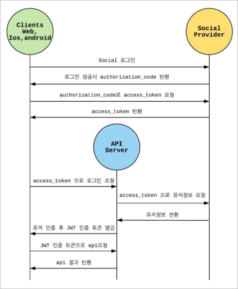
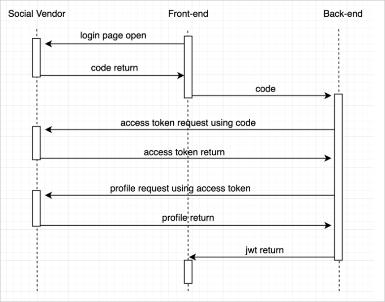


### CSRF
SRF(Cross Stie Request Forgery) : 사이트간 요청 위조
웹 애플리케이션 취약점 중 하나로 사용자가 자신의 의지와 무관하게 공격자가 의도한 행동을 하여 특정 웹페이지를 보안에 취약하게 한다거나 수정, 삭제 등의 작업을 하게 만드는 공격방법을 의미한다 

### BatchInsert
https://heowc.dev/2019/02/12/using-mysql-jdbc-to-handle-large-table-2/

### hikari CP

### tree /F

### 세션보다 토큰을 사용하는 이유
세션 대신 토큰을 사용하려는 이유는 확장성 때문이다. 만약 여러 서버가 돌아가는 상황이라면, 각 서버마다 세션 저장소를 두거나, 공통 세션 저장소를 만들어야하는데, 이 또한 비용이다. 반면에 토큰은 stateless 하기 때문에 확장에 용이하다.

다만, 토큰은 한 번 발급되면 강제로 만료시킬 수 없다는 단점이 있다. 따라서 만료 시간이 짧은 access token과 만료 시간이 긴 refresh token을 나눠서 사용하는 것이다.

토큰은 실제로 로그인을 유지하고 있는 것이 아니라 로그인이 유지된 것 처럼 행동한다.(클라이언트가 access token을 저장해두고, 요청 때 마다 보내는 방식) 따라서 만약 access token이 만료된 것이 아니라면, 로그아웃을 했더라도 해당 access token만 가지고 있다면, 로그인 된 상태처럼 행동할 수 있다고 한다.

### Redis 공부

### stream(value)

### webtestclient mutatedWith(csrf())

### @WithMockUser

### git-secret

### jasypt
jasypt을 적용하기 위해 주말을 모두 소모했다. 간단히 application 을 구동하는데에는 문제가 없었지만 @MybatisTest에도 암호화된 설정파일을 적용하는 것에 꽤 많은 시간이 들었다...

#### 의존 설정
```
implementation 'com.github.ulisesbocchio:jasypt-spring-boot-starter:3.0.3'
```

#### application.yml에 jasypt 설정
```
jasypt:
  encryptor:
    bean: jasyptStringEncryptor
```

#### JasyptConfig 생성
```
@Configuration
@PropertySource("classpath:application.yml")
public class JasyptConfig {

    @Bean("jasyptStringEncryptor")
    public StringEncryptor stringEncryptor() {
        PooledPBEStringEncryptor encryptor = new PooledPBEStringEncryptor();
        SimpleStringPBEConfig config = new SimpleStringPBEConfig();

        config.setPassword(System.getProperty("jasypt.encryptor.password"));
        config.setAlgorithm("PBEWithMD5AndDES");
        config.setKeyObtentionIterations("1000");
        config.setPoolSize("1");
        config.setSaltGeneratorClassName("org.jasypt.salt.RandomSaltGenerator");
        config.setStringOutputType("base64");
        encryptor.setConfig(config);

        return encryptor;
    }
}
```

#### JasyptConfig 테스트로 encrypt text 얻어오기
```
class JasyptConfigTest {

    @Test
    void jasypt_테스트() {

        String url = "기존 url";
        String username = "기존 username";
        String password = "기존 password";

        PooledPBEStringEncryptor encryptor = new PooledPBEStringEncryptor();
        SimpleStringPBEConfig config = new SimpleStringPBEConfig();

        config.setPassword("jasypt 비밀번호");
        config.setAlgorithm("PBEWithMD5AndDES");
        config.setKeyObtentionIterations("1000");
        config.setPoolSize("1");
        config.setSaltGeneratorClassName("org.jasypt.salt.RandomSaltGenerator");
        config.setStringOutputType("base64");
        encryptor.setConfig(config);

        String encryptUrl = encryptor.encrypt(url);
        String encryptUsername = encryptor.encrypt(username);
        String encryptPassword = encryptor.encrypt(password);

        System.out.println("encryptPassword = " + encryptPassword);
        System.out.println("encryptUsername = " + encryptUsername);
        System.out.println("encryptUrl = " + encryptUrl);

        assertThat(url).isEqualTo(encryptor.decrypt(encryptUrl));
    }

}
```
- 실제 JasyptConfig에 설정했던 내용대로 암호화가 이루어져야 하기 때문에 테스트 코드를 통해 encrypt String을 얻어오는게 확실한 방법이다.

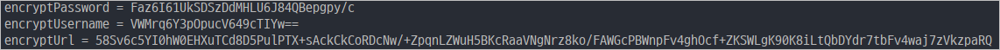 

결과로 출력된 암호값을 yml 설정 파일에 적용해주면 된다.

```yml
spring:
  datasource:
    url: ENC(gKZYnBvjAjedTjh3b9ZuuEGOAc6+yQKJ7vw1jq4xw143s7KcstlVg8NztcPRKjzJlWDo/rQlFRngtC3FcnowYFNhgGtEMZdzwow9elTByMlAMEFvlvmkKDihHQ0v4uDH)
    username: ENC(TrfO7cYfJec5zTygpY/GvA==)
    password: ENC(aGwjP5UFAUbohPv29yVHXxSncI8okXT5)
    driver-class-name: org.mariadb.jdbc.Driver
```

여기서 jasypt 비밀번호를 좀 더 안전하게 사용해주기 위해 VM Option을 사용해야 한다.

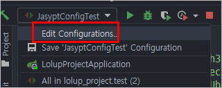

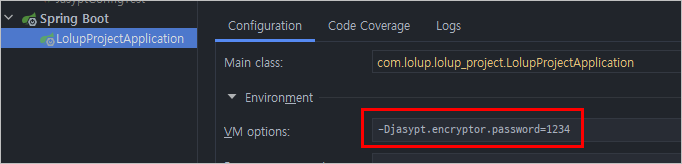

이 후 JasyptConfig 파일에서 비밀번호를 VM에 설정해준 값을 불러오는 방식으로 설정해준다.

```
config.setPassword(System.getProperty("jasypt.encryptor.password"));
```

이렇게 설정해주면 Application은 정상적으로 작동한다. 하지만 암호화된 설정에 의존하는 각종 테스트 코드에 에러가 발생한다. 

@MybatisTest는 DB 연결에 의존하지만 Jasypt으로 설정해준 암호화 복호화가 제대로 이루어지지 않아 계속 에러가 발생한다. 이 분을 해결하는데 몇 시간이 걸렸는지 가늠도 못하겠다...

#### 기존 yml 파일을 모두 합친 새로운 application-test.yml 생성
```yml
logging:
  level:
    root: info
    com.lolup.lolup_project: debug

spring:

  datasource:
    url: ENC(gKZYnBvjAjedTjh3b9ZuuEGOAc6+yQKJ7vw1jq4xw143s7KcstlVg8NztcPRKjzJlWDo/rQlFRngtC3FcnowYFNhgGtEMZdzwow9elTByMlAMEFvlvmkKDihHQ0v4uDH)
    username: ENC(TrfO7cYfJec5zTygpY/GvA==)
    password: ENC(aGwjP5UFAUbohPv29yVHXxSncI8okXT5)
    driver-class-name: org.mariadb.jdbc.Driver

  test:
    database:
      replace: none

mybatis:
  type-aliases-package: com.lolup.lolup_project
  mapper-locations: mybatis/mapper/**/*.xml

jasypt:
  encryptor:
    bean: jasyptStringEncryptor
```
- application.yml 과 application-db.yml에 나뉘어져있던 설정을 한데 모아 application-test.yml을 생성했다.
- 해당 설정 파일을 src/test/resources 하위에 두었다.
- 또한 application.yml에 test profile을 새롭게 include 해주었다.
  ```yml
  spring:
  profiles:
    include:
      - oauth
      - db
      - test
  ```

#### 테스트 설정
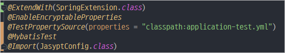

다음과 같이 DB에 의존하는 테스트의 설정 어노테이션을 여러가지 추가해줬다.

마지막으로 VM option도 설정해줘야했다.

처음엔 All in project test 에 VM option을 설정해줬다.

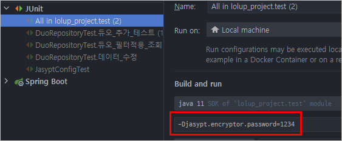

하지만 이렇게하면 Method 단위의 테스트에는 VM 옵션이 적용되지 않는 문제가 발생한다. 따라서 template을 설정해 새롭게 실행되는 test에 대해 같은 VM property가 전달될 수 있게 끔 설정해줘야했다.

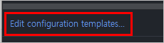

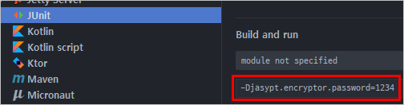

이렇게 설정해주면 암호화된 설정에 의존하는 단위 테스트도 정상적으로 작동된다.

문제는 앞으로 해당 암호화 내용을 Github action과 Jenkins에도 무사히 반영하는 작업이 남았다는 것이다...

#### jasypt 적용 후 build 시
```
gradlew build -Pjasypt.encryptor.password=1234
```
- vm property를 빌드할 때 같이 넘겨줘야한다.

#### jasypt 적용 후 Github action 설정 변경
CI 관련 workflow의 yml파일을 수정해줘야한다.
- build 부분에 `build -Pjasypt.encryptor.password=1234`를 추가해야한다.


#### jasypt 적용 후 Docker 설정과 Jenkins 설정 변경
**Docker 파일을 수정한다.**
```
FROM openjdk:11-jre-slim-buster
ARG JAR_FILE=build/libs/*.jar
COPY ${JAR_FILE} app.jar
ENTRYPOINT ["sh", "-c", "java ${JAVA_OPTS} -jar /app.jar"]
```
<br>

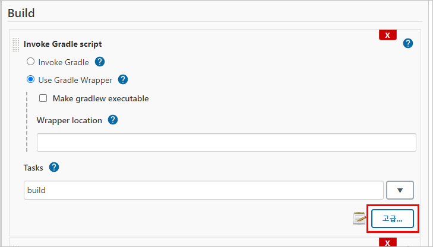
- Jenkins의 Item 설정에서 Build를 수정해야한다.

<br>

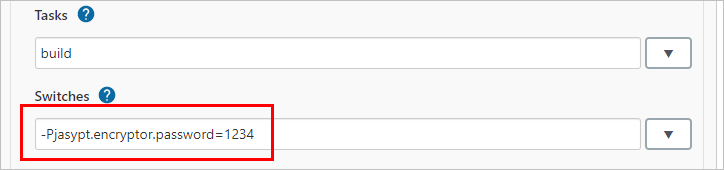
- Build Script를 작성해서 Vm option이 전달되도록 설정해준다.
- 추후 환경 변수로 수정해 줄 필요가 있다.

<br>

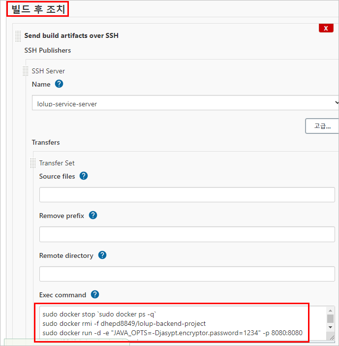
- 이후 빌드 후 조치에서 command를 수정해준다.
  ```
  sudo docker stop `sudo docker ps -q`
  sudo docker rmi -f dhepd8849/lolup-backend-project
  sudo docker run -d -e "JAVA_OPTS= -Djasypt.encryptor.password=1234" -p 8080:8080 dhepd8849/lolup-backend-project
  ```

### mapper.readValue(json, new TypeReference<List<MostInfo>>(){});


### Oauth 로그인
#### 구글
```
 getClientRegistration=ClientRegistration{registrationId='google', clientId='988347019914-o7367lsmnq231633cerpshve1rth3lmj.apps.googleusercontent.com', clientSecret='gW6W9qMnto02htjOez-I4YBK', clientAuthenticationMethod=org.springframework.security.oauth2.core.ClientAuthenticationMethod@4fcef9d3, authorizationGrantType=org.springframework.security.oauth2.core.AuthorizationGrantType@5da5e9f3, redirectUri='{baseUrl}/{action}/oauth2/code/{registrationId}', scopes=[profile, email], providerDetails=org.springframework.security.oauth2.client.registration.ClientRegistration$ProviderDetails@29a01b64, clientName='Google'}
getAccessToken=ya29.a0ARrdaM-5cqLvxqU_PVx_Ysu6S1IpoEUvslo6MOwkVly_HwzrYyUOoClKGR298J0_aFf2_WuPjRMWu8ySlbz_DhEiqqUp80ZYobgPUmbY-8VGWn_xAEYD4SuZy0jOEd3FU81CPJ_6_HZKWS78qM0LAhQlPXiorw


getAttributes=
	{
		sub=114910600427690976041, 
		name=김한준, 
		given_name=한준, 
		family_name=김, 
		picture=https://lh3.googleusercontent.com/a/AATXAJw7Uc4DY2UkII6X3zAbNT1WCXQJOPs-u3Tduj-S=s96-c,
		email=dhepd8849@gmail.com, 
		email_verified=true, 
		locale=ko
	}
```

### JWT
#### 구조
Header.Payload.Signature 처럼 .으로 구분된다.
기본적으로 Base64 문자열로 구성된다. Base64는 디코딩이 가능하다. 즉 JWT는 암호화에 목적이 있는게 아니라 검증에 중점을 두고있다.

- Header
  - RSA 포함
- Payload
  - username과 같은 정보가 담긴다.
- Signature
  - Header.Payload.Secret키

Signature를 만들때 Header + Payload만 가지고 암호화 한다. (RSA 방식 사용)
RSA에는 공개키, 개인키가 있다. 서버가 개인키로 잠궈서 signature를 만들고 해당 토큰을 클라이언트로 반환한다. 클라이언트가 토큰을 받으면 추후에 다시 서버쪽으로 해당 토큰을 통해 요청할 때 서버쪽에선 JWT를 받고 해당 토큰을 Secret key로 확인할 수 있다.

### Chrome 쿠키 정책
크롬 브라우저 80 버전 이후로는 다른 도메인 간 쿠키 전달을 제약하는 정책을 취한다.
Same site가 기존 none으로 설정되었지만 lax가 기본값으로 설정된다.

그런데 same site 설정을 none으로 지정해줬을 땐 Secure 상태로만 쿠키가 전달된다는 글을 봤는데
직접 확인해봐야할 것 같다.

A cookie with "SameSite=Strict" will only be sent with a same-site request. A 

cookie with "SameSite=Lax" will be sent with a same-site request, or a cross-site top-level navigation with a "safe" HTTP method. 

A cookie with "SameSite=None" will be sent with both same-site and cross-site requests.

위와 같이 "None"은 동일 사이트과 크로스 사이트에 모두 쿠키 전송이 가능합니다. 그리고 "Strict"로 설정할 경우 서로 다른 도메인에서는 아예 전송이 불가능해 지기 때문에 CSRF를 100% 방지할 수 있으나 사용자 편의성을 많이 해치게 됩니다. 그래서 Strict 설정에 일부  예외( HTTP get method / a href / link href )를 두어 적용되는 설정이 이번에 기본값으로 변경되는 "Lax" 입니다. 

