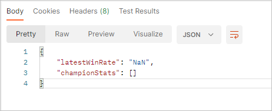

# 외부 API 호출 성능 개선기

현재 진행중인 프로젝트에서 외부 API를 호출해야했다. 게임 리그오브레전드의 사용자 계정 정보를 불러오고 이를 토대로 최근 매치 전적을 조회하는 작업이었다.

초기 기능 구현 시 10개의 매치 정보를 조회하도록 했는데, 성능이 처참했다. 기본적으로 2~3초정도 소요됐다. 사용자가 매치 정보를 요청할 때 마다 2초이상 소요된다면 편의성 측면에서 치명적이라고 생각했다.

라이엇 API를 사용하는 유명한 전적 검색 서비스를 참고하면서 어떤 방식으로 성능을 개선할지 고민했다. 라이엇 API에서 데이터를 호출해온 뒤 자체 DB에 저장해놓는다. 이를 위해 내부에서 지속적으로 DB와 라이엇 서버 데이터를 동기화하는 작업이 이루어진다고 한다.

처음엔 이런 방식을 간소화해서 따라해보려고 했다. 서비스를 한번이라도 이용했던 사용자의 라이엇 계정 PUUID를 DB에 저장해놓고 스프링 배치를 활용해서 DB에 전적 정보를 주기적으로 동기화하려했다. 하지만 곰곰히 생각해보니 이런 방식이 일반적으로 쓰이고 있다곤 하나. 현재 내가 작업중인 프로젝트와는 맞지 않다고 생각했다. 현재 프로젝트는 같이 게임할 듀오를 찾는 서비스이기 때문에 지난 전적을 누적해서 저장해놓을 필요가 없고 매 요청마다 최근 전적만 전달해주면됐다.

또한 생각해보면 외부 API에서 수천건, 수만건의 데이터를 조회하는 것도 아니고 고작 10건 조회하는데 2초가 넘게 소요된다는 게 이해가 가지 않았다. 분명 내가 짠 코드에 문제가 있겠다고 생각했고, 차근 차근 원인부터 찾기로 했다.

## 원인 파악

원인은 매치 정보를 조회하는 부분에 있었다.

```java
private List<ParticipantDto> extractParticipantsBy(final String puuid, final List<String> matchIds) {
    return matchIds.stream()
            .map(this::requestMatchHistory)
            .map(MatchDto::getParticipants)
            .map(participants -> findByPuuid(participants, puuid))
            .collect(Collectors.toList());
}

private MatchDto requestMatchHistory(final String matchId) {
    try {
        return webClient.get()
                .uri(MATCH_REQUEST_URI, matchId, apiKey)
                .retrieve()
                .bodyToMono(MatchDto.class)
                .block();
    } catch (RuntimeException e) {
        throw new InvalidMatchIdException();
    }
}
```

라이엇 서버로부터 사용자의 최근 매치 정보를 조회하면 MatchID들이 반환됐다. 그러면 MatchID로 다시 서버에 요청을 보내서 세부 매치 정보를 보내주는 식이었다. MatchID를 순회하면서 라이엇 서버에 매치 세부 정보 요청을 보내는 부분에서 가장 많은 시간이 소요됐다.

여기서 1차 위기가 왔다. 분명 비동기, 논블로킹을 사용하는 WebClient를 활용해 HTTP 요청을 보냈는데 왜 성능이 안나오는걸까? 이건 내 코드의 문제가 아니라 라이엇 API 자체의 성능이 떨어지는 것이 아닐까? 라고 잠시 오해를 하기도했다.

혹시나 WebClient를 잘못 사용하고 있는 것은 아닌지하는 생각이 들어 WebClient에 대해 다시 공부하기 시작했고 얼마 지나지 않아 쉽게 성능 저하의 원인을 찾아낼 수 있었다.

WebClient는 비동기, 논블로킹 방식을 지원하는 것이 맞다. 하지만 사용 방식에 따라 WebClient로 동기 방식으로 작업을 처리할 수도 있었는데, 내가 작성한 코드가 비동기 방식이 아닌 순차적으로 API를 호출하도록 만들어져있었다.

> 웹플럭스에서는 기본적으로 논블로킹 처리되지만 SpringMVC 환경에서 사용시에는 논블로킹 처리를 수동으로 구성해줘야 한다고 한다.

## 1차 개선 시도(실패)

### 수정 후
```java
private List<MatchDto> requestMatchHistories(final List<String> matchIds) {
    List<MatchDto> matchDtos = new ArrayList<>();
    matchIds.forEach(matchId ->
            webClient.get()
                    .uri(MATCH_REQUEST_URI, matchId, apiKey)
                    .retrieve()
                    .bodyToMono(MatchDto.class)
                    .subscribe(matchDtos::add)
    );
    return matchDtos;
}
```

WebClient로 동기 작업을 하고싶으면 block() 메서드를 사용하면 되고, 비동기 작업을 하고 싶으면 subscribe() 메서드를 사용하면된다고 해서 코드를 수정했다.



제대로 반환하는 것이었다. 그런데 비동기 호출 자체가 결과값을 예약해두는 개념이다. 동작하지 않았다. 외부 서버에서 받아온 매치 정보가 비어있었다. 문제는 subscribe()의 동작 방식에 있었다. 내가 원하는 것은 비동기적으로 요청을 보내고 받아온 정보들을 리스트에 담아 즉 호출하는 즉시 결과값을 받는 것이 아니라, 요청을 우선 보내면서 응답을 예약해놓고 다른 작업을 수행하다가 응답이 오면 그때 값을 받아오는 식인 것이다.

> 엄밀히 말하면 결과값이 준비되지 않았을 땐 **EWOULDBLOCK**라는 작업이 완료되지 않았음을 나타내는 상태를 반환한다.

따라서 수정한 코드는 요청을 우선 모두 보내놓고 응답을 받지도 않은 채 빈 리스트를 반환해버린 것이다.

## 2차 개선 시도(성공)
내가 원한 것은 10건의 API 요청을 비동기적으로 처리하면서 각 요청에 대한 응답을 하나의 리스트로 반환하는 것이었다. 따라서 기존에 사용했던 block()을 다시 활용하기로 했다. block()은 WebClient를 동기적으로 처리하도록 도와준다. 따라서 비동기 요청을 보낼 수만 있다면 모든 응답을 하나의 리스트로 받아온 뒤 정상적인 데이터로 다음 작업을 수행할 수 있게 되는 것이다.

여기서 문제는 HTTP 요청을 비동기적으로 처리하는 것이다. 이를 위해 Reactor의 flatMap()을 활용했다. n개의 요소를 JavaDoc에 따르면 flatMap()은 비동기적으로 연산하고, map()은 동기적으로 연산한다.

```java
private List<MatchDto> requestMatchHistories(final String[] matchIds) {
    return Flux.fromArray(matchIds)
            .flatMap(this::requestMatchMono)
            .collectList()
            .blockOptional()
            .orElseThrow(InvalidMatchIdException::new);
}

private Mono<MatchDto> requestMatchMono(final String matchId) {
    try {
        return webClient.get()
                .uri(MATCH_REQUEST_URI, matchId, apiKey)
                .retrieve()
                .bodyToMono(MatchDto.class);
    } catch (RuntimeException e) {
        throw new InvalidMatchIdException();
    }
}
```

> **Mono vs Flux** <br />
> Mono와 Flux 모두 Reactor Stream의 **Publisher** 역할을 한다.
> <br/> **Mono**는 0\~1개의 데이터를 전달한다.
> <br/> **Flux**는 0\~N개의 데이터를 전달한다. </br>
> <br/> **bodyToFlux()** 는 0\~N개의 데이터를 전달 받는다. 단 응답 헤더의 `Content-Type`이 `application/stream+json`인 경우에 의도한 대로 응답 값을 받아올 수 있다. <br/>
> <br/> **application/json**
> <br/> [{"value":0},{"value":1},{"value":2},{"value":3}] <br/>
> <br/> **application/stream+json**
> <br/> {"value":0}
<br/>{"value":1}
<br/>{"value":2}
<br/>{"value":3}


위와 같이 코드를 수정한 후 정상적인 결과물을 얻을 수 있었다. 결과적으로 대아토룰 10건 조회할 때의 성능을 약 5배 향상시켰다.

#### 개선 전 성능


#### 개선 후 성능


## 또 다른 성능 개선 방법 - parellelStream()
Reactor의 flatMap(), map()을 살펴보면서 Java Stream API의 map()이 떠올랐다. 성능 개선 이전 코드에선 반환받은 MatchID를 map()으로 순회하면서 라이엇 서버에 매치 세부 정보 요청을 보냈었다. 그런데 Stream API에 parellelStream()이라는 메서드가 있었다.

> 이 시점에서 기존에 발생했던 성능 문제가 WebClient를 사용하는 방식보다도 Stream API에 대한 이해도가 부족했기 때문이었음을 깨달았다.

기존 stream()은 순차적으로 작업을 진행하는 방식이라면 parellelStream()은 한마디로 병렬처리하는 것이다. parellelStream()을 활용하면 MatchID를 기존에 내가 원했던 대로 동시에 보낼 수 있었다.

```java
private List<ParticipantDto> extractParticipantsBy(final String puuid, final List<String> matchIds) {
    return matchIds.parellelStream()
            .map(this::requestMatchHistory)
            .map(MatchDto::getParticipants)
            .map(participants -> findByPuuid(participants, puuid))
            .collect(Collectors.toList());
}
```

실제로 stream()을 parellelStream()으로 바꿔주기만 했는데도 성능 개선이 이루어졌다. Reactor의 flatMap()을 활용한 코드와 성능 차이가 많이 나지 않았다.

### parellelStream() 사용시 유의사항
- 스트림 병렬화가 반드시 병렬 처리를 보장하는 것은 아니다.
  - 기기의 프로세서 수에 의존한다.
- 내부적으로 공유된 가변 상태를 가져선 안된다.
  - 공유된 가변 자원에 동시에 접근하기 때문에 충돌이 의도치 않은 결과가 발생할 수 있다.
- findFirst()나 limit()처럼 요소 순서에 의존하는 연산을 사용하면 오히려 성능이 악화된다.
- 스트림의 소스가 ArrayList, HashMap, HashSet, ConcurrentHashMap, 배열 intRange, longRange 일 때 스트림 병렬화의 효과가 극대화된다.
  - 데이터를 원하는 크기만큼 정확하고 손쉽게 나눌 수 있다.
  - LinkedList의 경우 원하는 대로 분할하기 위해선 모든 요소를 탐색해야한다.

## 느낀점

### 원인 파악 우선
성능 개선을 하면서 느낀 것은 문제가 발생했을 땐 원인 파악이 우선적으로 이루어져야 한다는 것이었다. 작성한 코드에서의 작은 문제부터 해결해나갔어야 했는데 처음 성능 개선을 고민할 때부터 방향성을 잘못 잡았다. (기존 전적 검색 서비스를 참고하며 라이엇 서버 데이터와 내부 DB 동기화 작업을 고민하는 과정에서 정말 많은 시간이 소요됐다.) 다음에 성능 이슈가 발생하면, 우선 성능 문제가 일어난 지점을 파악하고 작은 단위부터 해결해나가는 식으로 진행할 것이다.

### 얕은 지식, 잘못된 응용
이번 성능 이슈의 근본적인 원인은 얕은 지식에서 비롯된 잘못된 기능 구현이었다. WebClient는 그렇다 치더라도 Stream API는 평소에도 손에 익을 정도로 자주 사용했는데, 어떤 식으로 동작하는지 어떤 상황에 유의해야하는 지 모른채 그냥 사용해왔던 것이 문제였다.

> map()을 사용할 때 마다 새로운 객체가 생성된다는 것도 이번에 처음 알게됐다. map()을 여러번 사용하는 것도 성능 이슈의 원인이 될 수 있다.

사실 모든 기술을 사용전에 완벽하게 이해하고 접목시키는 것은 현실적으로 힘들다고 생각한다. 지금처럼 우선 활용부터 해보고 이후에 내부 원리에 대해 이해하는 것이 학습 동기도 마련해줘서 좋은 것 같다. 다만 기본적인 동작 방식이나 주의 사항 정도는 파악하는 것도 좋아보인다.

### 운영체제에 대한 지식의 필요성
이번에 WebClient를 활용해보면서 정말 많은 내용을 공부하게 됐다. 특히 동기/비동기, 블로킹/논블로킹, 병렬성/동시성과 관련된 내용들이 주를 이루었다. 해당 내용들을 공부하다 보니 프로세스와 쓰레드, 컨텍스트 스위칭, 커널과 백프레셔 등등 점점 범위가 끝도 없이 넓어졌다. 찾아보니 꽤 많은 부분들이 운영체제와 관련된 기술들이었다. 특히 대용량 트래픽에 잘 대처하려면 동시성에 대한 이해가 정말 중요하다는 걸 알게됐다.

> WebClient은 비동기, 논블로킹 방식을 지원한다. 하지만 이는 성능 향상보다는 보다 적은 리소스로 더 많은 트래픽에 효과적으로 대응하기 위함이라고 한다.